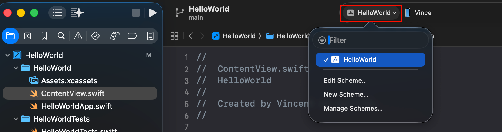
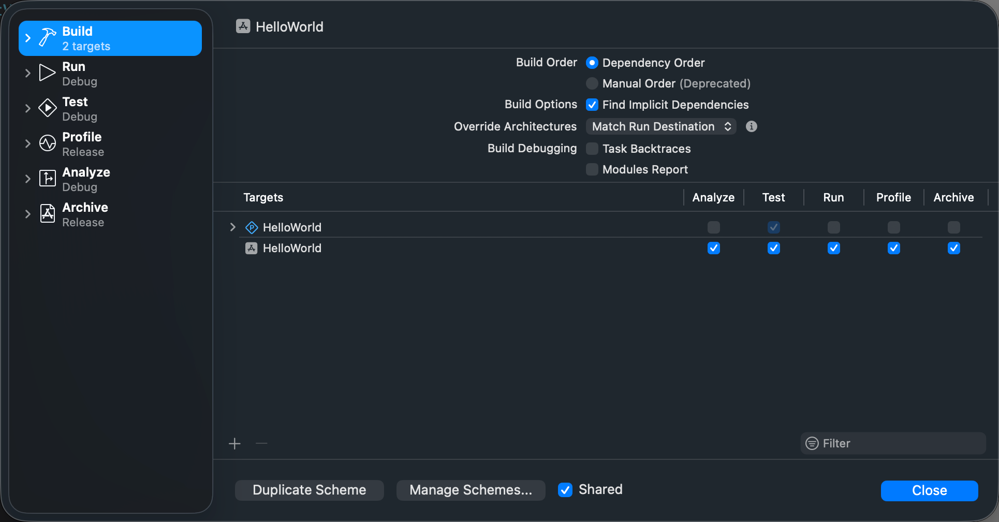

tags:: [[Xcode]]
---

- ## 创建 Xcode Project
	- 通读: [Creating an Xcode project for an app](https://developer.apple.com/documentation/xcode/creating-an-xcode-project-for-an-app)
- ## Xcode SwiftUI Project
	- 通读 [[Xcode SwiftUI Project]]
- ## Xcode Project 依赖管理
	- 通读 [[Xcode Project Dependencies Management]]
- ## Scheme
	- Scheme 用于配置 Build, Run , Test 等命令.
		- {:height 214, :width 804}
		- 
		-