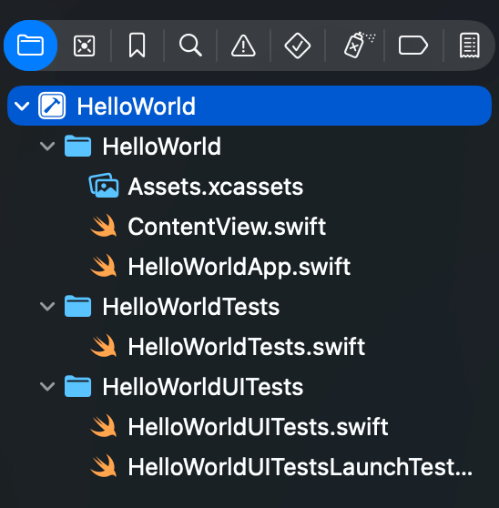
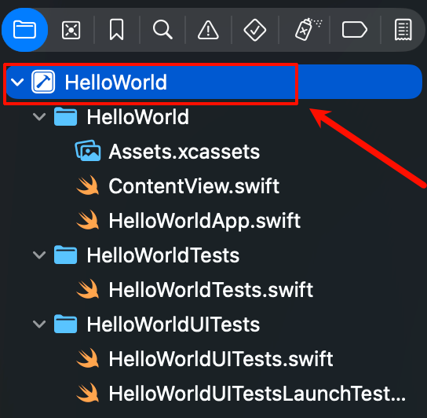
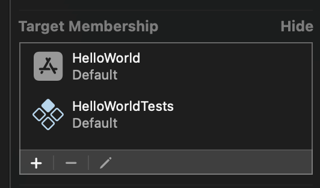

tags:: [[Xcode Project]] , [[SwiftUI]]
---

- ## Xcode 中项目视图
	- {:height 272, :width 255}
- ## 实际完整目录结构
	- ``` swift
	  HelloWorld
	  ├── HelloWorld
	  │   ├── Assets.xcassets
	  │   │   ├── AccentColor.colorset
	  │   │   │   └── Contents.json
	  │   │   ├── AppIcon.appiconset
	  │   │   │   └── Contents.json
	  │   │   └── Contents.json
	  │   ├── ContentView.swift
	  │   └── HelloWorldApp.swift
	  ├── HelloWorld.xcodeproj
	  │   ├── project.pbxproj
	  │   ├── project.xcworkspace
	  │   │   ├── contents.xcworkspacedata
	  │   │   ├── xcshareddata
	  │   │   │   └── swiftpm
	  │   │   │       └── configuration
	  │   │   └── xcuserdata
	  │   │       └── vincent.xcuserdatad
	  │   │           └── UserInterfaceState.xcuserstate
	  │   └── xcuserdata
	  │       └── vincent.xcuserdatad
	  │           └── xcschemes
	  │               └── xcschememanagement.plist
	  ├── HelloWorldTests
	  │   └── HelloWorldTests.swift
	  └── HelloWorldUITests
	      ├── HelloWorldUITests.swift
	      └── HelloWorldUITestsLaunchTests.swift
	  ```
- ## 项目根目录
	- ``` swift
	  HelloWorld
	  ├── HelloWorld
	  ├── HelloWorld.xcodeproj
	  ├── HelloWorldTests
	  └── HelloWorldUITests
	  ```
	- `HelloWorld` 是项目业务源码,  `HelloWorldTests` 是单元测试源码,  `HelloWorldUITests` 是 UI 自动化测试源码.
		- 它们都是要构建的 `Target` .
		- 每个 `Target` 构建为一个 `Product` .
	- `HelloWorld.xcodeproj` 是 **工程描述目录** .
		- 虽然是个目录, 但是在 Finder 中默认用 Xcode 打开.
		- Finder 中右击它, 选择 `Show Package Contents` , 可以进入这个目录.
- ## `HelloWorld` 业务源码目录
	- ``` swift
	  HelloWorld
	  ├── Assets.xcassets
	  │   ├── AccentColor.colorset
	  │   │   └── Contents.json
	  │   ├── AppIcon.appiconset
	  │   │   └── Contents.json
	  │   └── Contents.json
	  ├── ContentView.swift
	  └── HelloWorldApp.swift
	  ```
	- `HelloWorldApp.swift` 为程序入口.
		- 有标注 `@main` , 且遵循 `App` 的 `struct` . ( 详见: [[SwiftUI - App, Scene & View]] )
		- ``` swift
		  @main
		  struct HelloWorldApp: App {
		      var body: some Scene {
		          WindowGroup {
		              ContentView()
		          }
		      }
		  }
		  ```
	- `ContentView.swift` 为 `HelloWorldApp.swift` 中需要创建的页面.
	- `Assets.xcassets` 为资源目录, 用于存放: Icon, 图片, 颜色, Symbols 等.
- ## `HelloWorld.xcodeproj` 目录
	- ``` swift
	  HelloWorld.xcodeproj
	  ├── project.pbxproj
	  ├── project.xcworkspace
	  │   ├── contents.xcworkspacedata
	  │   ├── xcshareddata
	  │   │   └── swiftpm
	  │   │       └── configuration
	  │   └── xcuserdata
	  │       └── vincent.xcuserdatad
	  │           └── UserInterfaceState.xcuserstate
	  └── xcuserdata
	      └── vincent.xcuserdatad
	          └── xcschemes
	              └── xcschememanagement.plist
	  ```
	- `project.pbxproj` 最重要, 记录了 构建配置, 依赖 等相关信息.
	-
	- 我们不要手动编辑 `HelloWorld.xcodeproj` 目录中的内容
		- {:height 168, :width 191}
		- 点击 Xcode 项目视图的根目录, 在打开的 UI 中编辑即可.
- ## `project.pbxproj` 文件
	- ### PBX 什么意思?
		- 即 `Project Builder X` .
			- Xcode 最早叫 Project Builder ;
			- 后来为 Mac OS X 重写 Project Builder 后, 改名为 `Project Builder X` .
			- 最后改名为 Xcode
	- ### 包含的内容
		- 内容如下:
			- ``` json
			  // !$*UTF8*$!
			  {
			  	archiveVersion = 1;
			  	classes = {
			  	};
			  	objectVersion = 77;
			  	objects = {
			  
			  /* Begin PBXContainerItemProxy section */
			  ...
			  /* End PBXContainerItemProxy section */
			  
			  /* Begin PBXFileReference section */
			  ...
			  /* End PBXFileReference section */
			  
			  /* Begin PBXFileSystemSynchronizedRootGroup section */
			  ...
			  /* End PBXFileSystemSynchronizedRootGroup section */
			  
			  /* Begin PBXFrameworksBuildPhase section */
			  ...
			  /* End PBXFrameworksBuildPhase section */
			  
			  /* Begin PBXGroup section */
			  ...
			  /* End PBXGroup section */
			  
			  /* Begin PBXNativeTarget section */
			  ...
			  /* End PBXNativeTarget section */
			  
			  /* Begin PBXProject section */
			  ...
			  /* End PBXProject section */
			  
			  /* Begin PBXResourcesBuildPhase section */
			  ...
			  /* End PBXResourcesBuildPhase section */
			  
			  /* Begin PBXSourcesBuildPhase section */
			  ...
			  /* End PBXSourcesBuildPhase section */
			  
			  /* Begin PBXTargetDependency section */
			  ...
			  /* End PBXTargetDependency section */
			  
			  /* Begin XCBuildConfiguration section */
			  ...
			  /* End XCBuildConfiguration section */
			  
			  /* Begin XCConfigurationList section */
			  ...
			  /* End XCConfigurationList section */
			  	};
			  	rootObject = AAABBBCCCDDDFFFF013F /* Project object */;
			  }
			  ```
		- 简化一下就是:
			- ``` swift
			  // !$*UTF8*$!
			  {
			  	archiveVersion = 1;
			  	classes = {
			  	};
			  	objectVersion = 77;
			  	objects = {
			  	   // 很多个 section
			  	};
			  	rootObject = AAABBBCCCDDDFFFF013F /* Project object */;
			  }
			  ```
	- ### 包含的 Section
		- 大致包含如下 Section:
			- PBXContainerItemProxy
			  logseq.order-list-type:: number
			- PBXFileReference
			  logseq.order-list-type:: number
			- PBXFileSystemSynchronizedRootGroup
			  logseq.order-list-type:: number
			- PBXFrameworksBuildPhase
			  logseq.order-list-type:: number
			- PBXGroup
			  logseq.order-list-type:: number
			- PBXNativeTarget
			  logseq.order-list-type:: number
			- PBXProject
			  logseq.order-list-type:: number
			- PBXResourcesBuildPhase
			  logseq.order-list-type:: number
			- PBXSourcesBuildPhase
			  logseq.order-list-type:: number
			- PBXTargetDependency
			  logseq.order-list-type:: number
			- XCBuildConfiguration
			  logseq.order-list-type:: number
			- XCConfigurationList
			  logseq.order-list-type:: number
	- ### Section 内容
		- 每个 Section 中, 都会有多个 object , 格式如下:
			- ``` json
			  ACDFGFFFEDEDC /* HelloWorld */ = {
			    isa = PBXFileSystemSynchronizedRootGroup;
			    属性 1 = xxx;
			    属性 2 = yyy;
			  };
			  ```
			- 开头十六进制数, 是对象的唯一标识.
			- 公共属性:
				- `isa` : 对象类型 (即 Section 名称).
			- 其他属性:
				- 不同类型的对象, 可以配置不同的属性.
	- ### Section 怎么看
		- 先从 `PBXProject` 开始看, `PBXProject` 配置了整个项目的信息.
		  logseq.order-list-type:: number
			- `targets` 属性: 配置了整个项目的 `targets` , 指向的是 `PBXNativeTarget` 对象.
		- `PBXNativeTarget` 部分, 配置了 Target 信息:
		  logseq.order-list-type:: number
		  id:: 6a549f59-6fed-4b2a-b024-32a74975e6f7
			- `fileSystemSynchronizedGroups` 属性: 引用了 `PBXFileSystemSynchronizedRootGroup` 对象.
			- `name` 属性:  Target 名称.
			- `productName` 属性: Product 名称.
		- `PBXFileSystemSynchronizedRootGroup` 部分, 配置了根目录信息:
		  logseq.order-list-type:: number
			- ``` json
			  /* Begin PBXFileSystemSynchronizedRootGroup section */
			  		AAAA1 /* HelloWorld */ = {
			  			isa = PBXFileSystemSynchronizedRootGroup;
			            	exceptions = (
			  				DDDD4 /* Exceptions for "HelloWorld" folder in "HelloWorldTests" target */,
			              );
			  			path = HelloWorld;
			  			sourceTree = "<group>";
			  		};
			  		BBBB2 /* HelloWorldTests */ = {
			  			isa = PBXFileSystemSynchronizedRootGroup;
			  			path = HelloWorldTests;
			  			sourceTree = "<group>";
			  		};
			  		CCCC3 /* HelloWorldUITests */ = {
			  			isa = PBXFileSystemSynchronizedRootGroup;
			  			path = HelloWorldUITests;
			  			sourceTree = "<group>";
			  		};
			  /* End PBXFileSystemSynchronizedRootGroup section */
			  ```
			- `path` 属性: 相对项目根目录的 **相对路径** .
			- `exceptions` 属性: 配置例外情况, 执行 `PBXFileSystemSynchronizedBuildFileExceptionSet` 对象
				- 同一个目录下的所有文件, 并非都只能属于同一个 Target .
				- 可以配置属于其他 Target 的例外情况.
				- Xcode 可以在文件属性侧边栏设置 `Target` .
					- {:height 186, :width 342}
		- `PBXFileSystemSynchronizedBuildFileExceptionSet` 部分, 配置了例外情况:
		  logseq.order-list-type:: number
			- ``` json
			  /* Begin PBXFileSystemSynchronizedBuildFileExceptionSet section */
			  		DDDD4 /* Exceptions for "HelloWorld" folder in "HelloWorldTests" target */ = {
			  			isa = PBXFileSystemSynchronizedBuildFileExceptionSet;
			  			membershipExceptions = (
			  				ContentView.swift,
			  			);
			  			target = 1234 /* HelloWorldTests */;
			  		};
			  /* End PBXFileSystemSynchronizedBuildFileExceptionSet section */
			  ```
			- `membershipExceptions` : 例外的文件.
			- `target` : 例外文件所属的 Target .
- ## 参考
	- AI
	  logseq.order-list-type:: number