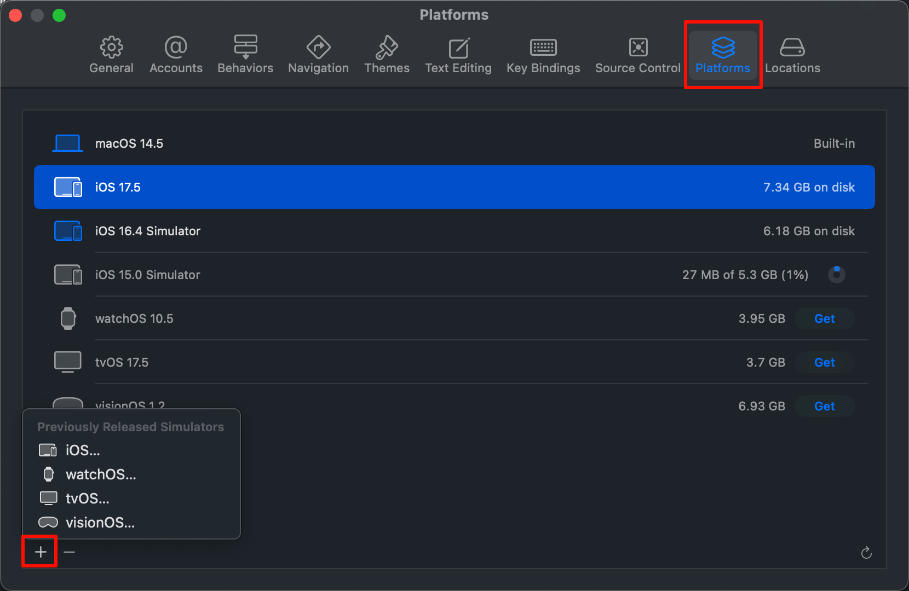
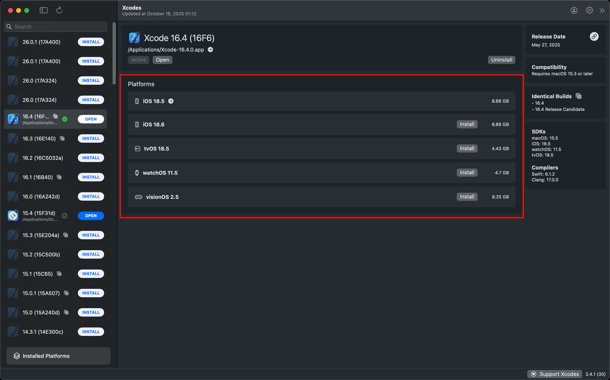

tags:: [[Xcode]], [[Simulator]] 
---

- ## 使用 Xcode 安装
	- 进入 Xcode 的 Settings > Platform , 下载各种版本的模拟器.
		- 点击左下角加号, 可以下载不同版本的模拟器.
		- {:height 538, :width 644}
- ## 使用 Xcodes 安装
	- {:height 697, :width 925}
- ## 使用命令行安装
	- 执行 `xcodebuild -downloadPlatform <iOS|watchOS|tvOS|visionOS>` 安装指定平台模拟器
- ## 启动模拟器
	- 执行 `open -a Simulator` .