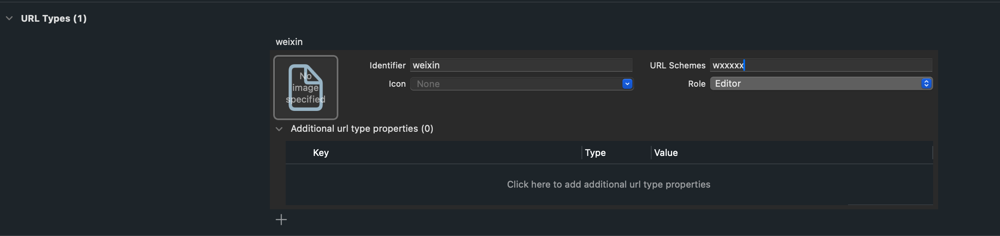
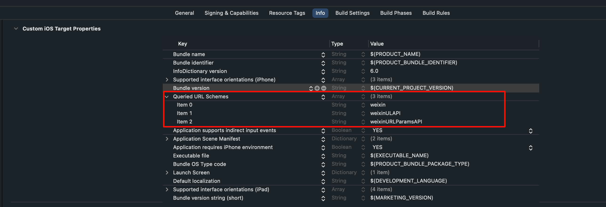
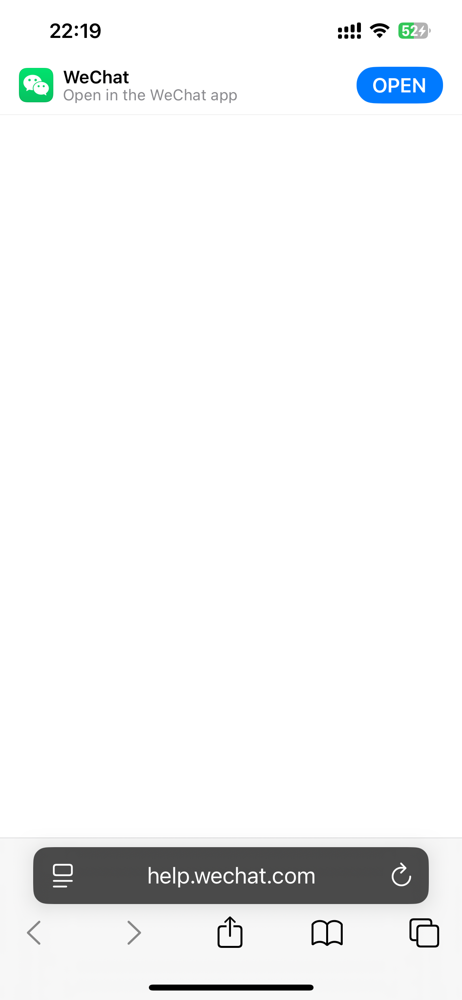

tags:: [[微信 Open SDK]] 
---

- ## 微信 Open SDK 各版本信息
	- 参见: [Open SDK for iOS](https://developers.weixin.qq.com/doc/oplatform/Mobile_App/Downloads/iOS_Resource.html)
	- 在 [Open SDK for iOS](https://developers.weixin.qq.com/doc/oplatform/Mobile_App/Downloads/iOS_Resource.html) 下载 Open SDK 与 范例代码.
- ## 接入微信 Open SDK 步骤
	- 在 [Apple 开发者后台](https://developer.apple.com/account/resources/certificates/list) 创建好 App 及其所需内容.
	  logseq.order-list-type:: number
	- 在 [微信开放平台](https://open.weixin.qq.com/) 注册 iOS App  ( 可以得到一个 AppID )
	  logseq.order-list-type:: number
	- 创建 Xcode 工程.
	  logseq.order-list-type:: number
		- 不管是手动创建的, 还是 Flutter 之类的跨平台框架创建的.
	- 引入微信 Open SDK:
	  logseq.order-list-type:: number
		- CocoaPods 引入依赖
		  logseq.order-list-type:: number
			- 在工程根目录下创建 `Podfile` 文件, 并引入 `pod 'WechatOpenSDK-XCFramework'`
			  logseq.order-list-type:: number
			- 执行 `pod install` 下载依赖.
			  logseq.order-list-type:: number
			- 使用 Xcode 打开生成的 `myapp.xcworkspace`
			  logseq.order-list-type:: number
		- 手动引入下载的 Open SDK .
		  logseq.order-list-type:: number
		- Flutter 引入 Open SDK
		  logseq.order-list-type:: number
			- `pubspec.yaml` 文件中加入 [[Fluwx]] 依赖
			  logseq.order-list-type:: number
				- ``` yaml
				  dependencies:
				    fluwx: ^${latestVersion}
				  ```
			- 执行 `flutter pub get` 下载依赖.
			  logseq.order-list-type:: number
	- 新增 URL Type (用于 微信 回调 第三方 App)
	  logseq.order-list-type:: number
		- Xcode 工程中, 进入 TARTGETS > 选择 TARGET > 顶部 Info 标签 > URL Types > 新增一个 URL Type
			- Identifier 填 : `weixin`
			- URL Schemes : 填入在微信开放平台注册的 `AppID`
		- {:height 255, :width 909}
	- 新增 Queried URL Schemes (用于调用 Open SDK 前的校验)
	  logseq.order-list-type:: number
		- Open SDK 会调用系统的 `canOpenURL()` API, 来判断微信相关 Scheme 是否存在, 如果不在 Queried URL Schemes 新增 Scheme, `canOpenURL()` 将返回 false.
		- Xcode 工程中, 进入 TARTGETS > 选择 TARGET > 顶部 Info 标签 > Custom iOS Target Properties > Queried URL Schemes 下 (没有这个配置就新增) 新增如下几个项目
			- weixin (拉起微信的基础通道, 最古老, 通常只用这个来判断是否安装微信)
			  logseq.order-list-type:: number
			- weixinULAPI (拉起微信的增强备用通道, 老版本没有)
			  logseq.order-list-type:: number
			- weixinURLParamsAPI  (参数传递通道, 支持分享、支付、登录等功能, 老版本没有)
			  logseq.order-list-type:: number
		- {:height 317, :width 903}
	- 配置第三方 App 的 Universal Links (参见: [[Apple: Associated domains]])
	  logseq.order-list-type:: number
- ## 验证 Universal Links 是否正常
	- ### 1.验证 **微信** 的 Universal Links 正常
		- Safari 访问 `https://help.wechat.com/app/` .
			- 注意: 使用 Chrome , Arc 等浏览器, 貌似不能进行跳转.
		- 如果出现如下情况, 且能跳转到 微信 , 则正常.
		- {:height 560, :width 267}
	- ### 2.验证第三方 App 的 Universal Links 正常.
		- 打包并安装第三方 App.
		  logseq.order-list-type:: number
		- Safari 访问 `https://{第三方 App 的域名}` .
		  logseq.order-list-type:: number
			- 如果可以跳转到第三方 App , 则正常.
- ## Swift 使用 Open SDK
	- 在需要使用 Open SDK 的文件中 `import WXApi.h` 头文件，并增加 `WXApiDelegate` 协议。
		- ``` swift
		  #import <UIKit/UIKit.h>
		  #import <WechatOpenSDK/WXApi.h> // （SDK版本 >= 2.0.5）
		  // #import <WXApi.h> // 旧版本SDK的导入方式（SDK版本 < 2.0.5）
		  
		  @interface AppDelegate : UIResponder<UIApplicationDelegate, WXApiDelegate>
		  
		  @property (strong, nonatomic) UIWindow *window;
		  
		  @end
		  ```
- ## 参考
	- [iOS接入指南](https://developers.weixin.qq.com/doc/oplatform/Mobile_App/Access_Guide/iOS.html#_2-%E7%A1%AE%E8%AE%A4-App-%E7%9A%84Universal-Links%E9%85%8D%E7%BD%AE%E6%88%90%E5%8A%9F)
	  logseq.order-list-type:: number