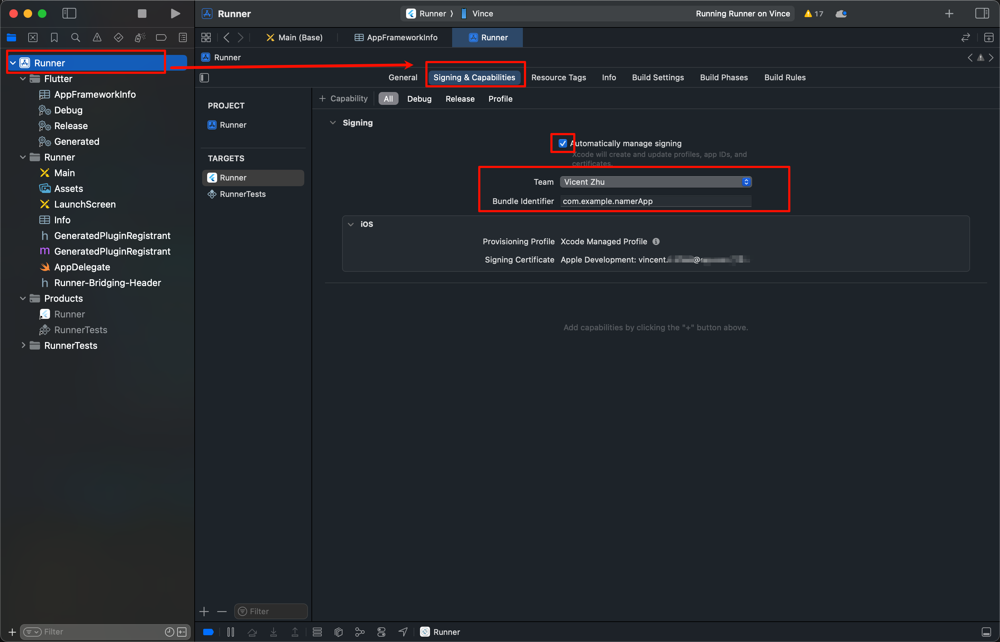
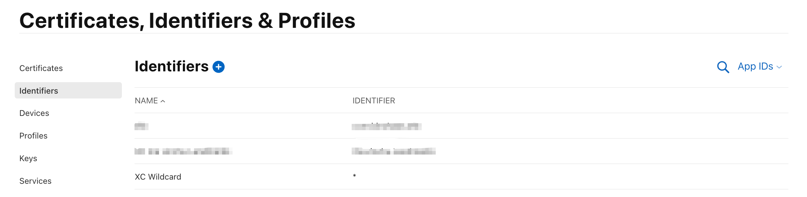

tags:: [[iOS]]
---

- ## 步骤
	- 参考:
		- [Flutter Docs - Set up an iOS device](https://docs.flutter.dev/platform-integration/ios/setup#set-up-devices)
		  logseq.order-list-type:: number
	- ---
	- 使用数据线将 iOS 设备连接到 Mac , 点击 `Trust` .
	  logseq.order-list-type:: number
	- 开启 iOS 设备的开发者模式:
	  logseq.order-list-type:: number
		- 进入 **Settings** > **Privacy & Security** > **Developer Mode** , 切到 **On** .
		  logseq.order-list-type:: number
		- 重启设备.
		  logseq.order-list-type:: number
		- 出现 **Turn on Developer Mode** , 则点击 **Turn On** .
		  logseq.order-list-type:: number
	- 上传证书 ==暂未搞清楚==
	  logseq.order-list-type:: number
- ## 在测试设备上运行
	- {:height 945, :width 973}
	- 使用 Xcode 打开项目.
	  logseq.order-list-type:: number
		- [[Flutter]] 项目就是打开 `ios` 目录 .
	- 进入 `Runner`  > `Signng & Capabilities` , 然后遵循以下步骤, 以自动生成签名:
	  logseq.order-list-type:: number
		- 取消勾选 `Automcatically manage signing` .
		  logseq.order-list-type:: number
		- 选择 `Team` (需要登录开发者账号) , `Bundle Indentifier` 可以就暂时使用测试的.
		  logseq.order-list-type:: number
		- 重新勾选 `Automcatically manage signing` .
		  logseq.order-list-type:: number
		- [[Flutter]] 项目会在 Apple Developer 账号下, 生成一个值为 `*` 的 Identifier .
			- {:height 225, :width 843}
	- 可以在 Xcode 或者 其他 IDE , 将代码运行到 iOS 设备上.
	  logseq.order-list-type:: number
		- 如果是 [[Flutter]] 项目, 且运行到 iOS 设备上出现白屏, 记得执行下 `flutter clean` .
		-
-