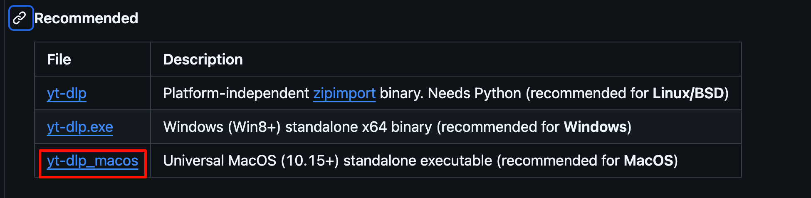
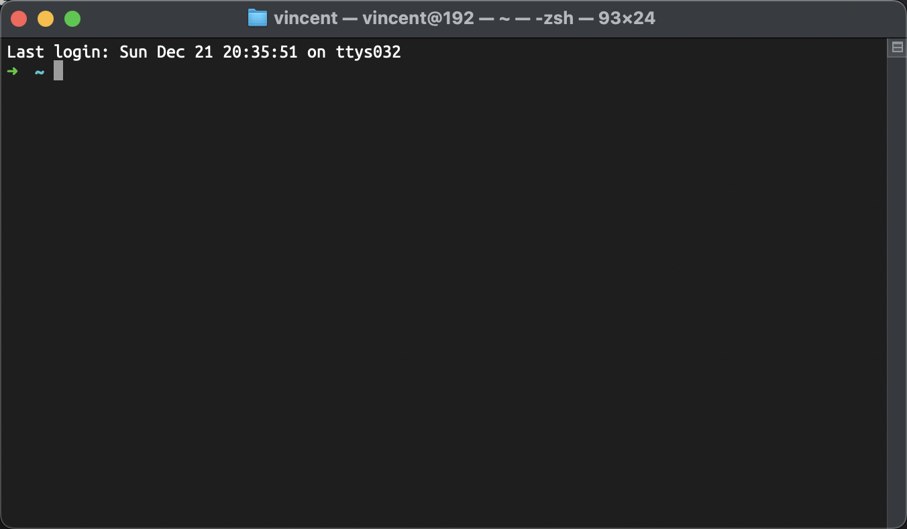
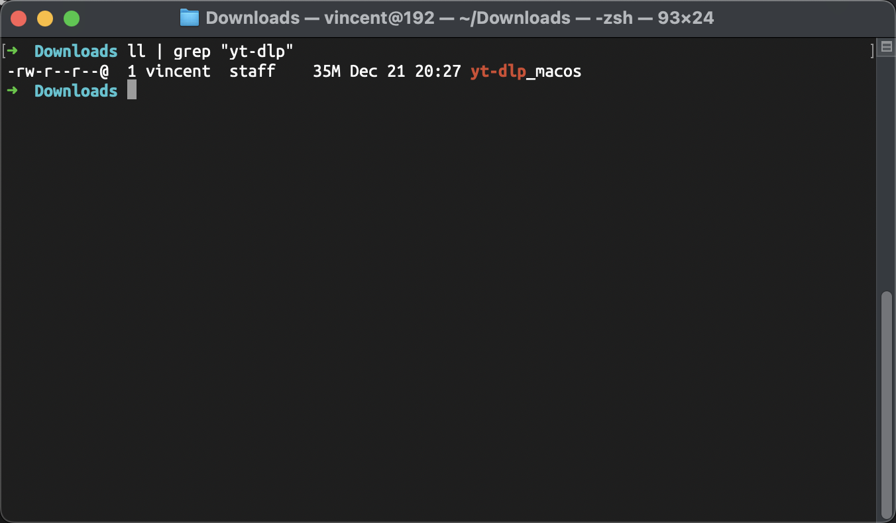
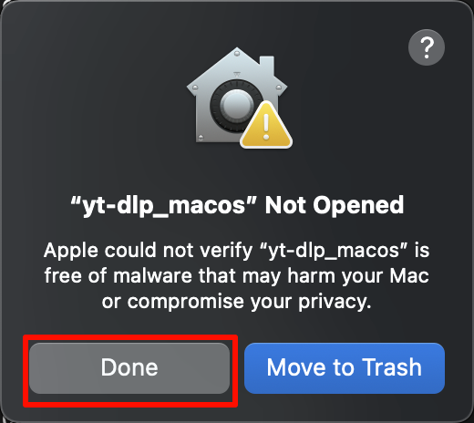
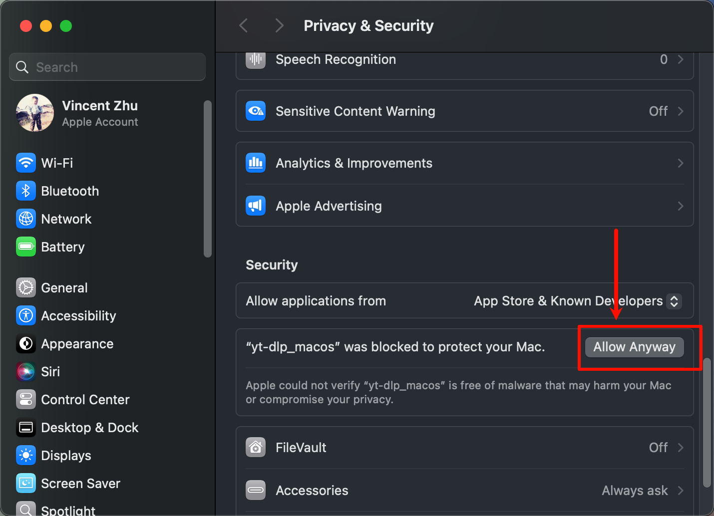
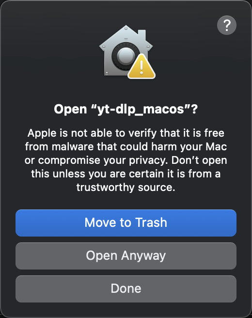
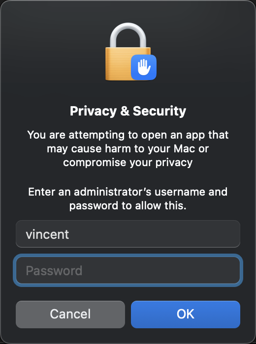
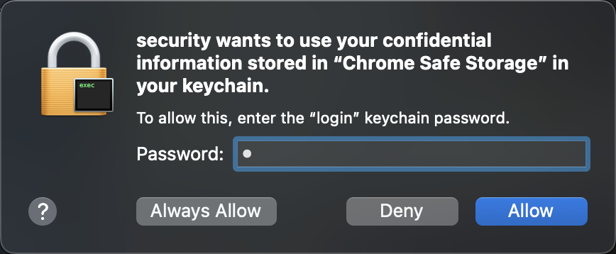

tags:: [[YT-DLP]]
---

- ## 如何安装 YT-DLP
	- 到这里下载: [Recommended Download](https://github.com/yt-dlp/yt-dlp?tab=readme-ov-file#recommended)
	  logseq.order-list-type:: number
		- {:height 170, :width 624}
		- masOS 下载 `yt-dlp_macOS`
		- 在下载文件夹中可以看到 一个 `yt-dlp_macos` 文件.
	- 按下 `Command` + `空格` 快捷键呼出全局搜索, 输入 `terminal` , 按下回车.
	  logseq.order-list-type:: number
		- {:height 669, :width 476}
	- 在弹出的窗口中输入 `cd ~/Downloads` 并回车, 以进入到刚才下载文件的位置.
	  logseq.order-list-type:: number
	- 在窗口中继续输入 `ll | grep "yt-dlp"` , 以查看刚刚下载的文件.
	  logseq.order-list-type:: number
		- {:height 292, :width 509}
	- 在窗口中继续输入 `chmod +x yt-dlp_macOS` , 给用户赋予执行 `yt-dlp_macOS` 的权限
	  logseq.order-list-type:: number
- ## 如何下载视频
	- 在上面的窗口中, 粘贴如下下载命令 (网址处替换为自己想要下载的视频地址), 并回车.
	  logseq.order-list-type:: number
		- ``` zsh
		  ./yt-dlp_macos -f bestvideo+bestaudio -o 'youtube/%(title)s.%(ext)s' \
		   --cookies-from-browser chrome \
		   'https://www.youtube.com/watch?v=dQw4w9WgXcQ'
		  ```
	- 弹出如下窗口, 点击 "Done" (点击完之后就执行就停掉了, 这是因为 macOS 认为这个不知道哪里来的东西不安全)
	  logseq.order-list-type:: number
		- {:height 358, :width 322}
	- 按下 `Command` + `空格` 快捷键呼出全局搜索, 输入 `Privacy & Security` 或者 `隐私与安全性` , 按下回车进入.
	  logseq.order-list-type:: number
	- 弹出如下窗口, 点击 `Allow Anyway` 按钮, 表示允许刚才的执行的命令.
	  logseq.order-list-type:: number
		- {:height 547, :width 586}
	- 再次回到刚才的 `terminal` 窗口, 重新输入的刚才的下载命令, 并回车.
	  logseq.order-list-type:: number
	- 弹出如下窗口, 点击 `Open Anyway` .
	  logseq.order-list-type:: number
		- {:height 283, :width 274}
	- 弹出如下窗口, 输入电脑的开机密码.
	  logseq.order-list-type:: number
		- {:height 621, :width 272}
	- 弹出如下窗口, 输入开机密码.
	  logseq.order-list-type:: number
		- {:height 298, :width 376}
	- 等待其执行完成, 到 下载目录 的 `youtube` 子目录下, 找到刚刚下载的 视频 和 音频 .
	  logseq.order-list-type:: number
		- {:height 388, :width 583}
- ## 参考
	- [Github Repo - YT-DLP](https://github.com/yt-dlp/yt-dlp?tab=readme-ov-file)
	  logseq.order-list-type:: number