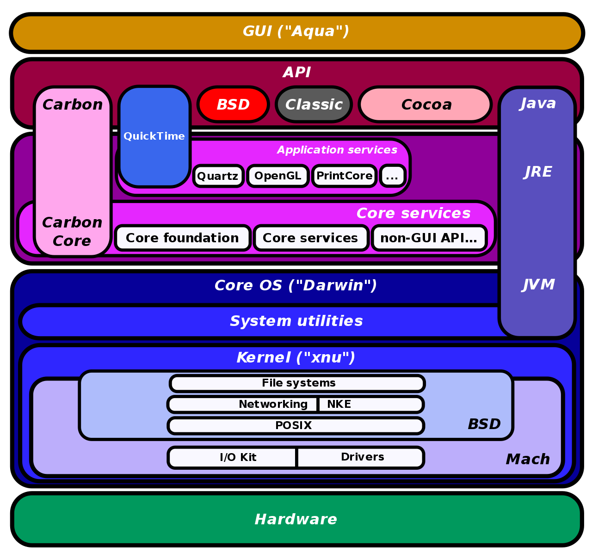

alias:: [[macOS history]]
tags:: macOS, history
---

- ## 第三方资料
	- [Why is macOS often referred to as 'Darwin'?](https://apple.stackexchange.com/questions/401832/why-is-macos-often-referred-to-as-darwin)
	- [Apple 开源系统 Darwin 的历史](https://zhuanlan.zhihu.com/p/436752408)
	- [wikipedia - OpenStep](https://en.wikipedia.org/wiki/OpenStep)
	- [wikipedia - XNU](https://en.wikipedia.org/wiki/XNU)
	- [wikipedia - Darwin](https://en.wikipedia.org/wiki/Darwin_(operating_system))
	-
- ## 简史
	- 1、NeXTSetp
		- 被开除的 Steve Jobs 开办了 NeXT 公司，NeXT 公司开发了 NeXTStep 系统；NeXTStep 系统基于 **将 BSD(源代码) 移植到 [[Mach]] 微内核** 。
		- 后来，NeXT 公司 将 NeXTSetp 系统的 **高层框架** 从 **底层系统** 抽离，并以 `OpenStep for 某某操作系统` 为名(如 OpenStep for Windows NT、OpenStep for Sun Solaris)，提供服务；"OPENSTEP for Mach" 仍然基于原 NeXTStep 相同的基础。
		-
	- 2、Apple
		- 苹果电脑的原有操作系统，从一开始就被设计成 **单用户、单任务** ，弊端很大；Apple 多次试图将操作系统 **现代化** ，但都以失败告终。
		- Apple 收购 NeXT 后，在 OPENSTEP for Mach 的基础上，将 Mach 内核从 2.5 升至 3 ，并使用 FreeBSD 内核中的概念对其进行了扩展，形成了新的内核 XNU ，也形成了 从 4.3 BSD 到 4.4 BSD 和 后来的 FreeBSD 的 BSD 基础；XNU 是一个混合内核 (Hybrid kernel)。
		- 最重要的是，他们扩展了 OpenStep API，并在其上构建了新的 API
		- 第一个系统原型被称为 Rhapsody，后来被称为 MacOS X -> OS X -> macOS， 后来又分出了iOS, iPadOS, tvOS 和 watchOS 。
		-
	- 3、[[Darwin]]
		- 上面提到 ”NeXT 公司 将 NeXTSetp 系统的 **高层框架** 从 **底层系统** 抽离“ ，其中低层级的部分(包含 XNU 内核)，被整合成 Darwin 。
		- 由于有 BSD 血统，Darwin 支持 [[POSIX]] API ，因此大量为 Unix / Unix-like 编写的程序可以直接在 Darwin 上编译运行。
		- 2003 年 7 月，苹果根据苹果源代码开源许可证 (APSL) 2.0 版发布了 Darwin 。
		- OpenDarwin 是苹果公司与互联网系统联盟 (Internet Systems Consortium, Inc) 于 2002 年 4 月成立，但随着苹果对 OS X 的组件控制加强而于 2006 年 7 月 25 日关闭。
		- [PureDarwin](http://www.puredarwin.org/) 是继 OpenDarwin 关闭后的一个Darwin项目。
		-
	- 4、macOS 架构图
		- [Mac OS X architecture](https://commons.wikimedia.org/wiki/File:Diagram_of_Mac_OS_X_architecture.svg)
		- {:height 684, :width 716}
-
-