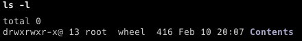

tags:: macOS, #常见问题

- ---
- ## Operation not permitted
	- 参考:  [mac shell 脚本执行报错 Operation not permitted](https://segmentfault.com/a/1190000039919416)
	- 执行 `ls -l` 会发现权限后面带了一个 `@` 。
	- 
	- 从互联网上下载来的文件，会被 macOS 打上 com.apple.quarantine 标志，从而隔离文件。
	- 需要执行如下命令去除。
	- ```zsh
	  sudo xattr -r -d com.apple.quarantine yourdir
	  ```
	- 但又出现如下错误: `xattr: [Errno 1] Operation not permitted`
	- 参考 [求助：Mac升级系统后, 某些文件夹执行脚本operation not permitted如何解决？](https://www.zhihu.com/question/518545517) 可知：
		- 需关闭 macOS 的 SIP ( System Integrity Protection ）
	-
- ## 安装软件时提示文件损坏
	- 执行如下命令
		- ``` zsh
		  # 可以从 /Applications 目录中，将软件拖到 Ternimal 中，会粘贴一个软件的路径
		  sudo xattr -r -d com.apple.quarantine /Applications/APP的名称.app
		  ```
	-
	-
-