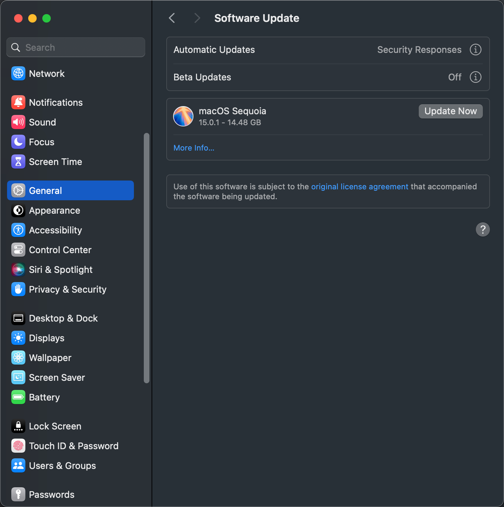
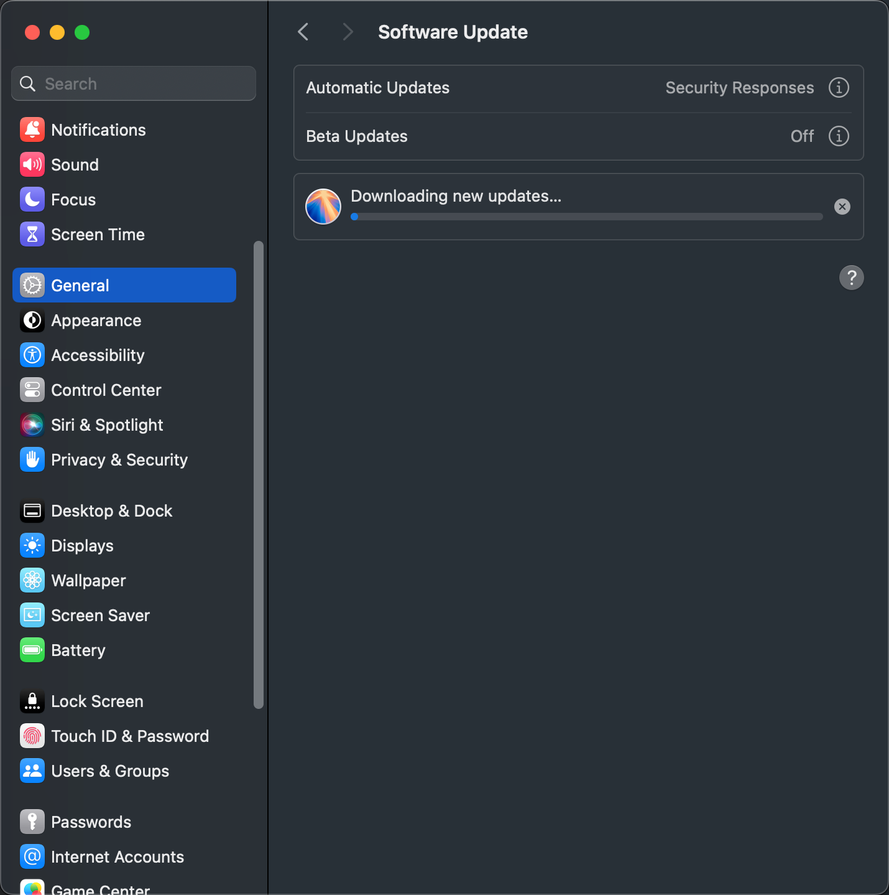
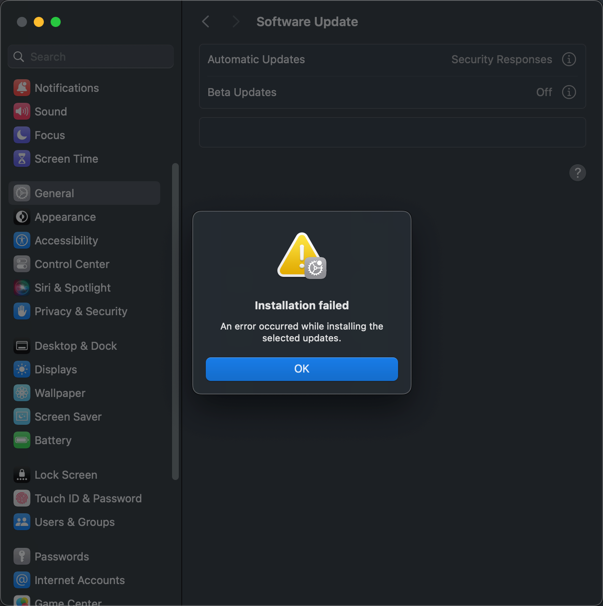
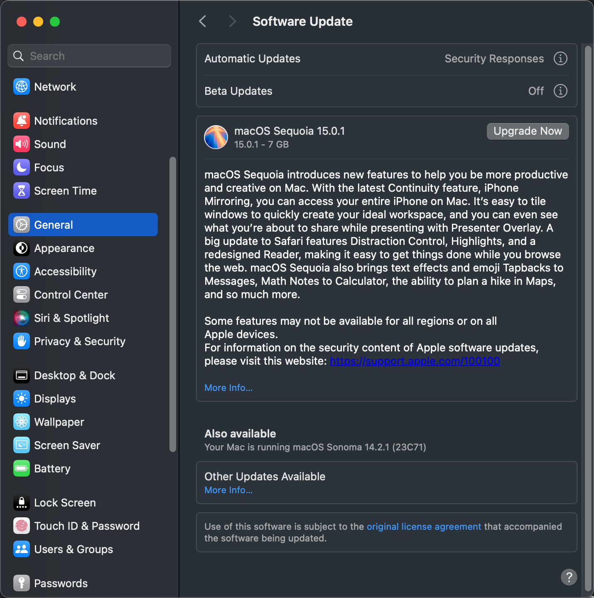
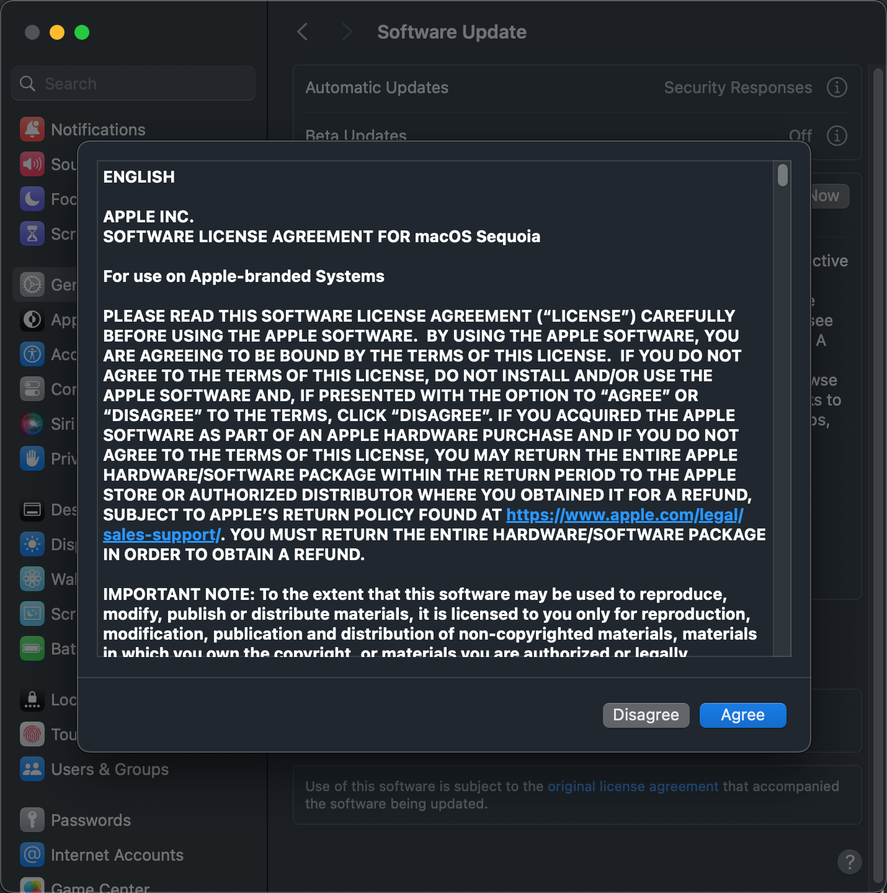
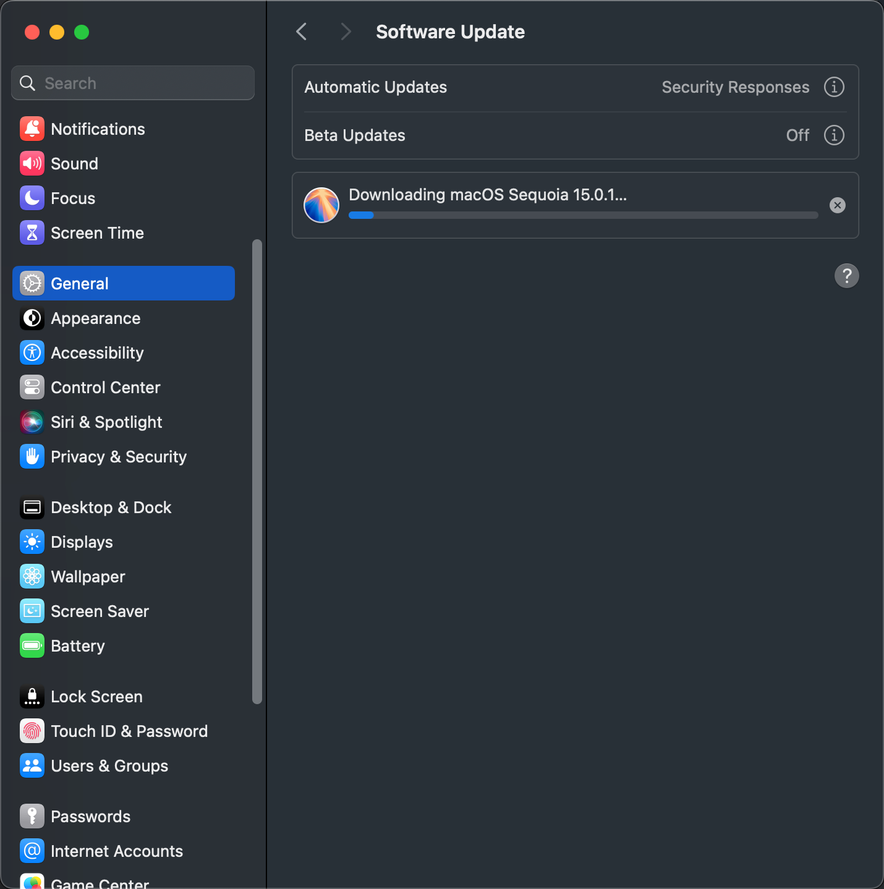
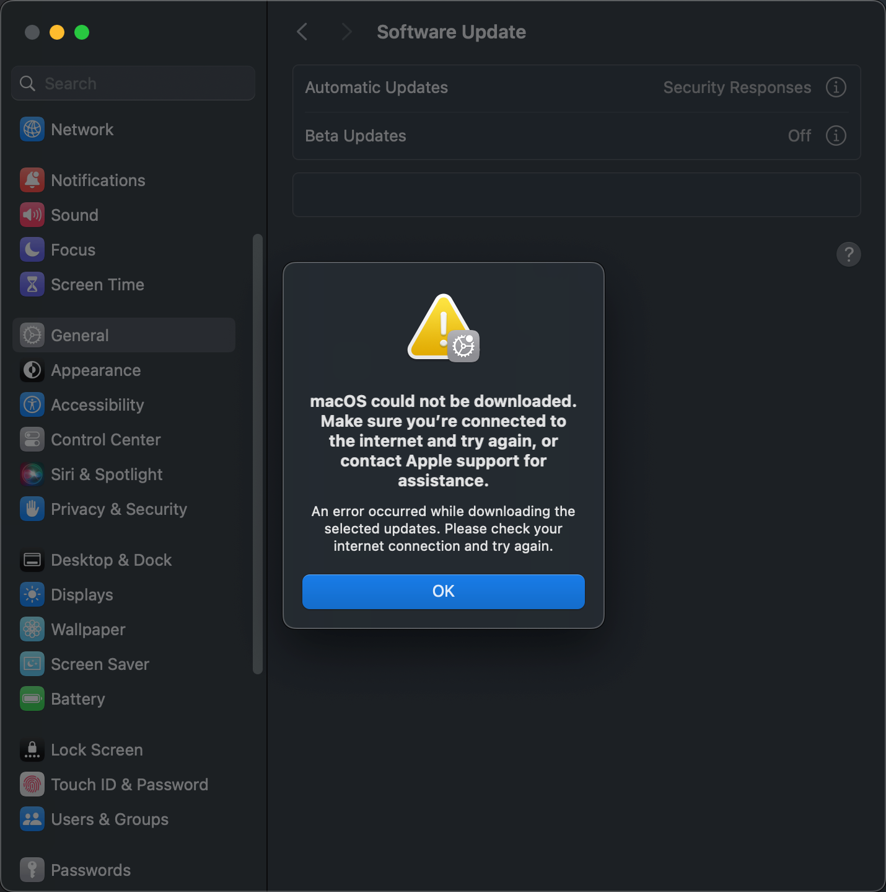
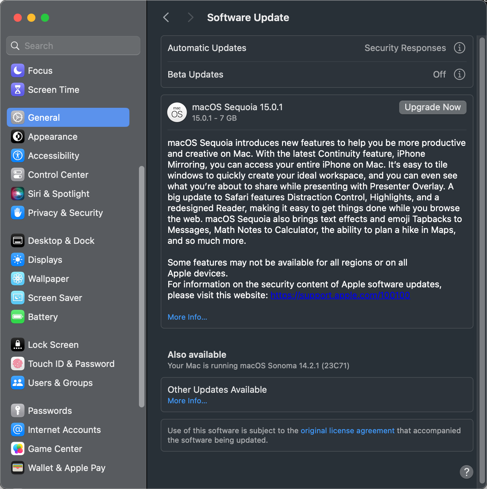
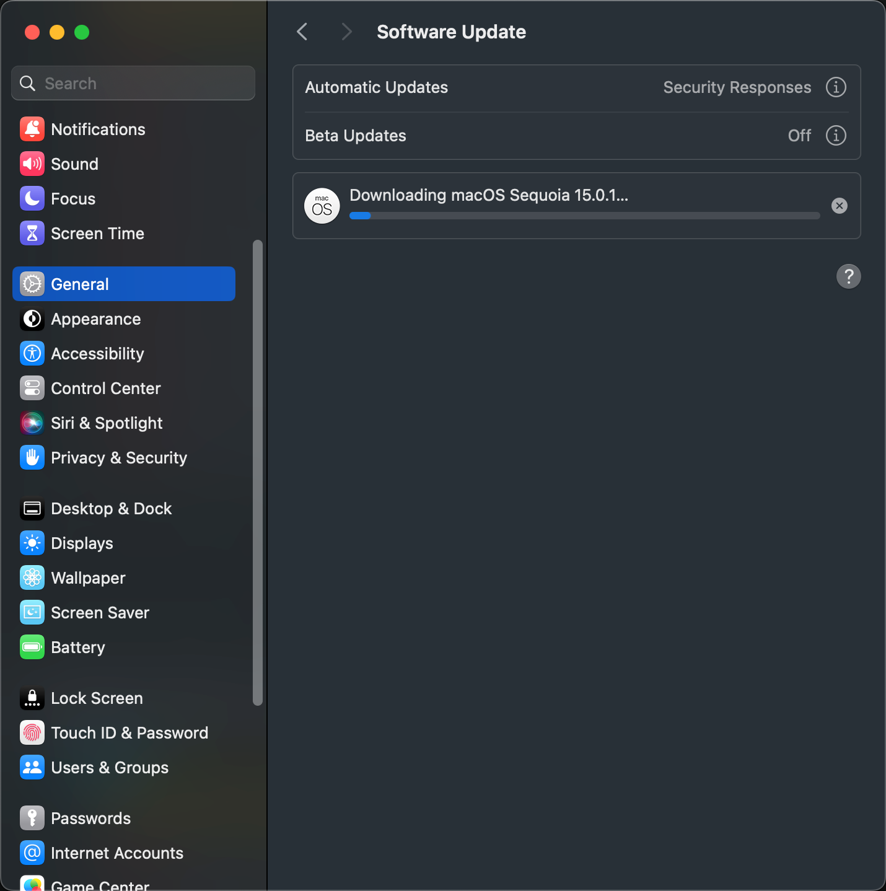
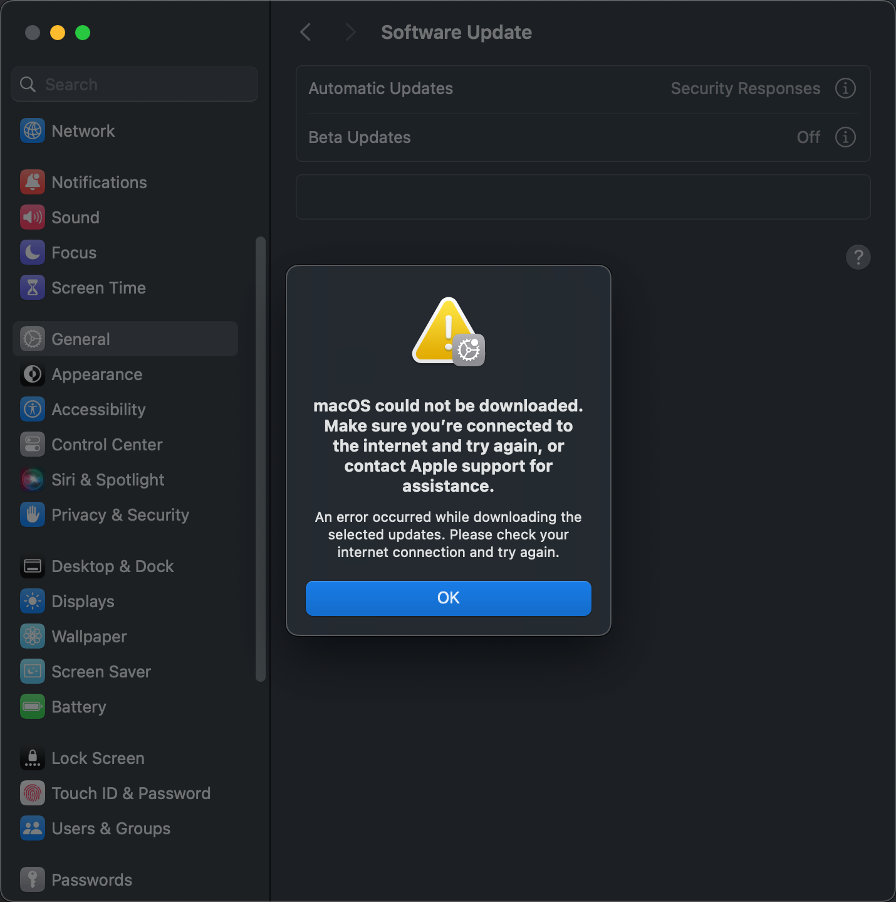

tags:: [[macOS]]
---

- ## 第一次安装
	- ### 1. 初始界面
		- 
	- ### 2. 点击 **Update Now** 的下载界面 (未出现协议弹框)
		- 
	- ### 3. 安装失败的弹框
		- ```sh
		  Installation failed
		  An error occurred while installing the selected updates.
		  ```
		- 
	- ### 4. 失败后界面
		- 与第一次安装前比较，图标不变，文件尺寸变小
		- 
		  id:: 6a01d5bc-040d-46ea-a931-5dfc1e80a373
- ## 第二次安装
	- ### 1. 点击第一次安装失败后的 Upgrade Now ，弹出协议框
		- 
	- ### 2. 点击 Agree 后的下载界面
		- 
	- ### 3. 安装失败的弹框
		- ```sh
		  macOS could not be downloaded. Make sure you’re connected to the internet and try again, or contact Apple support for assistance.
		  An error occurred while downloading the selected updates. Please check your internet connection and try again.
		  ```
		- 
	- ### 4. 失败后界面
		- 与第一次安装前比较，图标改变，文件尺寸变小
		- 
- ## 第三次安装
	- ### 1. 点击第二次安装失败后的 Upgrade Now ，弹出协议框
		- 
	- ### 3. 点击 Agree 后的下载界面
		- 
	- ### 4. 安装失败的弹框
		- ```sh
		  macOS could not be downloaded. Make sure you’re connected to the internet and try again, or contact Apple support for assistance.
		  An error occurred while downloading the selected updates. Please check your internet connection and try again.
		  ```
		- 
	- ### 5. 失败后界面与第二次安装失败后的界面一致
		- 后面继续点击 **Upgrade Now** 一直都是安装失败，并且一直都是这个界面
- ## 安装失败后恢复到第一次安装前的状态
	- 执行 `sudo softwareupdate -l` (列出当前可以更新的软件列表)
- ## 解决方案
	- 参考: [If an error occurred while updating or installing macOS](https://support.apple.com/en-us/102531)