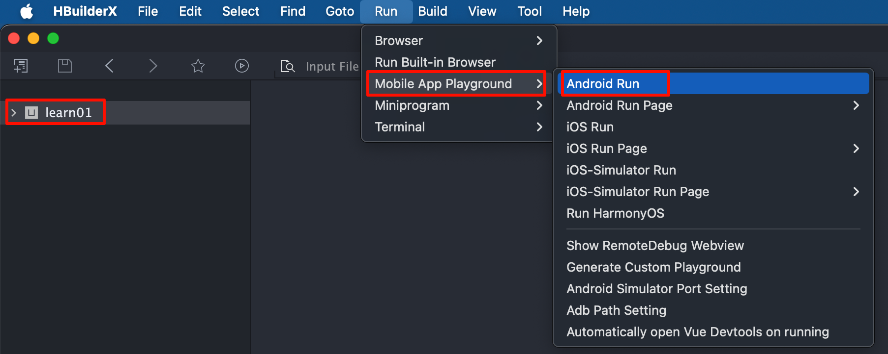
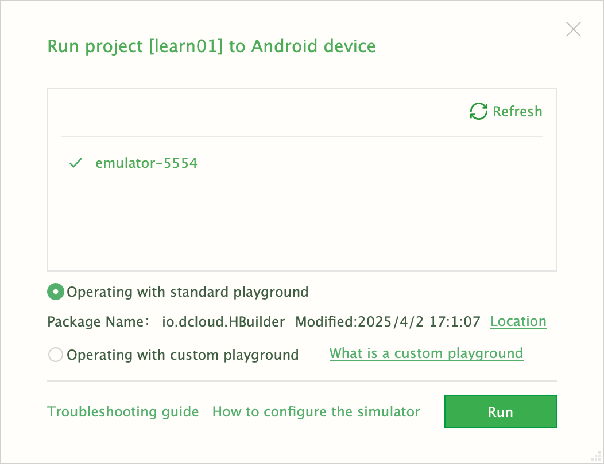
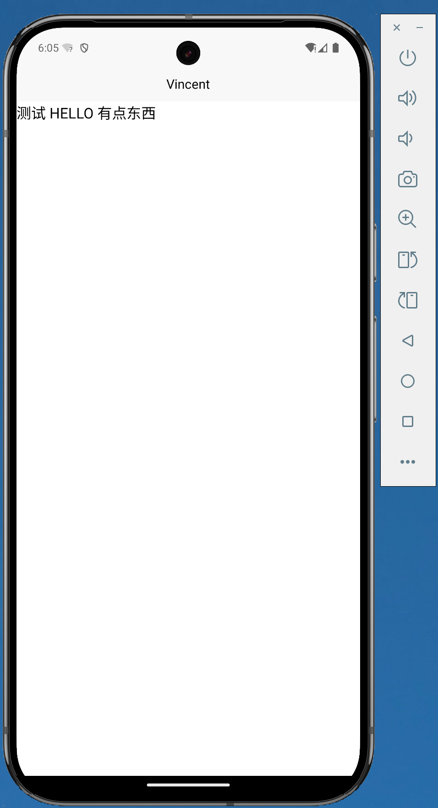

tags:: [[uni-app]], [[Simulator]] 
---

- ## 使用 Android Studio 安装模拟器 (推荐)
	- 参见: [[Android Studio 安装 SDK 与模拟器]]
- ## 使用第三方软件安装模拟器 (不推荐)
	- 如 [夜神模拟器](https://www.yeshen.com/) , [雷电模拟器](https://www.ldmnq.com/)
- ## 在 Android 模拟器上运行
	- 在 HBuilderX 中, 先选中要运行的项目.
	  logseq.order-list-type:: number
	- 然后点击 Run > Mobile App Playground > Android Run .
	  logseq.order-list-type:: number
		- 
	- 可以选择要运行的 Android 模拟器 (貌似需要先将模拟器启动, 比如在 Android Studio 的 `Virtual Device Manager` 界面启动模拟器) .
	  logseq.order-list-type:: number
		- {:height 377, :width 524}
	- 运行效果如下图所示.
	  logseq.order-list-type:: number
		- {:height 327, :width 458}
- ## 参考
	- [安装模拟器](https://uniapp.dcloud.net.cn/tutorial/run/installSimulator.html)
	  logseq.order-list-type:: number