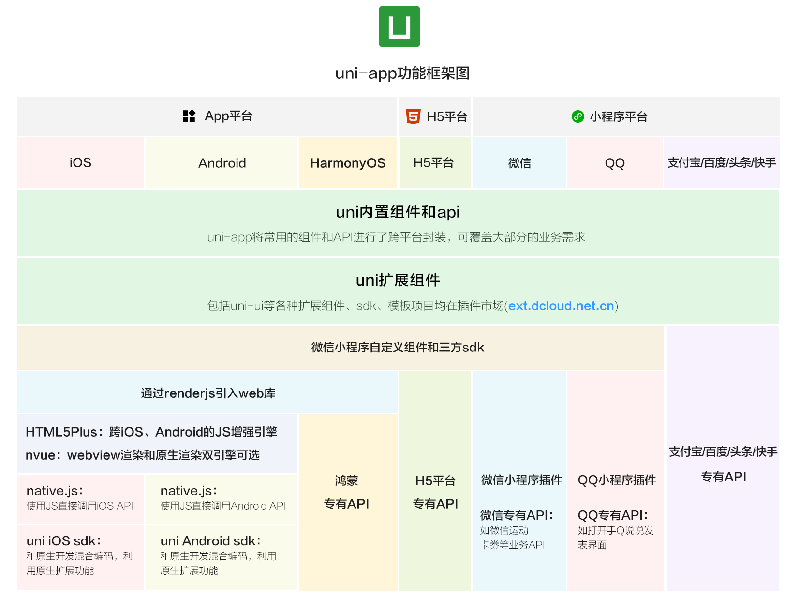

tags:: [[uni-app]]
---

- ## uni-app 是啥
	- `uni-app` 是一个使用 `Vue.js` 开发 **所有前端应用** 的框架。
	- 编写一套代码，可发布到如下多个平台：
		- iOS
		- Android
		- Web（响应式）
		- 各种小程序（微信/支付宝/百度/头条/飞书/QQ/快手/钉钉/淘宝）
		- 快应用
		- ......
- ## uni-app 功能框架
	- 
	- 图片来源: [什么是 uni-app](https://uniapp.dcloud.net.cn/#%E4%B8%BA%E4%BB%80%E4%B9%88%E8%A6%81%E9%80%89%E6%8B%A9uni-app)
- ## uni-app 的由来
	- 参考: [uni-app 的由来](https://uniapp.dcloud.net.cn/history.html)
	- 其实, 第一个推出小程序的并非 **微信** , 而是 DCloud .
		- 2012 年, DCloud 开始研发小程序技术.
		- 2015 年, DCloud 的小程序技术正式商用, 起名为 “流应用” .
		- 后面, DCloud 将技术标准捐献给工信部旗下的 [HTML5中国产业联盟](https://www.html5plus.org/) , 并推动行业内公司开展小程序业务.
		- 随后, 360 手机助手, 大众点评, 携程, 京东, 有道词典, 唯品会等众多开发者, 开始为流应用平台提供应用.
		- 2015 年 9 月, DCloud 推动 **微信** 团队开展小程序业务.
		- 2016 年初, **微信** 决定上线小程序业务，但其没有接入联盟标准，而是 **订制了自己的标准** .
	- DCloud 持续在业内普及小程序理念, 推进各大流量巨头, 包括手机厂商, 陆续上线类似小程序/快应用的业务.
		- 但, 只有部分公司接入了联盟标准, 更多公司是制定了自己的标准 .
	- 于是, DCloud 开发了 uni-app , 为开发者抹平各个标准的差异.
		- `uni` , 读作 `you ni` , 就是统一的意思。
- ## 参考
	- [什么是 uni-app](https://uniapp.dcloud.net.cn/#%E4%B8%BA%E4%BB%80%E4%B9%88%E8%A6%81%E9%80%89%E6%8B%A9uni-app)
	  logseq.order-list-type:: number
	- logseq.order-list-type:: number