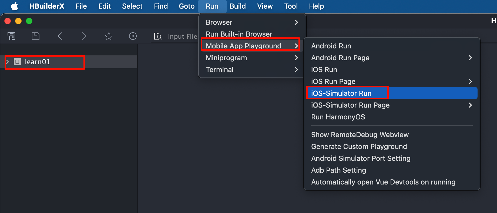
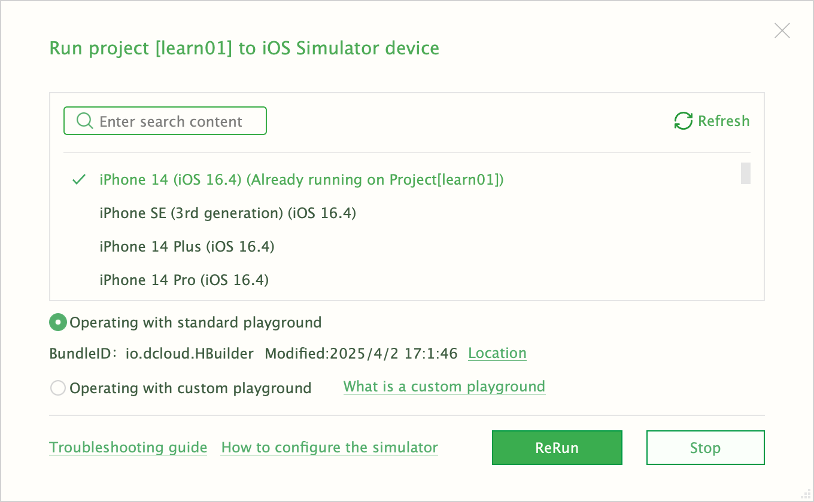
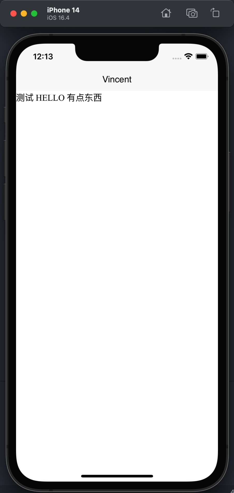

tags:: [[uni-app]], [[Simulator]] 
---

- ==注意: iOS 模拟器只能安装在 macOS 上, 不能安装在 Windows 上==
- ## 安装 iOS 模拟器
	- 参见 [[Xcode 安装与配置]] 安装 Xcode.
	  logseq.order-list-type:: number
	- 参见 [[Xcode 安装模拟器]] 安装 iOS 模拟器.
	  logseq.order-list-type:: number
- ## 在 iOS 模拟器上运行
	- 在 HBuilderX 中, 先选中要运行的项目.
	  logseq.order-list-type:: number
	- 然后点击 Run > Mobile App Playground > iOS-Simulator Run .
	  logseq.order-list-type:: number
		- {:height 533, :width 1220}
	- 选择 iOS 模拟器版本 (也可以选择不同机型, 包括 iPhone 和 iPad 的多个版本) .
	  logseq.order-list-type:: number
		- {:height 401, :width 620}
	- 运行效果如下图所示.
	  logseq.order-list-type:: number
		- {:height 611, :width 258}
- ## iOS 模拟器功能限制
	- iOS 模拟器 和 真机 使用不同的 CPU 架构, 所以部分模块依赖的 SDK 无法在模拟器上运行.
	- 比如:
		- 讯飞语音识别 (推荐 百度语音识别模块)
		  logseq.order-list-type:: number
		- 基于 又拍云推流 SDK 的 直播推流（live-pusher）
		  logseq.order-list-type:: number
	- 所以, 这些受限制的功能可能需要到真机上测试.
- ## 参考
	- [安装模拟器](https://uniapp.dcloud.net.cn/tutorial/run/installSimulator.html)
	  logseq.order-list-type:: number
-