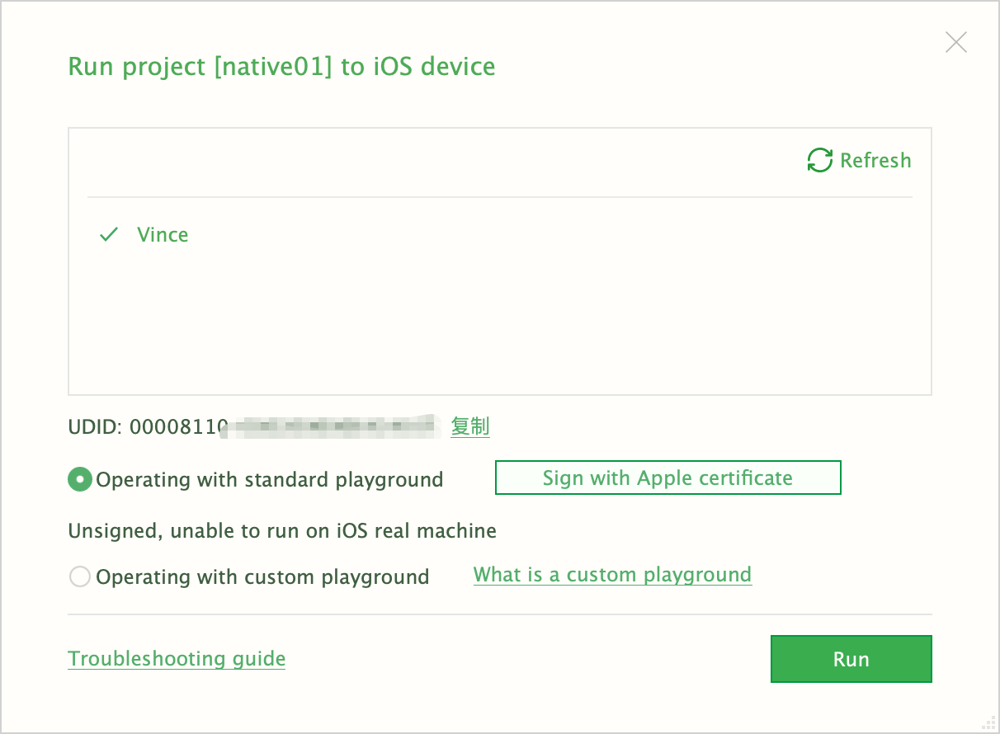
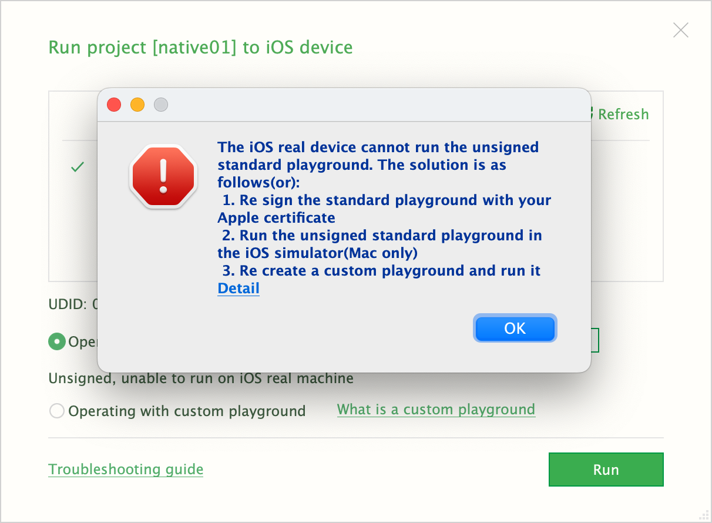
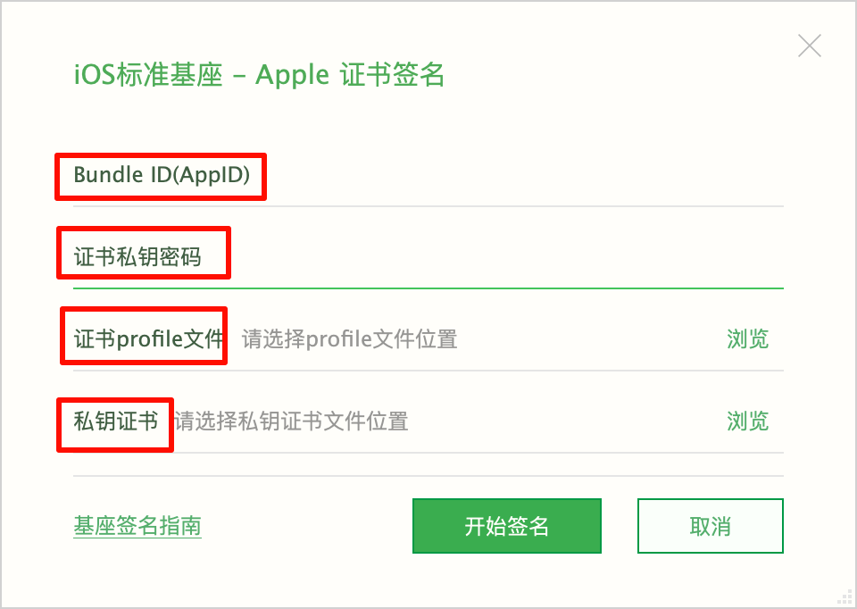

tags:: [[uni-app]]
---

- ## 未签名无法在真机运行
	- 将 iOS 设备通过数据线连接到 Mac 上.
	  logseq.order-list-type:: number
	- HbuilderX 点击 Run > Moblie App Playground > iOS Run , 可以看到我们连接到 Mac 上的设备.
	  logseq.order-list-type:: number
		- {:height 393, :width 512}
	- 选择我们的设备, 发现会有如下弹框.
	  logseq.order-list-type:: number
		- {:height 547, :width 471}
		- 这里就是需要我们上传 Apple 证书.
- ## 使用 Apple 证书签名
	- 参见: [[Apple Developer 证书相关]] , 参考: [iOS证书(.p12)和描述文件(.mobileprovision)申请](https://ask.dcloud.net.cn/article/152)
	- Apple 证书签名, 需要如下四项内容:
		- {:height 527, :width 562}
	- 创建证书相关文件的大致步骤如下:
		- Apple Developer Account 创建一个 App ID (即 ==Bundle ID== ) .
		  logseq.order-list-type:: number
		- Apple Developer Account  注册一个 iOS 设备.
		  logseq.order-list-type:: number
		- Keychain 创建一个 `.certSigningRequest` 文件.
		  logseq.order-list-type:: number
		  id:: 67f0f7ca-85b8-410f-a91e-239b58d7c418
		- Apple Developer Account 创建一个 `Development` 类型的 Certificate , 下载安装到本地.
		  logseq.order-list-type:: number
		- Keychain 导出 `Development` 类型的 Certificate 为 `.p12` 文件  (即 ==私钥证书== ) , 导出时需要填写密码 (即 ==证书私钥密码== ) .
		  logseq.order-list-type:: number
		- Apple Developer Account  创建 `Development` 类型的 Provisioning Profile (即 ==证书 profile 文件== ) .
		  logseq.order-list-type:: number
		- Apple Developer Account 创建一个 `Distribution` 类型的 Certificate , 下载安装到本地.
		  logseq.order-list-type:: number
		- Keychain 导出 `Distribution` 类型的 Certificate 为 `.p12` 文件  (即 ==私钥证书== ) , 导出时需要填写密码 (即 ==证书私钥密码== ) .
		  logseq.order-list-type:: number
		- Apple Developer Account  创建 `Distribution` 类型的 Provisioning Profile (即 ==证书 profile 文件== ) .
		  logseq.order-list-type:: number
	- `Development` 类型的相关文件, 仅用于 开发阶段, 可以用于直接将 App 安装到手机上, 但是不能用于将 App 发布到 App Store .
	- `Distribution` 类型的相关文件, 仅用于 发布阶段, 仅用于将 App 发布到 App Store , 不能用于将 App 直接安装到手机上.
- ## iOS 真机运行限制
	- 并非所有 iOS 版本的真机都能直接运行.
	- 执行 `ls -lh  /Applications/Xcode.app/Contents/Developer/Platforms/iPhoneOS.platform/DeviceSupport` 查看支持的 iOS 版本.
- ## 参考
	- [uni-app - App 平台: 真机运行](https://uniapp.dcloud.net.cn/tutorial/run/run-app.html#ios_device)
	  logseq.order-list-type:: number
-