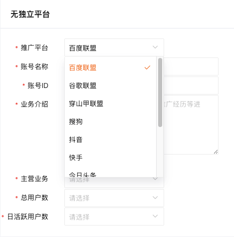

tags:: [[Cost per sale]]
---

- ## CPS 平台
	- 提供 CPS 推广获利能力的平台.
	- 比如 [[美团联盟]] , [[多多进宝]] , [[京东联盟]] 等.
- ## 物料
	- 即, CPS 平台上, 需要被推广的对象.
	- 常见的有:
		- 商品
		  logseq.order-list-type:: number
		- 优惠券
		  logseq.order-list-type:: number
		- 活动 (包含一系列参与活动的 `商品` 或 `优惠券`)
		  logseq.order-list-type:: number
- ## 推广者
	- 即, 通过帮 `CPS 平台` 推广 `物料` 而获利的人.
- ## 媒体
	- ### 什么是媒体
		- 即, 推广 `物料` 的地方.
	- ### 媒体种类
		- 自有平台 (包括 网站, APP 等 `推广者` 自己开发的平台)
		  logseq.order-list-type:: number
		- 第三方平台
		  logseq.order-list-type:: number
			- 社交平台: 微信, QQ, 贴吧等个人账号.
			- 内容平台: 抖音, 微博, 知乎等自媒体大 V 账号.
		- 无独立平台
		  logseq.order-list-type:: number
			- 百度联盟, 谷歌联盟等 (==其实没太明白与第三方平台的区别==)
			- {:height 372, :width 359}
			- ==截图来自美团联盟后台==
- ## 推广位
	- 用于区分在 `媒体` 上不同地方做的推广, 便于后续做效果追踪.
- ## 推广者, 媒体与推广位
	- 一个 `推广者` , 可以注册多个 `媒体` .
	- 一个 `推广位` , 需要绑定一个指定的 `媒体` .
	- 一个 `媒体` 下, 可以绑定多个 `推广位` .
- ## 推广链接
	- 即 **推广者** 用于推广 **物料** 的链接.
	- 该链接通常通过 `CPS 平台`  提供的 **生成推广链接的 API** 来生成:
		- 为了让 `CPS 平台` 知道是哪个 `推广位` 带来的客户, 通常需要传入:  `媒体 id` 和 `推广位 id` .
		- 为了让 `推广者` 追踪是哪些客户通过他的 `推广链接` 进行了消费, 通常还需要传入指定 `媒体` 上的 `用户 id` .
-