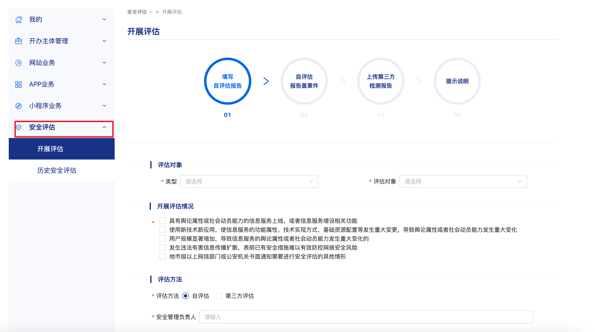

## 域名备案
	- 购买域名不使用的话，可以不用备案。
	- 备案是发生在你的域名要绑定大陆 IP 时，如果不进行备案，将无法成功绑定（绑定服务由各大厂商提供）。
	- 备案时，需要提供域名的实名信息；由于你无法提供境外购买域名的实名信息，所以境外的域名无法在大陆备案（除非通过企业途径）。
	- 由上可知，如果你绑定的 IP 不是大陆的 IP (需要在大陆以外的厂商那里绑定)，将不需要备案。
	- ### 不同情况
		- 大陆域名(需实名认证) + 大陆服务器 => 备案
		- 大陆域名(需实名认证) + 境外服务器 => 免备案
		- 境外域名(免实名认证) + 大陆服务器 => 备案 (需先将域名转入大陆域名服务商, 转入后在新的服务商续费)
		- 境外域名(免实名认证) + 境外服务器 => 免备案
	- ### ICP 备案
		- 在各大运营商平台操作。
	- ### 公安备案
		- 做了 ICP 备案 之后，在网站开通的一个月内，在公安部的平台操作。
			- 如有评论功能，还需做安全评估 (深圳市网安支队在我电话咨询时说的，2024-07-18)。
			- {:height 188, :width 603}
		- 参考: [阿里云 - 公安联网备案信息填写指南](https://help.aliyun.com/zh/icp-filing/basic-icp-service/user-guide/the-public-security-network-for-the-record-information-fill-in-the-guide)
	- ### 法律依据
		- [《非经营性互联网信息服务备案管理办法》](https://www.gov.cn/gongbao/content/2005/content_93018.htm)
-