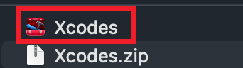
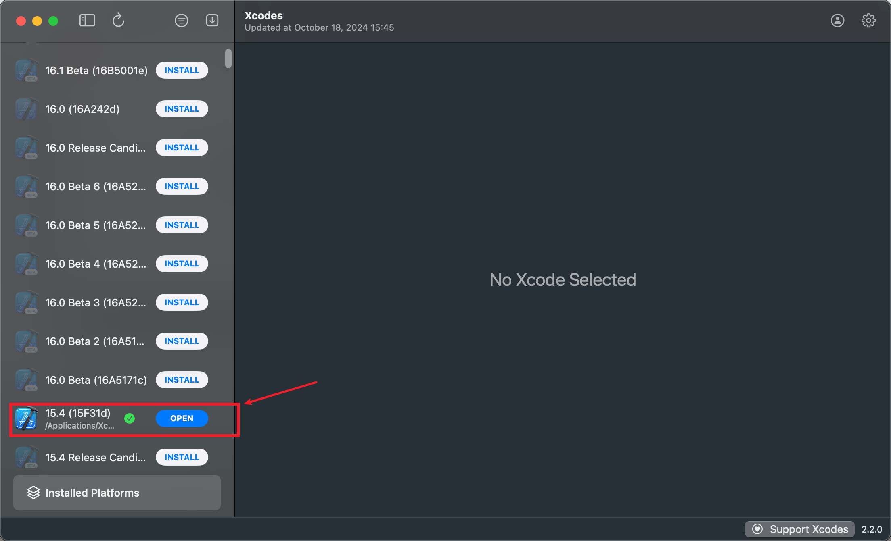
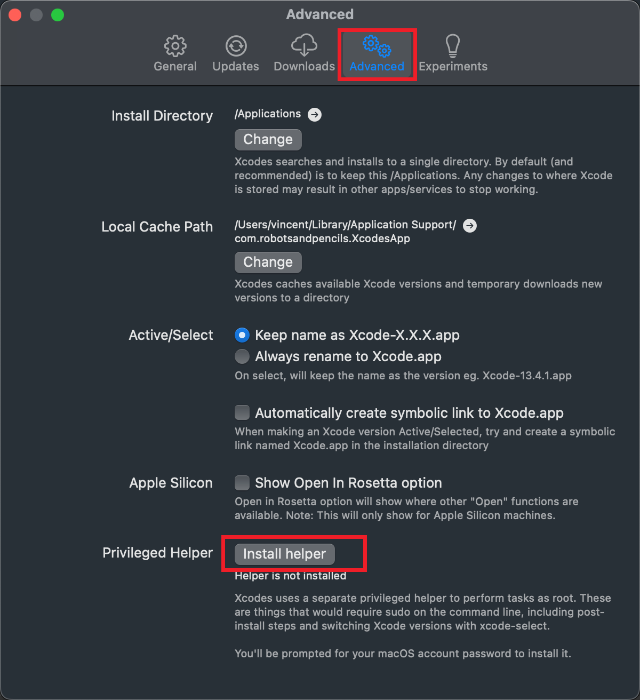
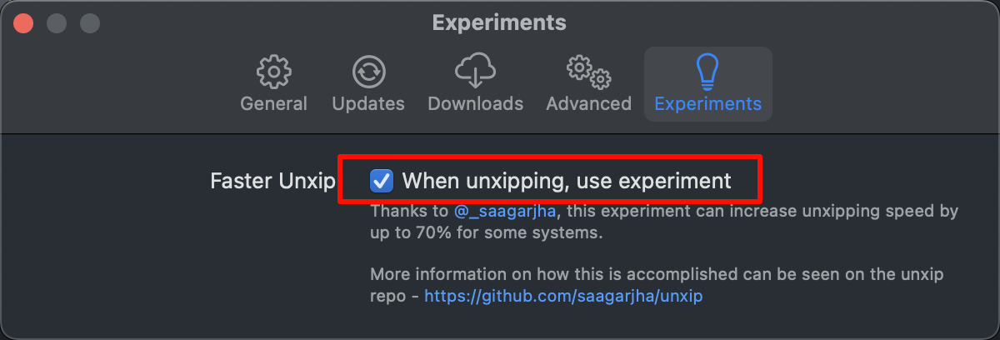

tags:: [[Xcodes]], [[Xcode]]
---

- ## 使用 Xcodes 安装 Xcode
	- [Xcodes Github Repo](https://github.com/XcodesOrg/XcodesApp) > [Xcodes Releases](https://github.com/XcodesOrg/XcodesApp/releases) > 下载最新版本的 .zip 安装包
	  logseq.order-list-type:: number
		- 
	- 安装包解压后得到如下 APP , 将它拖到 Applications 目录中即可.
	  logseq.order-list-type:: number
		- 
	- 打开 Xcodes 后, 我们可以看到左侧有各种版本的 Xcode 供我们安装 (我在 App Store 安装的 Xcode 它也能识别).
	  logseq.order-list-type:: number
		- 
	- 进入 Settings 界面 > 点击 General > 登录开发者账号
	  logseq.order-list-type:: number
		- 安装时会要求登录开发者账号.
	- 进入 Settings 界面 > 点击 Advanced > 点击 Install helper
	  logseq.order-list-type:: number
		- 安装 helper 以保证 Xcodes 可以正常运行。
		- {:height 656, :width 593}
	- 进入 Settings 界面 > 点击 Experiments , 建议勾选 Faster Unxip , 以加快解压缩速度.
	  logseq.order-list-type:: number
		- {:height 309, :width 577}
- ---
- ## 参考
	- [ChaoCode - [準備好你的 Xcode：使用 Xcodes 安裝 ＆ 手機測試環境設定]](https://www.youtube.com/watch?v=e6wF5UTcxkU&t=836s)
	  logseq.order-list-type:: number
	- logseq.order-list-type:: number