tags:: [[Raspberry Pi]]
---

- ## 事先准备
	- 一张 microSD.
	  logseq.order-list-type:: number
	- 一个 microSD 读卡器.
	  logseq.order-list-type:: number
	- 一台电脑, 事先访问 [Software](https://www.raspberrypi.com/software/) , 安装好烧录工具: Raspberry Pi Imager
	  logseq.order-list-type:: number
		- 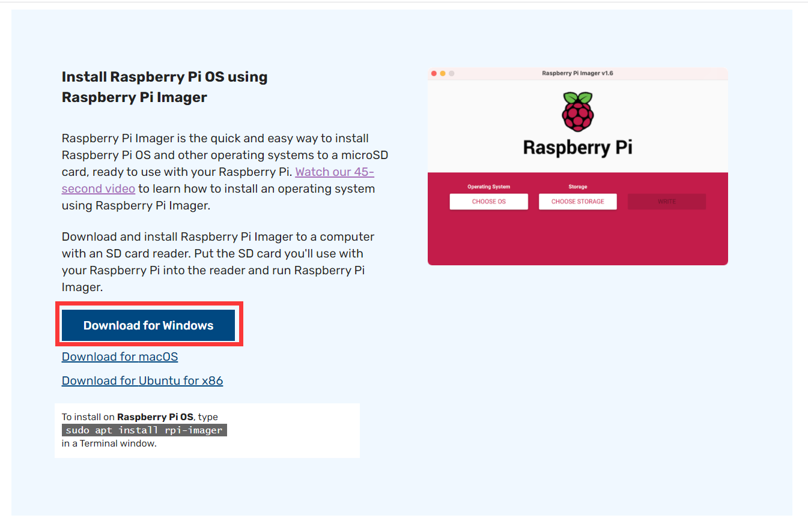{:height 417, :width 523}
- ## 安装步骤
	- ### 1. 插入 microSD
		- 将 microSD 卡插入读卡器, 将读卡器插到自己的电脑上.
			- 如果 microSD 不是新的, 建议先格式化 (参考: [[SD Card 格式化]] ).
	- ### 2. Raspberry Pi Imager 选择通用选项
		- 电脑打开 Raspberry Pi Imager .
			- 选择设备型号.
			  logseq.order-list-type:: number
				- 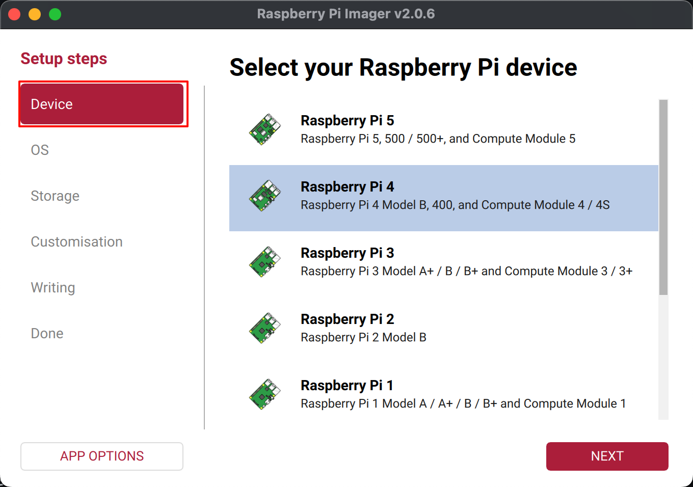{:height 417, :width 587}
			- 选择系统.
			  logseq.order-list-type:: number
				- 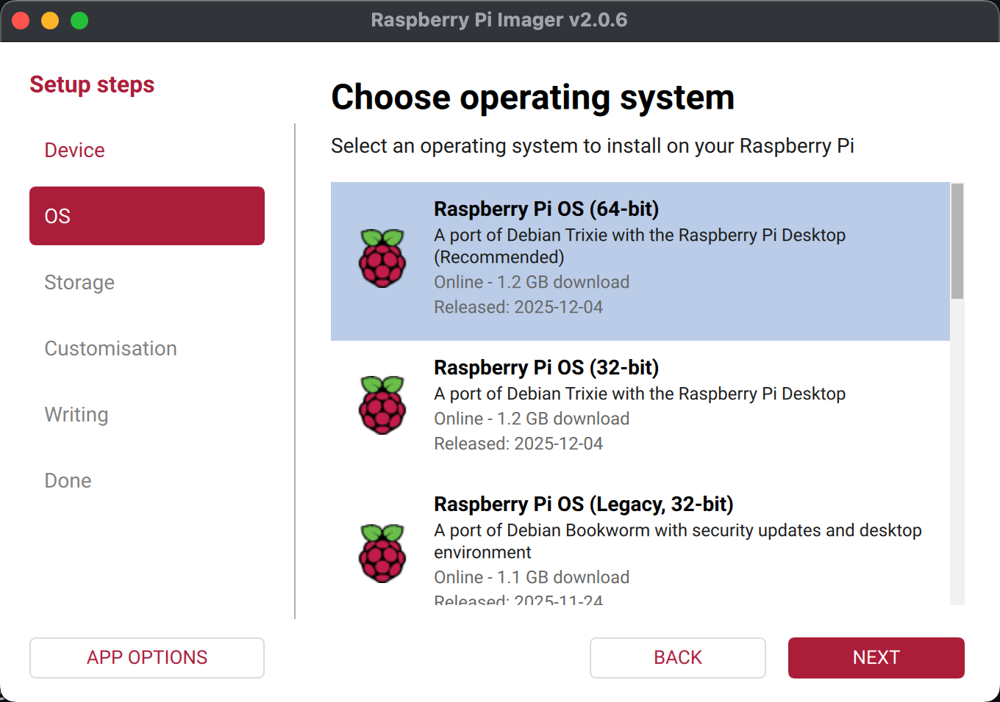{:height 421, :width 587}
			- 选择存储设备.
			  logseq.order-list-type:: number
				- 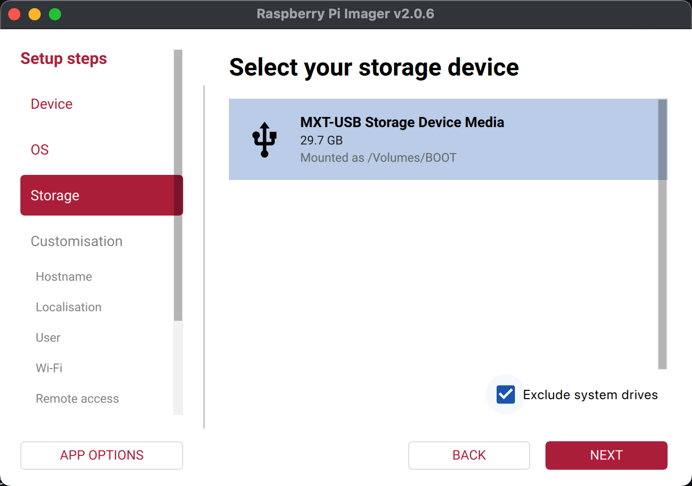{:height 417, :width 587}
	- ### 3. Raspberry Pi Imager 进行个性化配置
		- ==这些信息如果在 Raspberry Pi Imager 中不配置, 首次启动系统时, 将需要我们配置==
		- #### 配置 hostname (用于网络中区分设备)
			- 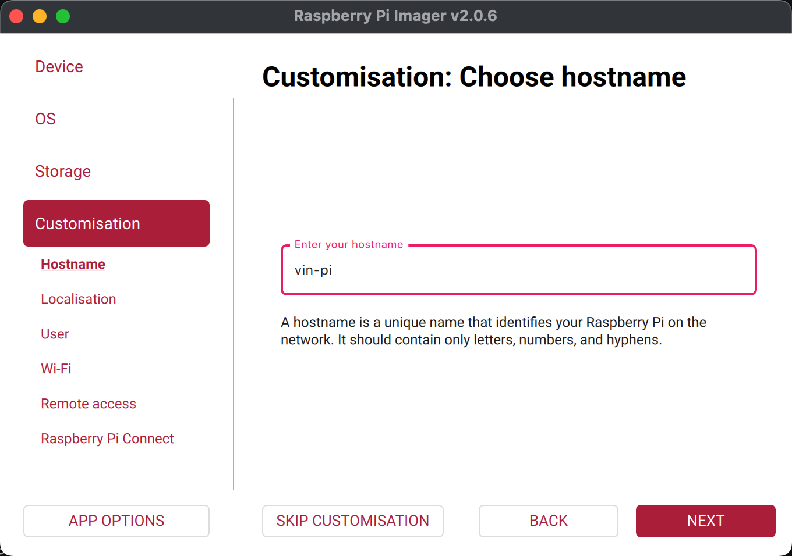{:height 417, :width 587}
			- 树莓派会通过 [[mDNS]] 将 `hostname` 广播到它接入的网络.
			- 网络上的其他设备可以通过 `<hostname>.local` 或 `<hostname>.lan` 访问树莓派.
		- #### 配置 Localisation .
			- Capital city: `Beijing`
			- Time zone: `Asia/Shanghai`
			- Keyboard layout: `cn`
			- 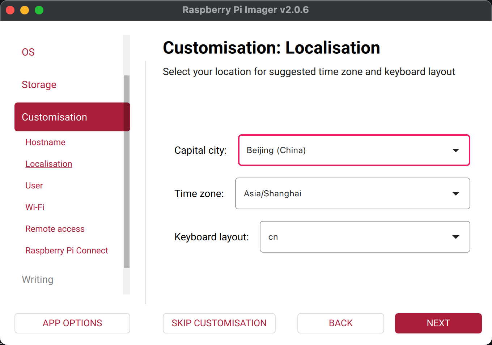{:height 417, :width 587}
		- #### 配置 User .
			- 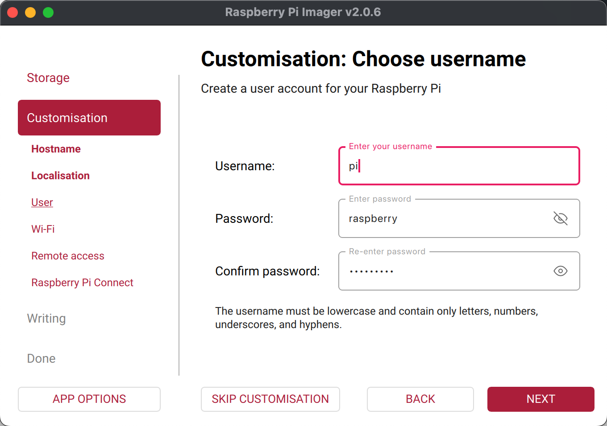{:height 417, :width 587}
			- 为了安全, 最好不要使用默认账号  `pi` , 和默认密码 `raspberry` .
		- #### 配置 Wi-Fi .
			- 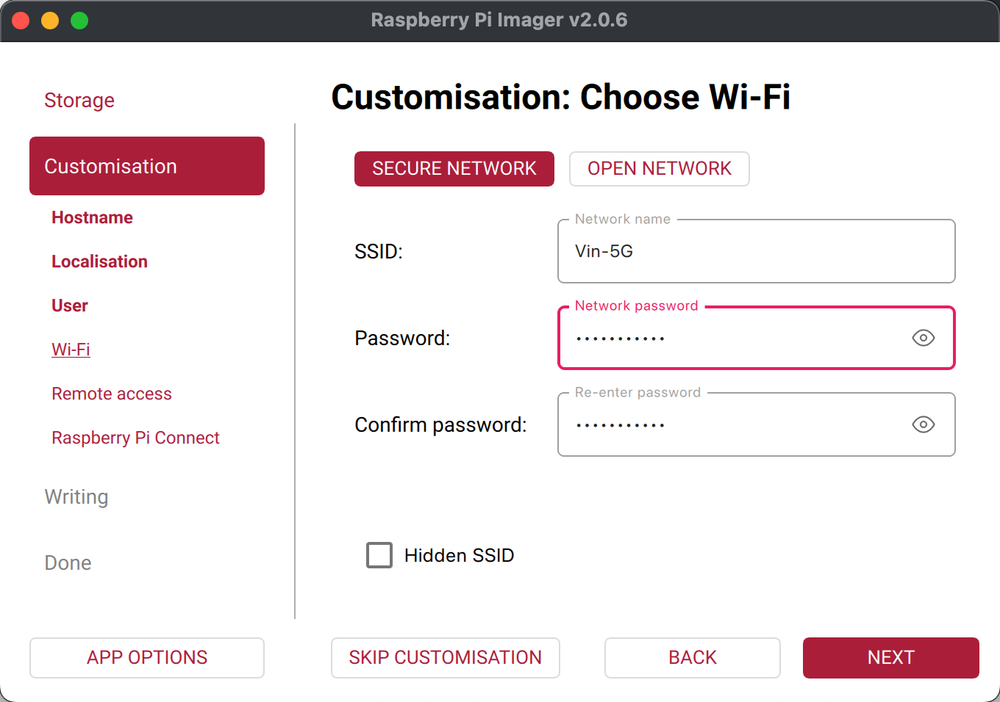{:height 417, :width 587}
			- 如果不连 Wi-Fi, 则不编辑.
			  logseq.order-list-type:: number
			- 如果连 Wi-Fi, 则:
			  logseq.order-list-type:: number
				- 有密码, 则选 `SECURE NETWORK` ; 无密码, 则选 `OPEN NETWORK` .
				- 如果网络不公开广播 `SSID` , 则勾选 `Hidden SSID` .
		- #### 配置 Remote access (SSH) .
			- 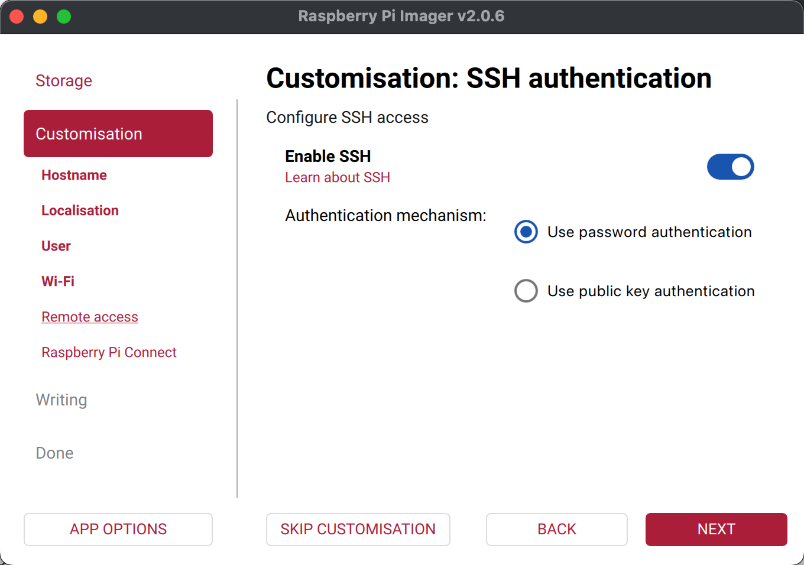{:height 417, :width 587}
		- #### 配置 [[Raspberry Pi Connect]] (用于 Web 端连接树莓派)
			- 勾选 `Enable Raspberry Pi Connect`
			  logseq.order-list-type:: number
			- 勾选后, 会自动在浏览器打开 Raspberry Pi Connect 网站, 需要登录 **Raspberry Pi ID** .
			  logseq.order-list-type:: number
			- 浏览器点击 `Create auth key and launch Raspberry Pi Imager` .
			  logseq.order-list-type:: number
				- 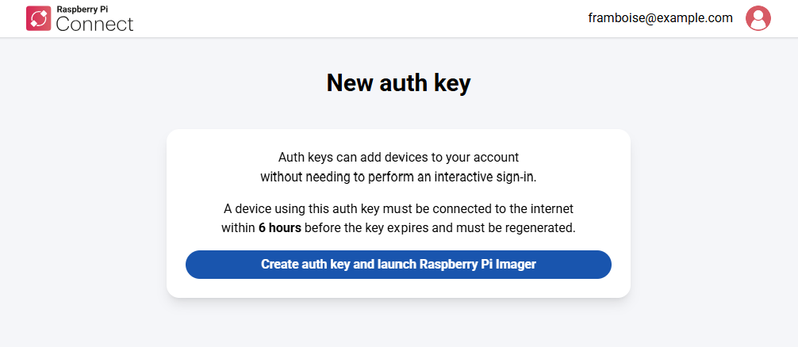{:height 290, :width 562}
			- 浏览器打开 `Raspberry Pi Imager` , 并自动回填 `Authentication token` (如果没有回填, 则手动粘贴) .
			  logseq.order-list-type:: number
				- 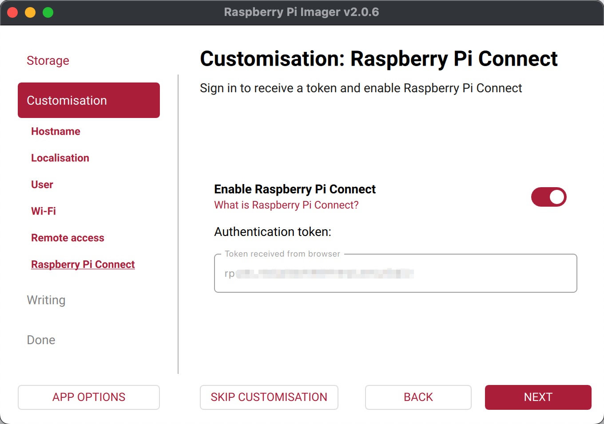{:height 417, :width 587}
				- 每个 `Authentication token` 只有 6 个小时有效期, 过期了需要重新生成.
	- ### 4. Raspberry Pi Imager 写入
		- 确保电脑代理已开启 (开增强模式) .
		  logseq.order-list-type:: number
		- 点击 `WRITE` .
		  logseq.order-list-type:: number
			- 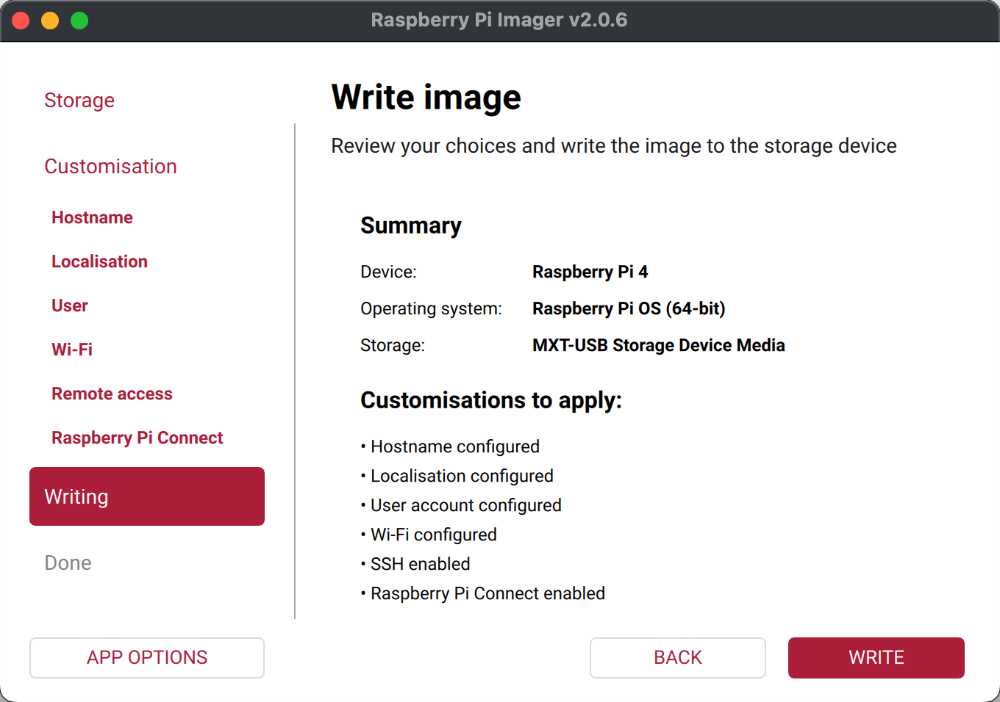{:height 417, :width 587}
		- Writing 完成后, 等待 Verifying 完成.
		  logseq.order-list-type:: number
		- 点击 `FININSH` .
		  logseq.order-list-type:: number
- ## 参考
	- [Getting Started](https://www.raspberrypi.com/documentation/computers/getting-started.html)
	  logseq.order-list-type:: number
-