tags:: [[树莓派]]
---

- ## SD卡格式化
	- 所谓格式化，即将存储设备的数据清除。
	- 参考: https://blog.csdn.net/peng_YuJun/article/details/122618492
	- 以下以SanDisk举例
	- ### 使用 SD Memory Card Formatter 格式化
		- 官网: https://www.sdcard.org/
		- 1. 下载 SD Memory Card Formatter 。
			- 
		- 2. 解压、无脑安装
		- 3. 打开工具，将SD卡插入读卡器，将读卡器接入电脑。
		- 4. 插入读卡器后，电脑显示增加了两个磁盘
			- 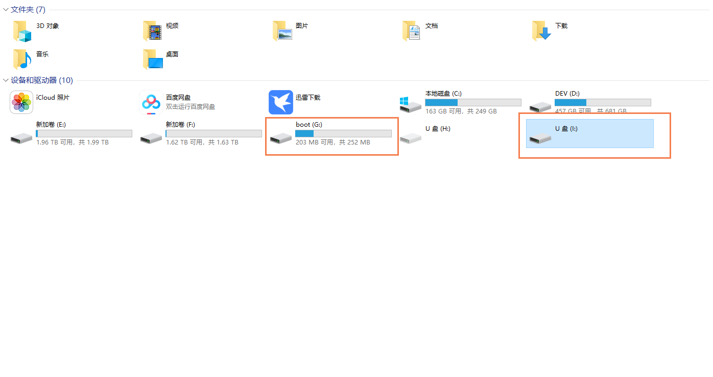{:height 373, :width 687}
		- 5. 选择boot盘，并选择 Quick format (Overwrite format 清除更彻底，但比较耗时)，点击Format。
			- 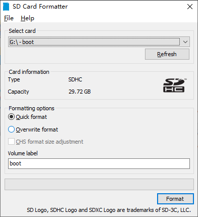
		- 6. 格式化完成后，只剩下一个G盘
			- 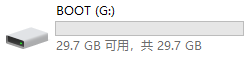
- ## 第一次开机
	- ### 烧录系统
		- 如果不是新的存储卡，建议先格式化。
		- **使用官方烧录工具**
			- 1. 将SD卡插入读卡器，将读卡器插到自己的电脑上。
			- 2. 电脑访问 https://www.raspberrypi.com/software/ ，点击下载烧录工具。
				- 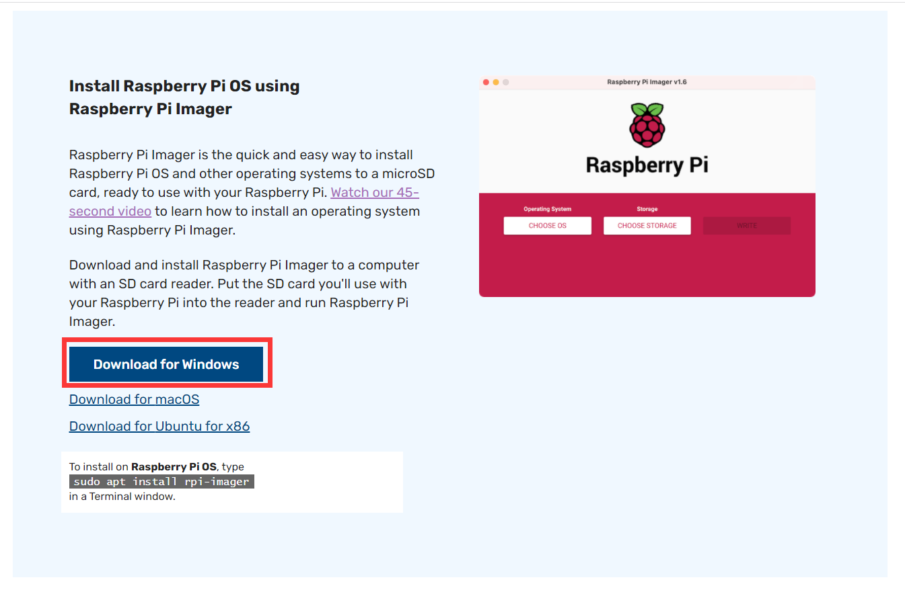
			- 3. 双击在电脑上安装烧录工具。
			- 4. 打开烧录工具。
				- 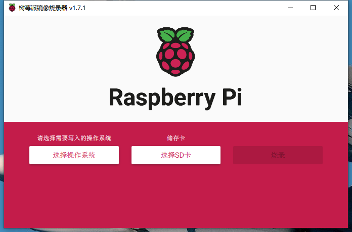
			- 5. 选择操作系统，选择存储卡。
				- 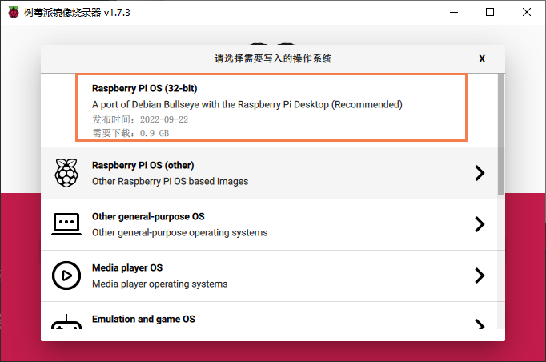
				- 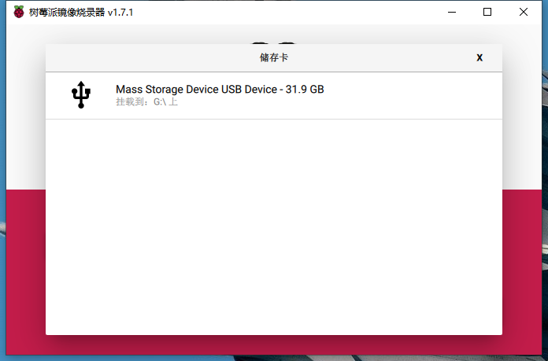
			- 6. 点击 `烧录` 按钮。
	- ### 使用ssh工具连接树莓派
		- #### 使用网线连接
			- 1. 将树莓派关机。
			- 2. 取出 **SD卡** ，使用读卡器连接到电脑上；点击取消。
				- 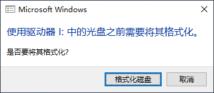
			- 3. 开启树莓派的ssh端口：在已烧录系统的SD卡的根目录中，新建一个名为 `ssh` 的文件(无后缀)。
			- 4. 将SD卡插到树莓派上，给树莓派插上电源，打开电源开关。
			- 5. 用网线一端连接树莓派，一端连接我们已有的电脑。
			- 6. 首先右击电脑已连接的网络适配器（这里是WLAN），进入 **共享** 标签页，勾选 "允许其他网络用户通过此计算机的Internet连接来连接(N)"；如果已是勾选状态，需要取消勾选重新选择一个 **家庭网络连接** ，必须是网线连接的那个接口(这里连的是 **以太网** )，然后重启树莓派。
				- 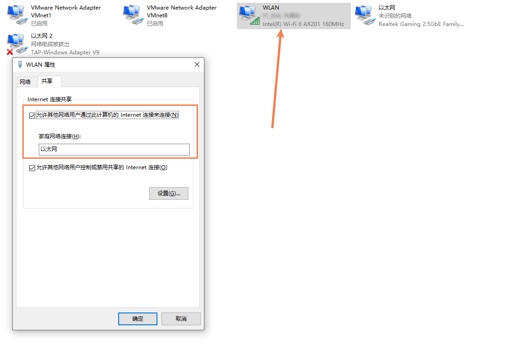
			- 7. 命令行输入 `arp -a` 查看  ARP 缓存，根据上一步选择的接口的ip易知， `192.168.137.33` 即是树莓派的ip。
				- 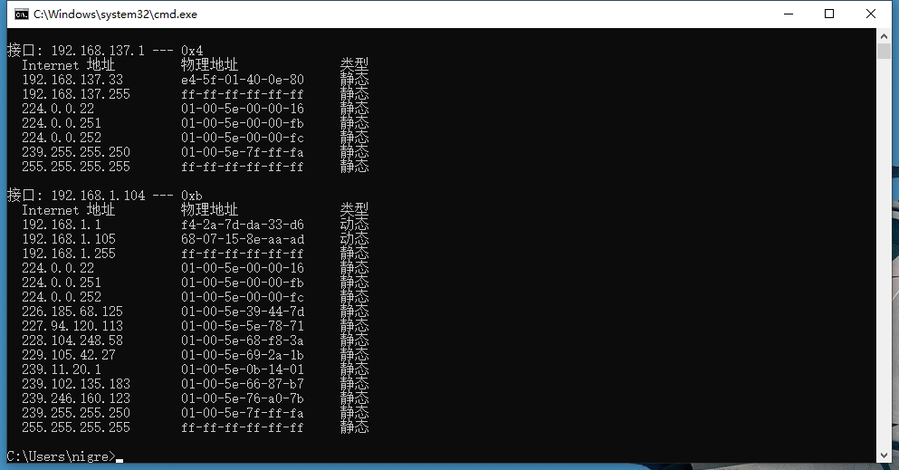
			- 8. 使用ssh工具连接树莓派，默认账号为 `pi` ，默认密码为 `raspberry` 。
		- #### 使用无线网连接
			- 1. 将树莓派关机。
			- 2. 取出 **SD卡** ，使用读卡器连接到电脑上；点击取消。
				- 
			- 3. 开启树莓派的ssh端口：在已烧录系统的SD卡的根目录中，新建一个名为 `ssh` 的文件(无后缀)。
			- 4. 连接无线网：在已烧录系统的SD卡的根目录中，新建一个名为 `wpa_supplicant.conf` 的文件(无后缀)。
			- ```properties
			  country=CN
			  ctrl_interface=DIR=/var/run/wpa_supplicant GROUP=netdev
			  update_config=1
			  network={
			    ssid="F7_804_5G"
			    psk="15989506582"
			    priority=10
			  }
			  ```
			- 5. 将SD卡插到树莓派上，给树莓派插上电源，打开电源开关。
			- 6. 在路由器上查看树莓派 ip 。
				- 
			- 7. 使用ssh工具连接树莓派，默认账号为 `pi` ，默认密码为 `raspberry` 。
	- ### 使用远程桌面连接树莓派
		- 1. 使用ssh工具连接树莓派，默认账号为 `pi` ，默认密码为 `raspberry` 。
		- 2. 执行 `sudo apt-get install xrdp` 安装 `xrdp`
			- `xrdp` 是 Microsoft **远程桌面协议 (RDP)** 的一个 **开源实现** ，它允许以图形方式控制远程系统。
			- 若安装出现如下问题：
			- ```sh
			  E: Failed to fetch http://raspbian.raspberrypi.org/raspbian/pool/main/x/xterm/xterm_366-1_armhf.deb  404  Not Found [IP: 93.93.128.193 80]
			  E: Unable to fetch some archives, maybe run apt-get update or try with --fix-missing?
			  ```
			- 则先执行 `sudo apt-get update` 更新，再执行上述安装命令即可。
		- 3. 执行 `mstsc -admin` ，打开 Windows 自带的远程桌面连接软件。
		- 4. 输入ip后进入如下界面，默认账号为 `pi` ，默认密码为 `raspberry` 。
	- ### 设置静态IP
		- 参考: https://blog.csdn.net/qq_41204553/article/details/127936312
		- 1. 远程连接树莓派。
		- 2. 执行 `sudo nano /etc/dhcpcd.conf` ，在文件末尾加入如下内容 ( `ctrl+o` -> `enter` -> `ctrl+x` 保存并退出 )
		  
		   ```sh
		   # 有线网络配置
		   interface eth0
		   static ip_address=192.168.1.136/24
		   static routers=192.168.1.1
		   static domain_name_servers=114.114.114.114
		   
		   # 无线网络配置
		   interface wlan0
		   # 静态IP
		   static ip_address=192.168.1.136/24
		   # 网关 这个查看自己路由器的网关
		   static routers=192.168.1.1
		   # DNS 114.114.114.114 为给国内常用的共用DNS服务器
		   static domain_name_servers=114.114.114.114
		   ```
		- 3. 执行 `sudo reboot` 重启树莓派。
- ## 指示灯
	- 红色代表电源，绿色一般代表SD读写
	- 正常情况下，红灯常亮，绿色每隔几秒闪一次，表示网络连接成功
	- 而绿灯有规律的闪烁，表示SD没有插好或者是无效的SD卡。
- ## 问题汇总
	- ### 默认密码问题
		- **参考** : https://blog.csdn.net/u012329294/article/details/123447208
		- 由于安全问题，最新版本的树莓派默认账号 pi 的密码 不再是 raspberry
		- #### 方法一：烧录时设置
			- 在使用树莓派烧录工具时，设置账号密码。
		- #### 方法二：编辑文件
			- 1. 根目录新建 `userconf` 文件。
			- 2. 编辑如下内容，即 username:hash(password)，这一串hash就是raspberry。
			- ```sh
			  pi:$6$/4.VdYgDm7RJ0qM1$FwXCeQgDKkqrOU3RIRuDSKpauAbBvP11msq9X58c8Que2l1Dwq3vdJMgiZlQSbEXGaY5esVHGBNbCxKLVNqZW1
			   ```
	- ### wifi连接失败问题
		- 参考: https://blog.csdn.net/l_z_y_000/article/details/128412237
		- 1. 先执行 `ifconfig` 看是否有 `wlan0` ，应该是没有的（否则，这里无法解决）。
		- 2. 执行 `sudo ifconfig -a` ，看是否有 `wlan0` ；如果有，说明 无线射频 被锁。
		- 3. 执行 `rfkill list` 看是否有被锁住的内容
		- ```sh
		   pi@raspberrypi:~ $ rfkill list
		   0: phy0: Wireless LAN
		           Soft blocked: yes
		           Hard blocked: no
		   1: hci0: Bluetooth
		           Soft blocked: no
		           Hard blocked: no
		   ```
		- 4. 执行 `rfkill unblock all` 解锁所有内容。
		- 5. 再次执行 `ifconfig` 应该可以看到 `wlan0` 。
		- 6. 下面则进行wifi的ssid和密码的配置。
	- ### 远程连接树莓派桌面黑屏
		- **下面的方法貌似不起作用**
		- 参考: https://talk.quwj.com/topic/2660\
		- 
		- 需要添加新用户：
		- ```sh
		  # 新增用户 remote
		  sudo useradd remote
		  # 为 remote 设置密码
		  sudo passwd remote
		  ```
	- ### 蓝屏问题
		- **下面的方法貌似不起作用**
		- 可能在使用远程桌面连接树莓派时，会出现蓝屏问题：
			- 
			- 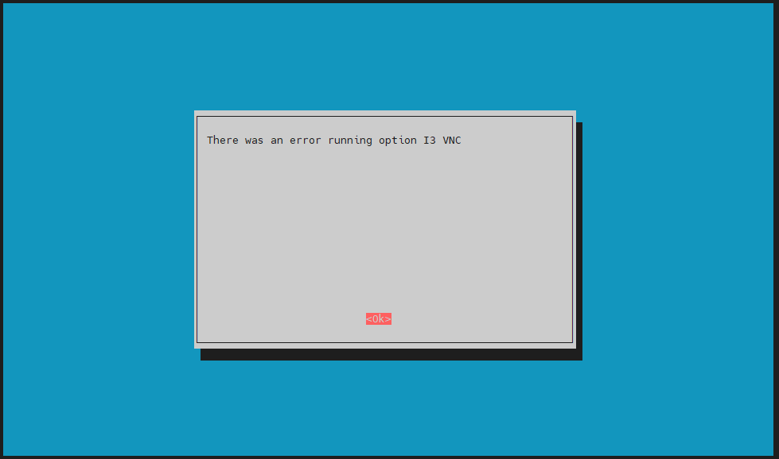
		- **解决方法如下：**
			- 参考: https://blog.csdn.net/Yolanda_Salvatore/article/details/106439903
			- 1. 蓝屏问题：
				- https://superuser.com/questions/1701464/xrdp-only-showing-blue-green-background-screen-after-login
				- ```sh
				  deb http://mirrors.ustc.edu.cn/raspbian/raspbian/ buster main contrib non-free rpi
				  deb-src http://mirrors.ustc.edu.cn/raspbian/raspbian/ buster main contrib non-free rpi
				  ```
- ## 参考
  ---
	- 1. [树小悉](https://www.bilibili.com/video/BV16U4y1879Q?vd_source=f1fbb083ddef12dcff3388779faac201)