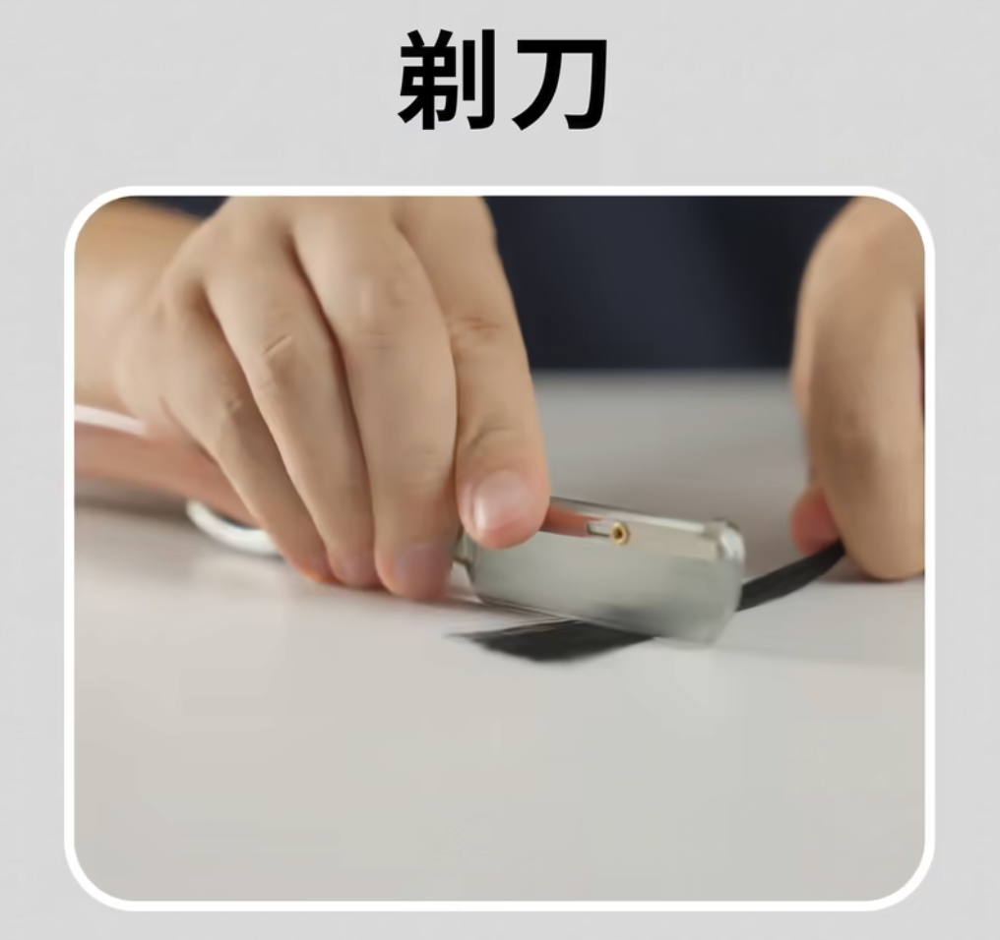
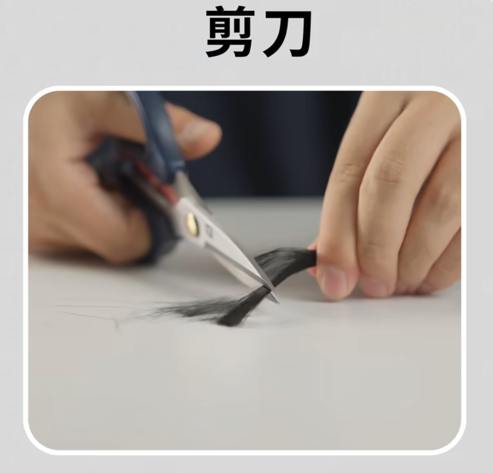
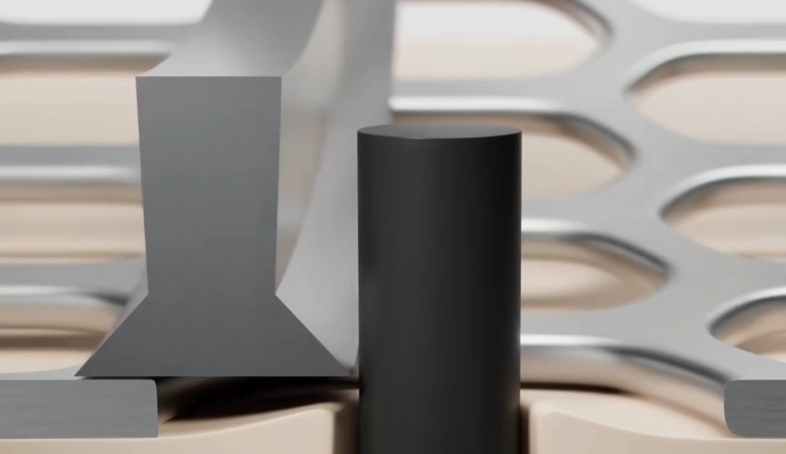
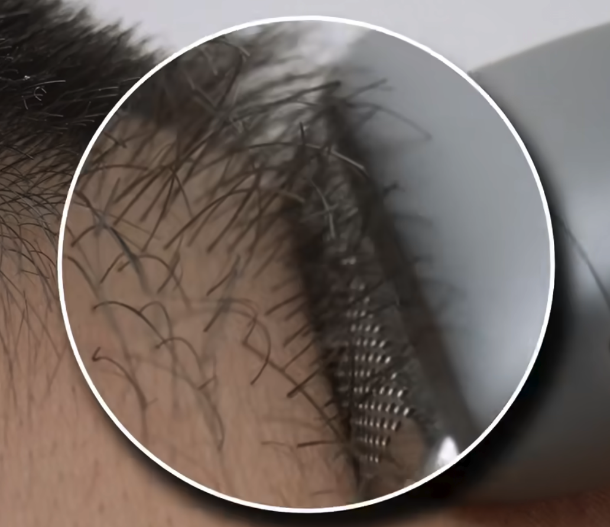
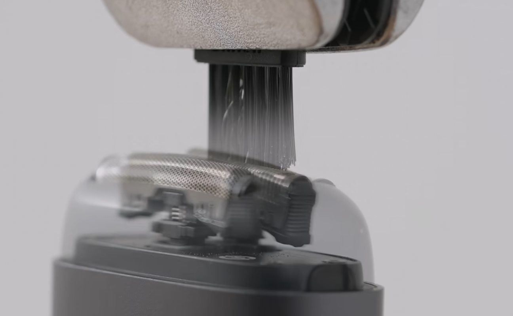
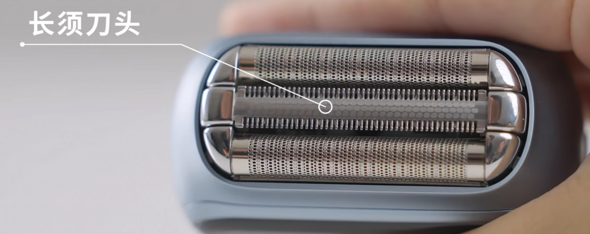
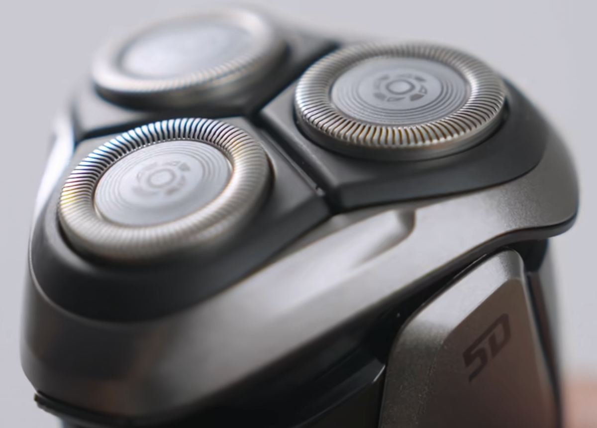

tags:: [[Shopping]]
---

- ## 手动 与 电动 原理
	- ### 手动剃须刀原理
		- **手动剃须刀** 属于 **剃刀** 逻辑.
			- {:height 161, :width 204}
	- ### 电动剃须刀原理
		- **电动剃须刀** 属于 **剪刀** 原理.
			- {:height 161, :width 204}
			- 即 胡须从 **电动剃须刀** 刀网的小孔进入, 刀网内部快速移动的刀片, 与刀网之间形成类似 **剪刀** 的剪切力.
				- {:height 175, :width 285}
			- 因此, **刀网** 的厚度 决定了 **电动剃须刀** 刮胡子的最短长度.
	- ### 电动剃须刀的使用方式
		- 如果采用 **手动剃须刀** 的逻辑使用 **电动剃须刀**, 过长的毛发, 可能会被刀头压倒, 而无法进入刀网.
			- {:height 277, :width 236}
		- 所以, 正确的使用方式是: 让毛发以合适的角度进入刀网.
			- {:height 160, :width 330}
		- 另外, 由此可见, **电动剃须刀** 并不擅长处理 **较长** 的毛发.
			- 因此, 有些 **电动剃须刀** 会增加 **长须刀头** , 以先将 **长须** 送到刀头处理成 **短须** , 便于刀网再去捕获.
			- {:height 316, :width 383}
- ## 旋转式 与 往复式
	- ### 区别
		- 旋转式: 刀片通过 **旋转运动** 来切割毛发.
			- {:height 236, :width 242}
			- 使用方式: 在长胡须处, 来回打磨.
		- 往复式: 刀片通过 **往复运动** 来切割毛发.
			- {:height 316, :width 383}
			- 使用方式: 逆着胡须正常方向去剃.
- ## 镍网 与 钢网
	- 镍网舒适度更高, 但有人会过敏.
	- 钢网舒适度更低, 过敏较少.
- ## 手动 与 电动选择
	- 男生刚开始长胡须时, 没有稳定的剃须习惯, 可以选 **手动** .
		- 因为, **手动剃须刀** 兼容 **各种长度** 的胡须, 也刮得足够干净.
	- 胡须生长稳定, 剃须频率固定时, 可以考虑 **电动** .
		- **电动剃须刀** 足够方便和快捷.
	-
- ## 参考
	- [手动？电动？往复？旋转？剃须刀全分类一次讲清，到底你该选哪款？](https://www.bilibili.com/video/BV1C7GnzyETR/?vd_source=f1fbb083ddef12dcff3388779faac201)
	  logseq.order-list-type:: number