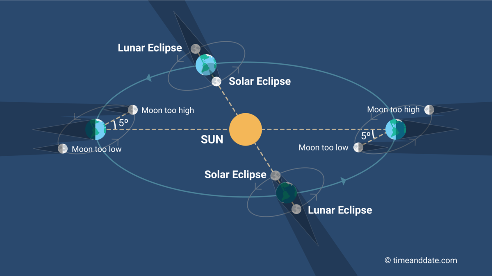
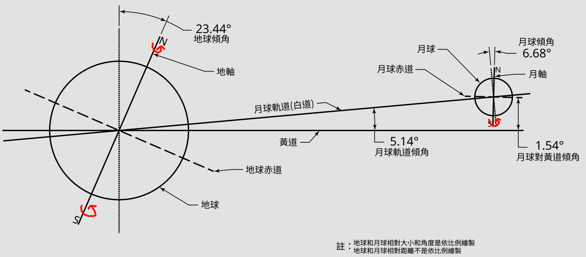
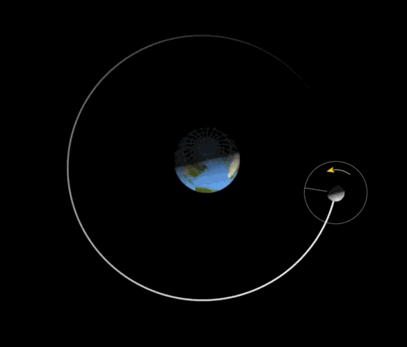

tags:: [[地月日系统]] 
---

- ## 太阳自转
	- 太阳也会自转，它的 **自转轴** 并不与 **黄道面垂直** ，而是有一个倾角。
	- 注意，太阳是 **气体球** ，与 **地球** 这类固体球的自转不太相同。
		- 太阳 的 赤道 和 两极 的转速不太一样, 这被称为 **差异自转** .
- ## 地月日自转与公转模型
	- ### 轨道模型
		- 在地月日模型中, 我们忽略太阳的 **自转** 和 **绕太阳系质心的运动** , 将 **太阳** 作为参考系, 近似认为 **太阳** 静止.
		- 地月公转轨道示意图:
			- {:height 488, :width 787}
			- 图源: [How Often Do Solar Eclipses Occur?](https://www.timeanddate.com/eclipse/how-often-solar-eclipse.html)
		- 地月自转轴与公转轨道示意图:
			- {:height 364, :width 683}
			- 图源: [月球轨道](https://zh.wikipedia.org/zh-cn/%E6%9C%88%E7%90%83%E8%BB%8C%E9%81%93)
	- ### 太阳
		- 忽略 **自转** 和 **绕太阳系质心的运动** .
	- ### 地球
		- #### 公转
			- 和 **月球** 作为一个整体, 绕 **太阳** 公转, 轨道为近似圆形的椭圆, 我们近似看成圆形.
		- #### 自转
			- 自转轴 : **自转轴** 与 **黄道面** 夹角 **66.6 度**  (或  66.5 度)
			  logseq.order-list-type:: number
			- 自转方向 : 绕 **自转轴** 自西向东旋转, 从 **北极** 上空看, 是 **逆时针** 自转.
			  logseq.order-list-type:: number
	- ### 月球
		- #### 公转
			- 绕 **地球** 公转, 轨道为近似圆形的椭圆, 我们近似看成圆形.
			- 注意: **地球** 公转轨道平面 (即 **黄道面** ) 与 **月球** 公转轨道平面, 不是一个平面, 而是有一个 **5 度夹角** .
		- #### 自转
			- 自转轴 : **自转轴** 与 **月球公转轨道** 夹角 **83.32 度** .
			  logseq.order-list-type:: number
				- 在研究 **月相** 时, 我们通常忽略自转轴倾角, 即认为自转轴与公转轨道垂直.
			- 自转方向 : 绕 **自转轴** 自西向东旋转 (与月球公转 方向一致), 从 **北极** 上空看, 是 **逆时针** 自转.
			  logseq.order-list-type:: number
		- #### 同步自转
			- `月球自转周期 ≈ 月球绕地球公转周期` , 我们近似看成相等, 这被称为 **同步自转** .
				- ==所以, 我们可以近似认为 **月球** 总是用同一面对着 **地球** .==
			- ==注意:==
				- 物体 A 绕 物体 B 做匀速圆周运动, 并不意味着 A 总是用同一面朝着 B .
				- 下面的例子不能模拟月球公转:
					- **用一根绳子绑住小球某一点, 拉着绳子旋转, 小球总是同一点对着你** .
					- 这是因为, **绳子** 绑住了 **小球** 的一个点, 控制了 **小球** 的姿态.
				- **月球的受力** 应该考虑用 **质心** 受到的 **万有引力** 进行等效. ( ==为什么用质心等效, 需要再学习== )
				- 我们观察下图中月球上的某一点:
					- 如果没有月球自转, 他将会始终保持一个方向, 并不会一直朝着地球.
					- 比如它一开始朝着画面左边, 不管月球公转到哪个位置, 它将一直朝着画面左边, 而不是始终指着地球.
					- {:height 297, :width 322}
					- 图源: [NASA - The Moon's Rotation](https://svs.gsfc.nasa.gov/4709/)
- ## 参考
	- GPT
	  logseq.order-list-type:: number
	- logseq.order-list-type:: number