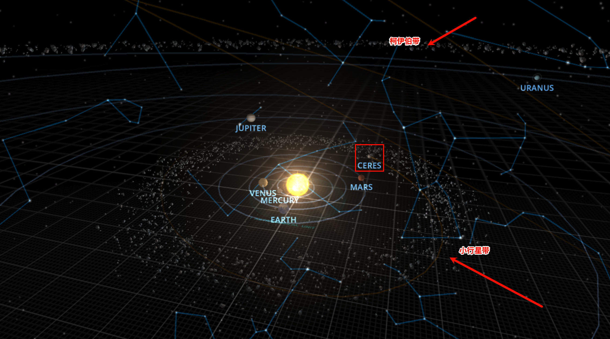
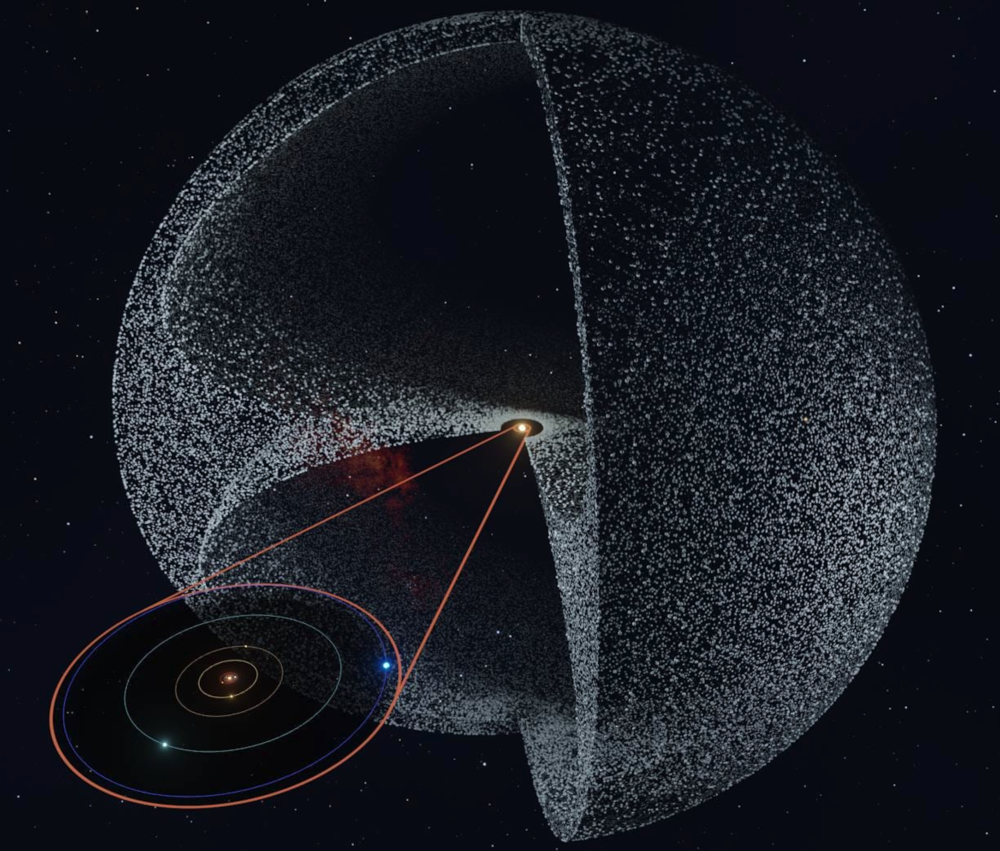
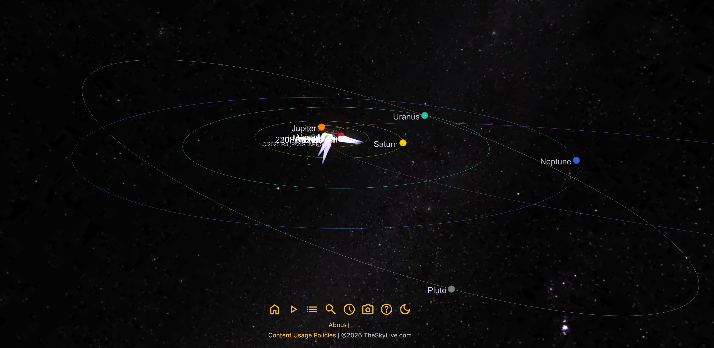
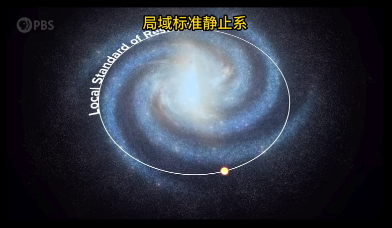
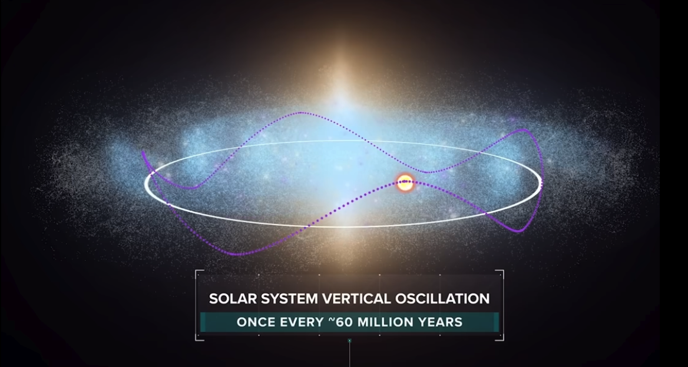
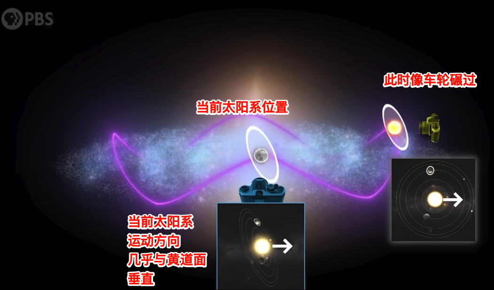

tags:: [[Solar System]]
---

- ## 啥是太阳系
	- 太阳系就是：以 **太阳为中心** ，被 **太阳引力** 束缚在一起的一整套天体系统。
	- 太阳的引力控制范围，最远可到达 **奥尔特云** 。
- ## 太阳系有啥
	- 主要有如下天体（按与太阳的距离由近至远排列）：
		- ``` sh
		  太阳
		  ↓
		  内太阳系：水星、金星、地球（卫星：月球）、火星
		  ↓
		  小行星带：谷神星 Ceres、灶神星 Vesta、智神星 Pallas 等小天体所在区域，主要位于火星和木星之间。
		  ↓
		  外太阳系：木星、土星、天王星、海王星
		  ↓
		  柯伊伯带：冥王星等冰质小天体所在区域
		  ↓
		  奥尔特云：猜想中存在的球体区域（还未被观测到），将太阳系包裹在中间；非常遥远，可能是彗星的来源地
		  ```
	- 查看 3D 模型： [Solar System Scope](https://www.solarsystemscope.com/)
		- {:height 415, :width 664}
	- 奥尔特云（猜想）：
		- 图源：[什么是奥尔特云？位置、大小与关键事实](https://starwalk.space/zh-Hans/news/what-is-oort-cloud)
		- {:height 475, :width 510}
- ## 太阳系八大行星
	- 水星，金星，地球，火星，木星，土星，天王星，海王星。
	- **冥王星** 已被划分为 **矮行星** 。
- ## 太阳系天体公转轨道
	- ### 黄道面
		- **地球** 绕 **太阳** 公转轨道所在的平面。
	- ### 其他天体轨道
		- **八大行星** 的公转轨道平面，大体上接近 **同一平面** ，除 **地球** 以外的七大行星，只与 **黄道面** 有一点点 **轨道倾角** 。
		- 查看轨道图：[The Sky Live（太阳系各星体和各国人造卫星的实时位置）](https://theskylive.com/3dsolarsystem)
			- {:height 405, :width 771}
			- 矮行星、小行星、彗星的轨道，与 **黄道面** 相差很大。
	- ### 轨道模型
		- **简易模型** :
			- 以 **太阳** 为近似 **静止中心** , 并将 **行星** 轨道近似为 **椭圆** , **太阳** 位于 **椭圆** 的一个 **焦点** .
			- ==但由于 **太阳** 会被其他天体引力拉动, 所以它不是一个严格的 [[惯性参考系]] , 所以不是特别严谨==
		- **严谨模型** :
			- 以 **太阳系质心** 为近似 **静止中心** , **太阳** 和 **太阳系中的其他星体** 绕着 **太阳系质心** 转, 轨道形状不是 **完美椭圆** .
				- 即, 研究各时刻 **各天体** 相对于那个时刻 **太阳系质心** 的 **运动状态**.
			- **太阳系** 整体, 其实也会受到太阳系外部天体的引力影响, 所以 **太阳系质心** 也不是一个严格的 [[惯性参考系]] .
				- 但由于这种影响很弱, 我们通常可以忽略.
				- 所以, 我们把 **太阳系** 近似看成 **孤立系统** , 把 **质心** 近似看成做 **匀速直线运动** .
			- 另外, 由于 **太阳质量** 占 **太阳系总质量** 的绝大部分, 所以 **太阳系质心** 通常非常接近 **太阳** .
- ## 太阳自转
	- 太阳也会自转，它的 **自转轴** 并不与 **黄道面垂直** ，而是有一个倾角。
	- 注意，太阳是 **气体球** ，与 **地球** 这类固体球的自转不太相同。
- ## 太阳系相对银河系的运动
	- 参考:
		- [地球在银河系中是怎样运动的？](https://www.bilibili.com/video/BV12o4y177Hn)
		  logseq.order-list-type:: number
		- ChatGPT
		  logseq.order-list-type:: number
	- ### 啥是 LSR
		- 我们把整个 **太阳系** 作为一个整体，研究他的运动，需要一个 **参考系** 。
		- 一般采用 `LSR` (Local Standard of Rest, 局部静止标准参考系 / 本地静止标准) 做为参考系.
			- `LSR` 取的是 **太阳** 附近银河盘的平均运动 .
				- 即 绕 **银河系质心 (银心)** 做匀速圆周运动的一个参考系.
				- 它是假想出来的, “跟随本地平均银河旋转运动的观察者” .
				- {:height 293, :width 475}
			- 包括 **太阳系** 在内的 **银河系中其他天体** 的运动, 都可以将 `LSR` 作为参考系.
			- 以 `LSR` 为参考系的速度, 一般用 `v_LSR` 表示.
	- ### LSR 圆周速度
		- `LSR` 圆周速度一般有个固定的标准值.
			- 传统标准: LSR 圆周速度 ≈ 220 km/s
			- 新标准: LSR 圆周速度 ≈ 230 km/s、232 km/s、236 km/s、240 km/s 等
	- ### 太阳系相对 LSR 的运行轨迹
		- {:height 234, :width 431}
		- 在一次太阳系轨道周期内, 会发生 4 次垂直穿越 `LSR` 盘面, 每次间隔约 6000 万年.
			- ==这个穿越周期可能与地球上的大灭绝有关.==
	- ### 太阳系运动方向与黄道平面
		- **太阳系** 的 **黄道平面** , 在 **太阳系** 的轨道运动过程中, 朝向一直保持不变.
		- {:height 254, :width 378}
		- 当前 **太阳系** 的 **运动方向** 几乎与 **黄道平面** 垂直.
		-
-