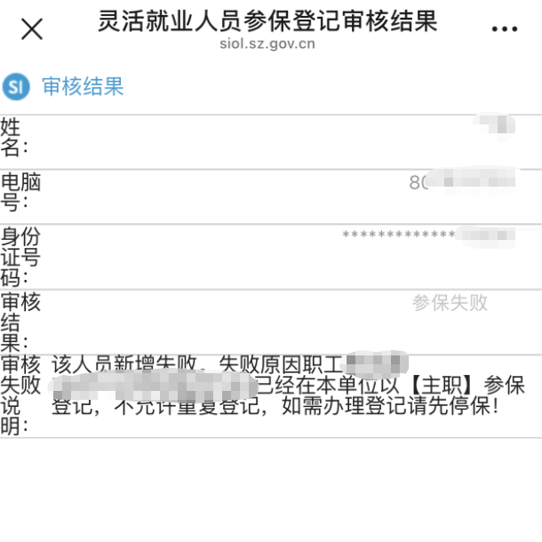

tags:: [[养老保险]]
---

- ## 需要缴纳的险种
	- 个人只需缴纳 **养老保险**
		- 参见: [[申领失业保险金]]
- ## 深圳
	- ### 参保登记
		- **深圳社保** 公众号 -> **掌上办** -> **业务办理** -> **参保登记管理** -> **参保管理** -> **失业人员灵活就业参保登记** 。
			- 之前貌似是因为多点了一次，导致最终显示：
				- `该人员新增失败。失败原因职工XXX[111111111111111111]已经在本单位以【主职】参保登记，不允许重复登记，如需办理登记请先停保！`
				- {:height 374, :width 248}
			- 问过 **社保局** ，工作人员帮我在 **民意速办** 小程序上发了个工单询问，最终是短信通知我说 **参保成功** 了。
	- ### 缴费时间
		- 每月 1-25 日，缴纳当月的社保。
			- 无法提前缴纳。
			- 逾期无法补缴。
	- ### 如何缴费
		- **深圳税务** 公众号 -> **社保缴费** -> **灵活就业人员申报缴费**
			- 每月选择 **支付宝/微信扣款模式** 进行手动缴费就好，避免后续无需个人缴费时自动扣费了。
	-