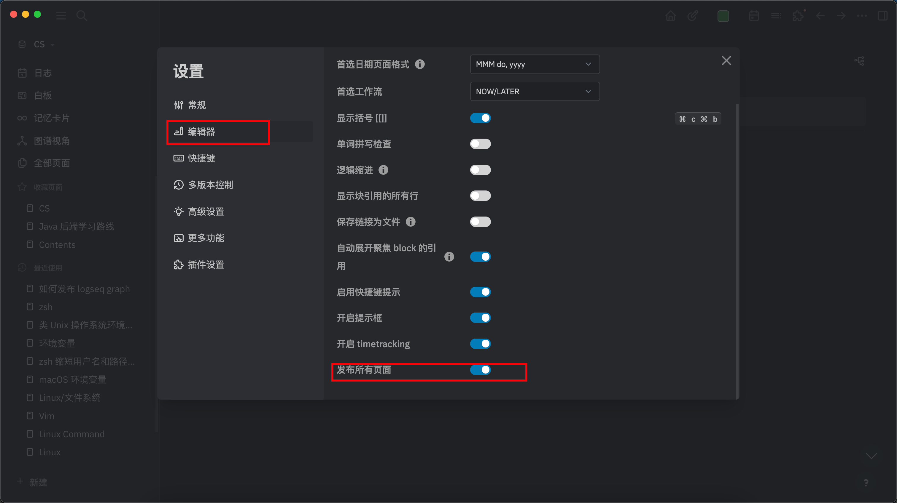

tags:: [[Logseq]]
---

- 参考: ~~[Logseq Twitter](https://x.com/logseq/status/1514504572651585538?s=20) 中提到的仓库 [logseq-publish](https://github.com/pengx17/logseq-publish?tab=readme-ov-file)~~
	- Logseq 官方工具: [publish-spa](https://github.com/logseq/publish-spa)
-
- 记得打开 graph 的 **发布所有页面**
- 
-
- 如果遇到如下问题:
	- > The deploy step encountered an error: The process '/usr/bin/git' failed with exit code 128 ❌
	- 则参考: [【Git】workflows 部署 vuepress 错误“The process ‘/usr/bin/git‘ failed with exit code 128“](https://blog.csdn.net/weixin_42282187/article/details/124766382)