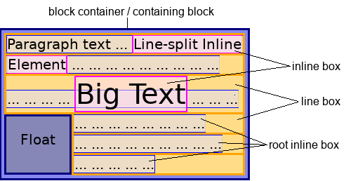

tags:: [[CSS]]
---

- ## 问题
	- inline
	  logseq.order-list-type:: number
		- 
		- 来自 [MDN - Inline-level content](https://developer.mozilla.org/en-US/docs/Glossary/Inline-level_content)
		- 这图 inline  box / line box 啥意思
	- inline formatting context / block formatting context , 及其与 inline-level / block-level content 的关系。
	  logseq.order-list-type:: number
- ## 学习进度
	- 接下来学: [How CSS is Structured#Functions](https://developer.mozilla.org/en-US/docs/Learn/CSS/First_steps/How_CSS_is_structured#functions)
- ## 官方资料
	- ### 官方文档
		- W3C CSS Standard : https://www.w3.org/Style/CSS/
		  logseq.order-list-type:: number
	-