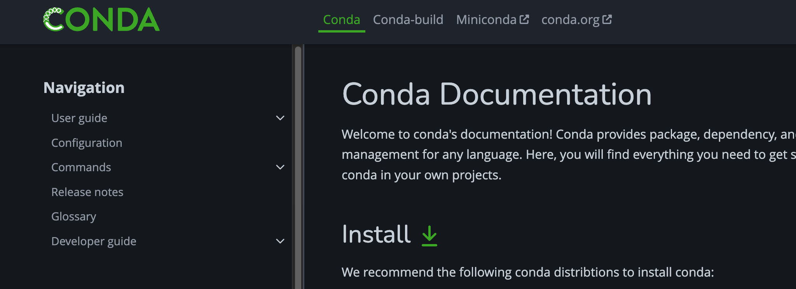

tags:: [[Conda]]
---

- ## 问题
	- Conda Channel 怎么配置?
	  logseq.order-list-type:: number
- ## 官网资料
	- [Conda 官网](https://conda.org/)
	  logseq.order-list-type:: number
		- [Conda Projects](https://docs.conda.io/en/latest/) ==已阅 (2025-03-30)==
		  logseq.order-list-type:: number
			- [Conda Docs](https://docs.conda.io/projects/conda/en/stable/)
			  logseq.order-list-type:: number
				- {:height 305, :width 515}
			- [Conda-build Docs](https://docs.conda.io/projects/conda-build/en/stable/index.html)
			  logseq.order-list-type:: number
				- {:height 209, :width 518}
		- [Conda Learn - FAQ](https://conda.org/learn/faq)
		  logseq.order-list-type:: number
			- ==已看完 (2025-03-30)==
	- logseq.order-list-type:: number