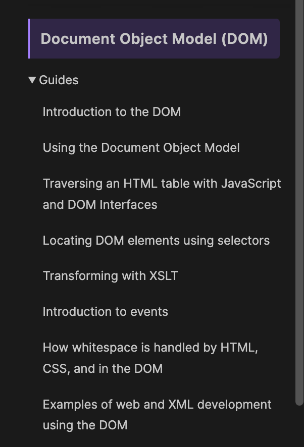
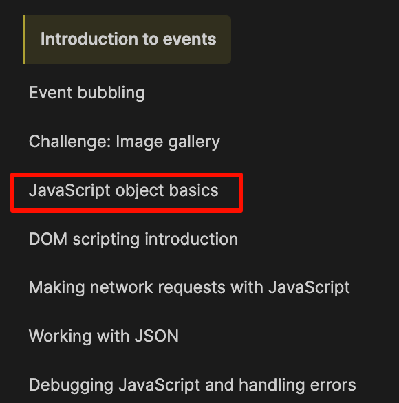

tags:: [[DOM]]
---

- ## 学习进度
	- [Document Object Model (DOM)](https://developer.mozilla.org/en-US/docs/Web/API/Document_Object_Model)
		- {:height 473, :width 283}
		- ==[Transforming with XSLT](https://developer.mozilla.org/en-US/docs/Web/API/Document_Object_Model/Transforming_with_XSLT) 不用看, 其他都已学完==
		- Introduction to events 跳转到：
			- {:height 352, :width 248}
			- 除了 JavaScript object basics (这篇的内容，可以在学习 JavaScript 语法时学习到)，其他都可以看下
			-
- ## 学习资料
	- [Document Object Model (DOM)](https://developer.mozilla.org/en-US/docs/Web/API/Document_Object_Model)
	  logseq.order-list-type:: number
	- [DOM scripting introduction](https://developer.mozilla.org/en-US/docs/Learn_web_development/Core/Scripting/DOM_scripting)
	  logseq.order-list-type:: number
	- [The HTML DOM API](https://developer.mozilla.org/en-US/docs/Web/API/HTML_DOM_API)
	  logseq.order-list-type:: number