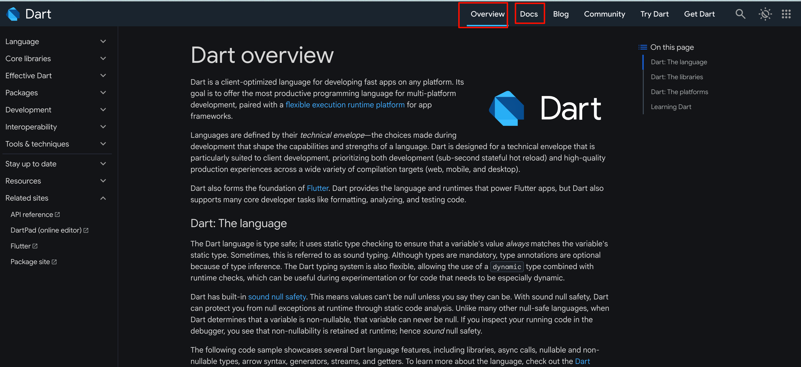

tags:: [[Dart]]
---

- ## 学习资源
	- [Dart 官网](https://dart.dev/)
	  logseq.order-list-type:: number
	- [Dart 中文官网](https://dart.cn/)
	  logseq.order-list-type:: number
- ## 学习进度
	- ### [Dart 官网](https://dart.dev/)
		- 
		- #### Get Dart ==已阅==
		- #### Overview ==已阅==
		- #### Docs
			- Language
				- 看完 Introduction, Variables, Operators, Comments   ==已阅==
				- Types
					- 看完 Built-in types, Typedefs
				- Functions (==还差 Generators 部分==)
				- Metadatas  ==已阅==
				- Library & imports  ==已阅==
				- Classes & Objects
					- 看完 Classes, Constructors, Methods, Extend a class, Mixins, Enums, Dot shorthands, Callable objects
				- Class modifiers
					-
			- Packages
				-
			- Development
				- 看完: Number Representation,
			- Tools & techniques
				- Overview  ==已阅==
				- Editors & debuggers  ==已阅==
				- Command-line Tools
					- Overview, dart, dart create, dart run
-