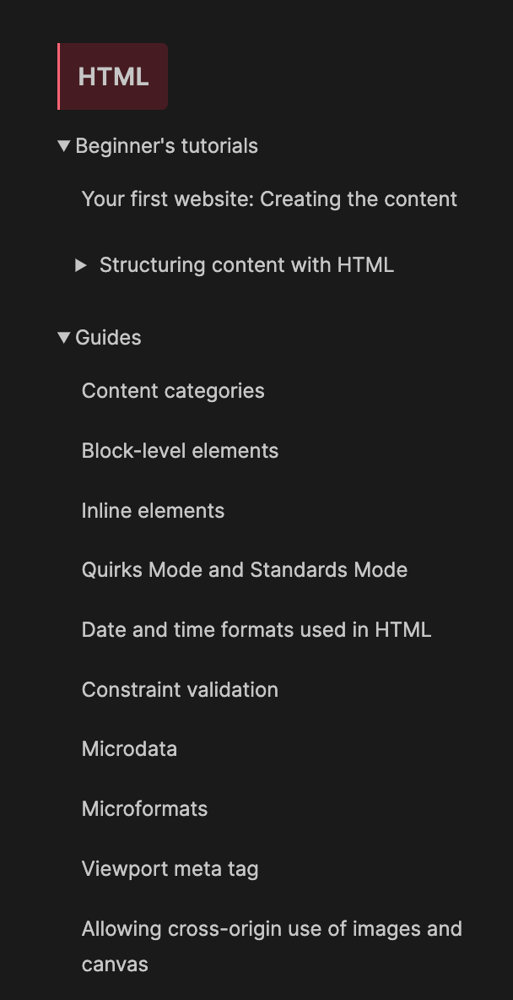

tags:: [[HTML]]
---

- ## 学习进度
	- [MDN - HTML Reference](https://developer.mozilla.org/en-US/docs/Web/HTML)
		- {:height 489, :width 268}
	- [MDN - HTML Reference - Beginner's Tutorials](https://developer.mozilla.org/en-US/docs/Learn/HTML)
		- 接下来看 [Video and audio content#Other <video> features](https://developer.mozilla.org/en-US/docs/Learn/HTML/Multimedia_and_embedding/Video_and_audio_content#other_video_features)
- ## Refrences
	- HTML 的标准: [[HTML Spec]]
	  logseq.order-list-type:: number
-