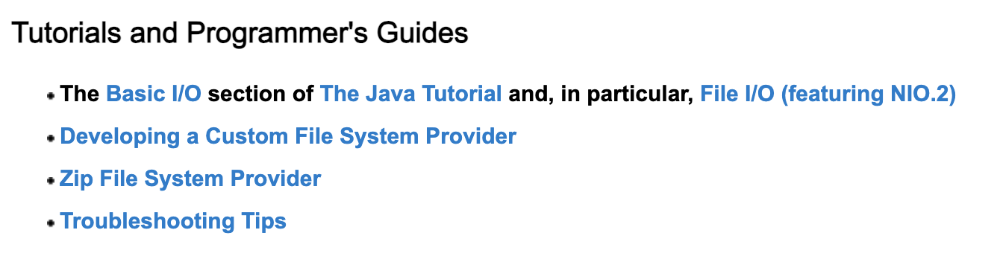
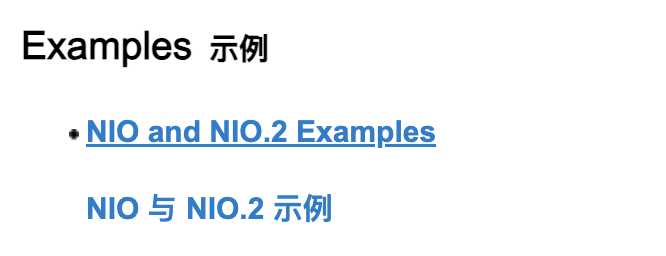

tags:: [[Java IO]]
---

- ## 学习资料
	- ### 官方资料
		- [Java I/O, NIO, and NIO.2](https://docs.oracle.com/javase/8/docs/technotes/guides/io/index.html)
			- [The Java™ Tutorials - IO](https://docs.oracle.com/javase/tutorial/essential/io/index.html)
	- ### 第三方资料
		- [JavaGuide - IO](https://javaguide.cn/java/io/io-basis.html)
- ## 学习进度
	- [Java SE 8](https://docs.oracle.com/javase/8/) > [Java SE 8 Documentation](https://docs.oracle.com/javase/8/docs/) > 点击 Input/Output: [Java I/O, NIO, and NIO.2](https://docs.oracle.com/javase/8/docs/technotes/guides/io/index.html)
		- {:height 224, :width 740}
		- {:height 153, :width 390}
		- {:height 181, :width 561}
		- 先看 [The Java™ Tutorials - IO](https://docs.oracle.com/javase/tutorial/essential/io/index.html)
			-
-