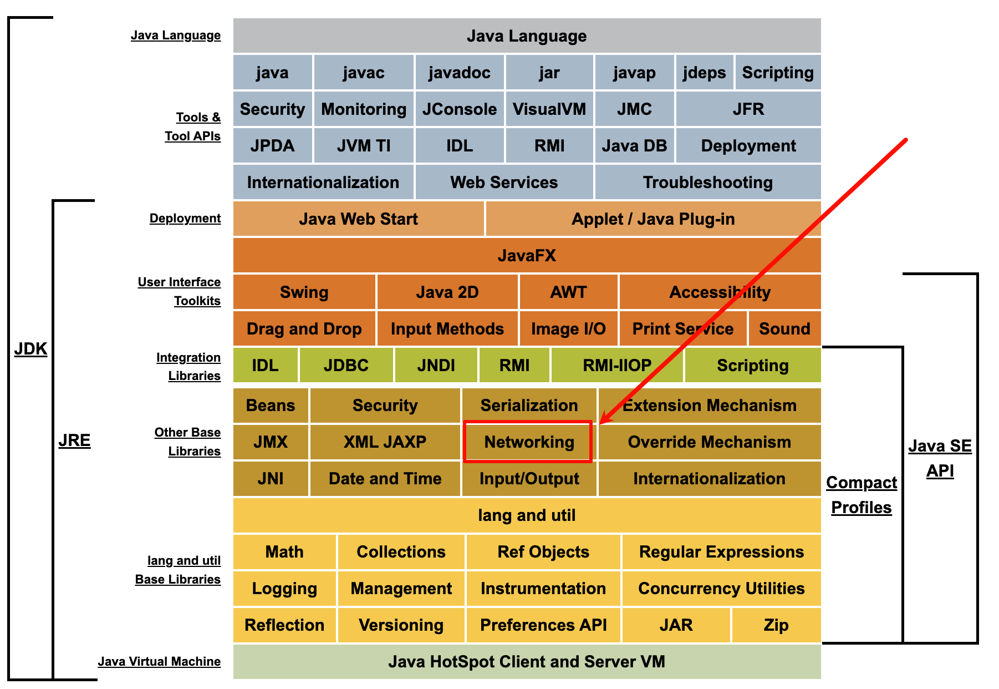

tags:: [[Java Network]]
---

- ## 学习资料
	- [Java SE 8 Documentation](https://docs.oracle.com/javase/8/docs/) > [Java Networking](https://docs.oracle.com/javase/8/docs/technotes/guides/net/index.html)
	  logseq.order-list-type:: number
		- {:height 358, :width 517}
	- [黑马Java网络编程教程，全面深入讲解java网络编程，UPD/TCP含即时通信案例](https://www.bilibili.com/video/BV1Bp4y1E7sh?vd_source=f1fbb083ddef12dcff3388779faac201&p=4)
	  logseq.order-list-type:: number
		- 看完了 P4
-