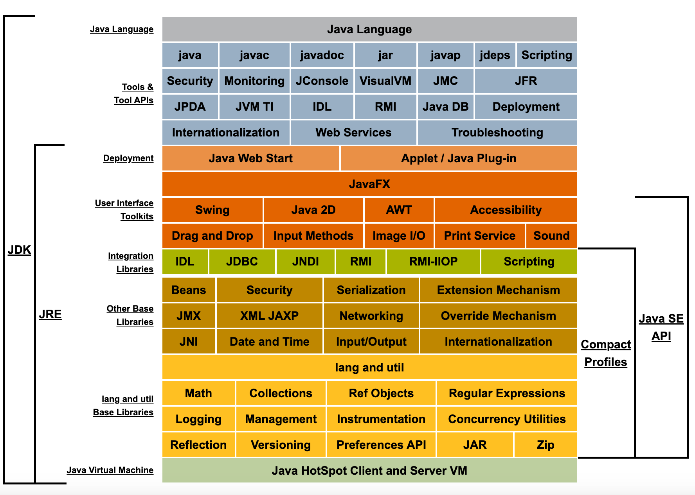

tags:: [[Java SE]]
---

- ## 问题点
	- java 是如何编译项目的？Javac 参数
	  logseq.order-list-type:: number
	- Java 程序是如何读取 Jar 文件的？
	  logseq.order-list-type:: number
	- Java 命令？java -cp ？
	  logseq.order-list-type:: number
	- classpath 是啥？
	  logseq.order-list-type:: number
- ## 学习进度
	- 以 Java SE 8 为基础版本进行学习.
	- ### [Java SE 8](https://docs.oracle.com/javase/8/)
		- [Java SE 8 Documentation](https://docs.oracle.com/javase/8/docs/)
			- {:height 521, :width 719}
				-
- ## 学习资料
	- ### 官方资料
		- [Oracle - Java SE 主页](https://www.oracle.com/java/technologies/java-se-glance.html)
		- [Java Platform, Standard Edition (Java SE)](https://docs.oracle.com/en/java/javase/index.html)
			- [Java SE 8](https://docs.oracle.com/javase/8/)
				- [Java SE 8 Documentation](https://docs.oracle.com/javase/8/docs/)
					- [Java SE 8 Security](https://docs.oracle.com/javase/8/docs/technotes/guides/security/index.html)
		- [dev.java](https://dev.java/)
	- ### 第三方资料
		- [JAVA8 官网笔记教程](https://zq99299.github.io/java-tutorial/)
		  logseq.order-list-type:: number
		- [Java™ 教程-Java Tutorials 中文版](https://pingfangx.github.io/java-tutorials/)
		  logseq.order-list-type:: number
-