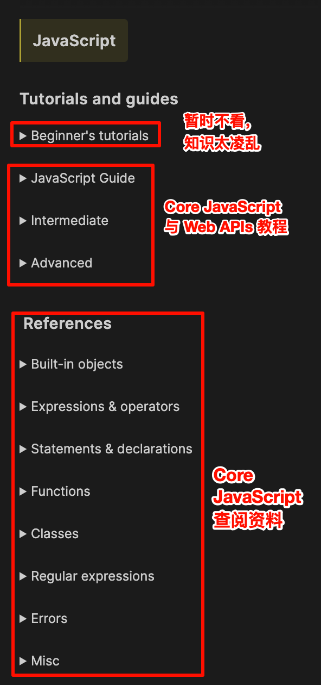

tags:: [[JavaScript]]
---

- ## 学习资源
	- ### 系统教程
		- [javascript.info](https://zh.javascript.info/)
		  logseq.order-list-type:: number
		- [MDN - JavaScript Reference](https://developer.mozilla.org/en-US/docs/Web/JavaScript) -> [MDN - JavaScript Guide](https://developer.mozilla.org/en-US/docs/Learn/JavaScript)
		  logseq.order-list-type:: number
		  id:: 6684ad75-03e1-4d9a-b242-04592a97b915
		- [Exploring JavaScript (ES2024 Edition)](https://exploringjs.com/js/book/index.html)
		  logseq.order-list-type:: number
		- [Eloquent JavaScript](https://eloquentjavascript.net/)
		  logseq.order-list-type:: number
- ## 如何使用 MDN
	- ### 教程
		- [MDN - JavaScript Reference](https://developer.mozilla.org/en-US/docs/Web/JavaScript)
			- {:height 941, :width 271}
	- ### 查阅
		- [MDN - Web APIs](https://developer.mozilla.org/en-US/docs/Web/API)
- ## 当前进度
	- ### MDN 教程
		- ~~[MDN - JavaScript Reference](https://developer.mozilla.org/en-US/docs/Web/JavaScript) -> Complete beginners~~
			- 不用学这个了，这个是给编程新人的，关于 JavaScript 的知识过于松散，直接从 JavaScript Guide 开始学习就 OK。
			- 下一步学习 [Basic math in JavaScript — numbers and operators](https://developer.mozilla.org/en-US/docs/Learn/JavaScript/First_steps/Math)
		- [MDN - JavaScript Reference](https://developer.mozilla.org/en-US/docs/Web/JavaScript) -> [MDN - JavaScript Guide](https://developer.mozilla.org/en-US/docs/Learn/JavaScript)
			- 学习完 [MDN - JavaScript Guide - Introduction](https://developer.mozilla.org/en-US/docs/Web/JavaScript/Guide/Introduction) ，但未学习其中提到的 [strict mode](https://developer.mozilla.org/en-US/docs/Web/JavaScript/Reference/Strict_mode) ==2024-08-22==
			- 接下来学习 [MDN - JavaScript Guide - Functions - Calling functions](https://developer.mozilla.org/en-US/docs/Web/JavaScript/Guide/Functions#calling_functions)
			-
-