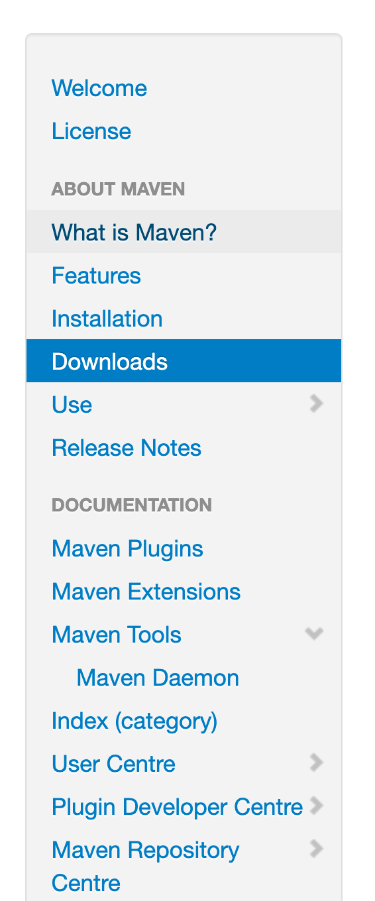
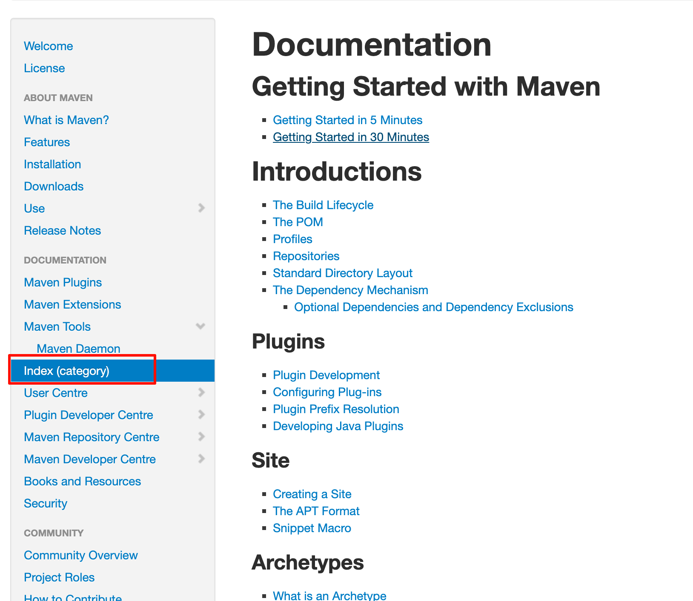

tags:: [[Maven]]
---

- ## 问题点
	- mvn spring-boot:run 为啥可以执行? ((6620bd09-1085-4f98-8ffd-4011f497fe85))
	  logseq.order-list-type:: number
	- logseq.order-list-type:: number
- ## 官方资料
	- ### 学习文档
		- [Maven Home Page](https://maven.apache.org/index.html)
			- [文档预览](https://maven.apache.org/guides/index.html)
- ## 学习进度
	- 跟着导航栏的文档看先
		- {:height 1189, :width 313}
		- 看完 Installation (2025-06-30)
	- 所有文档目录: [文档预览](https://maven.apache.org/guides/index.html)
		- {:height 422, :width 612}