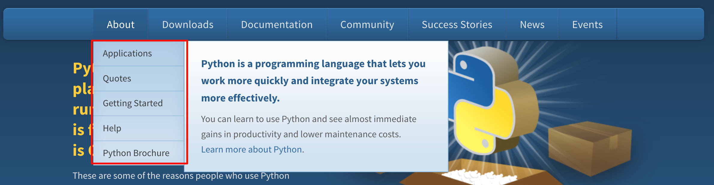
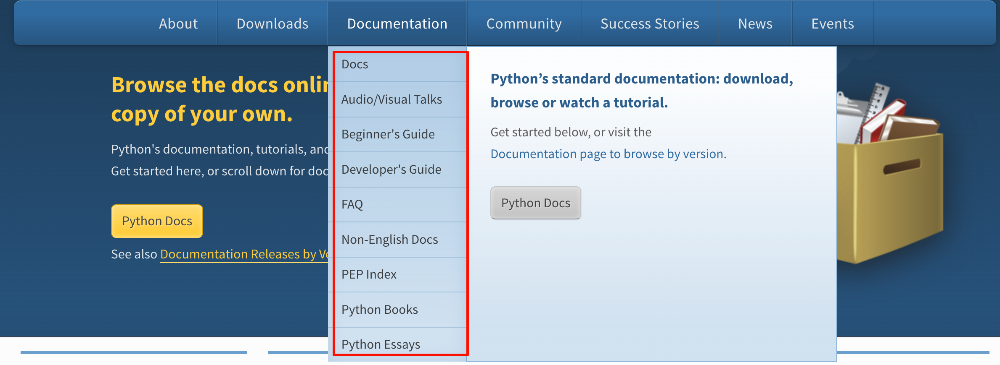

tags:: [[Python]]
---

- ## 官方资料
	- [Python - About](https://www.python.org/about/)
	  logseq.order-list-type:: number
		- {:height 281, :width 661}
	- [Python - Documentation](https://www.python.org/doc/)
	  logseq.order-list-type:: number
		- {:height 300, :width 663}
		- [Python Docs](https://docs.python.org/3/index.html)
		  logseq.order-list-type:: number
			- [Python Docs - Tutorial](https://docs.python.org/3/tutorial/index.html)
			  logseq.order-list-type:: number
	- [Python Wiki](https://wiki.python.org/moin/)
	  logseq.order-list-type:: number
	- [python3-cookbook 中文译文](https://python3-cookbook.readthedocs.io/zh_CN/latest/index.html)
	  logseq.order-list-type:: number
- ## 三方资料
	- [Real Python Tutorials](https://realpython.com/)
	  logseq.order-list-type:: number