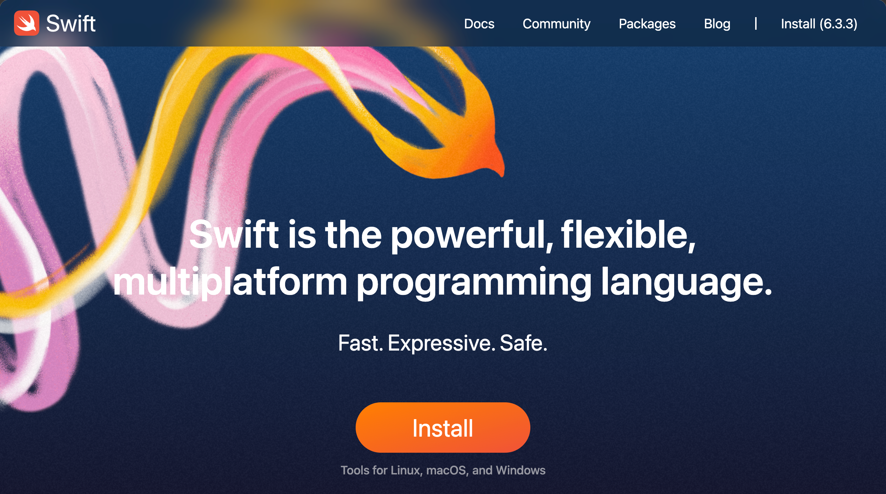

tags:: [[Swift]]
---

- ## 问题
	-
- ## 官方资料
	- [Swift Docs - Home](https://www.swift.org/documentation/)
	- [Swift API Design Guidelines](https://www.swift.org/documentation/api-design-guidelines/)
- ## 第三方资料
	- [hacking with swift - 100 Days of Swift](https://www.hackingwithswift.com/100)
	- [Stanford CS193p - Developing Apps for iOS](https://cs193p.sites.stanford.edu/2023)
	- [bilibili - 斯坦福CS193P 2021春季SwiftUI 2.0课程](https://www.bilibili.com/video/BV1q64y1d7x5/?vd_source=2b44b4aaa2e3bce2ee0eff9ff550c6bb)
	- [Youtube - SwiftfulThinking](https://www.youtube.com/@SwiftfulThinking/playlists)
- ## 学习进度: 官网
	- 
	- ==已阅:== 首页 (2026-07-08), Packages (2026-07-08)
	- ==需要时再看:== Blog
	- ### Swift Language
		- [The Swift Programming Language - 最新版本](https://docs.swift.org/swift-book/documentation/the-swift-programming-language/)
		- [The Swift Programming Language - 中文版本 (by swiftgg)](https://doc.swiftgg.team/documentation/the-swift-programming-language/)
		- Welcome to Swift
			- ==已阅:== About Swift, Version Compatibility
			- A Swift Tour
				- ==不看，讲的内容不全面，大概就是让初学者了解下这个语言的调性。==
		- Language Guide
			- ==已阅:== The Basics, Basic Operators, Strings and Characters, Collection Types, Control Flow, Functions
			- Closures
				- 接下来看: [Swift Guide - Closures#Escaping Closures](https://docs.swift.org/swift-book/documentation/the-swift-programming-language/closures/#Escaping-Closures)
				- 建议先去读 [Automatic Reference Counting](https://docs.swift.org/swift-book/documentation/the-swift-programming-language/automaticreferencecounting) 了解 `self` 和 `Capture List`
				- 参见: [[Swift Escaping Closure]]
			- ==已阅:== Enumerations, Structures and Classes, Properties, Methods
			- ==已阅:== Inheritance
			- Initialization
				- 接下来看: [Class Inheritance and Initialization](https://docs.swift.org/swift-book/documentation/the-swift-programming-language/initialization/#Class-Inheritance-and-Initialization)
				- 参见: [[Swift - Class Inheritance & Initialization]]
			- Access Control
				- 看完 Modules, Source Files, and Packages, 接下来看 [Access Levels](https://docs.swift.org/swift-book/documentation/the-swift-programming-language/accesscontrol/#Access-Levels)
				- 参见: [[Swift Access Control]]
			- Memory Safety
				- 接下来看 [Conflicting Access to self in Methods](https://docs.swift.org/swift-book/documentation/the-swift-programming-language/memorysafety/#Conflicting-Access-to-self-in-Methods)
				- 参见: [[Swift Memory Safety]]
		- Language Reference
			- ==只是详细且严谨的语法规则说明, 暂时无需阅读==
	- ### Install
		- ==暂不关注==
	- ### Community
		- ==暂不关注==