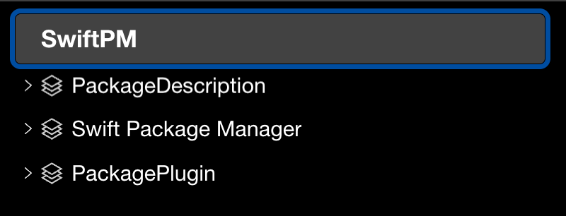
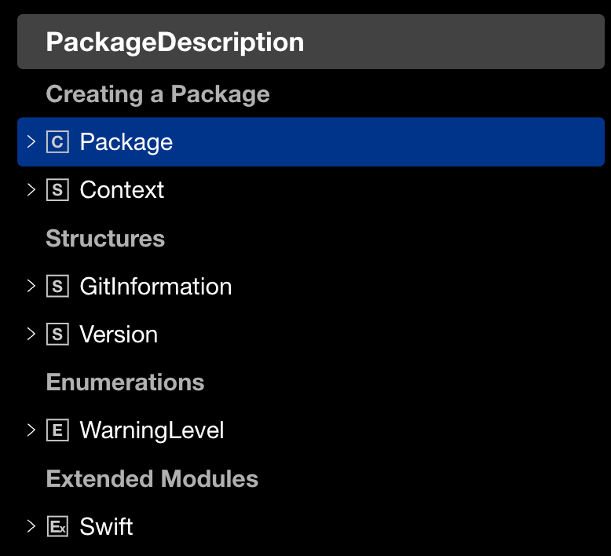

tags:: [[SwiftPM]]
---

- ## 官方资料
	- [Swift.org - SwiftPM](https://docs.swift.org/swiftpm/documentation)
	  logseq.order-list-type:: number
- ## 学习进度: 官方文档
	- {:height 217, :width 378}
	- 上面的三项, 有像上面这样在左侧三项并排展示的地址, 也有每项单独展开的地址.
	- ### [Swift Package Manager](https://docs.swift.org/swiftpm/documentation/packagemanagerdocs/)
		- ==已阅:== 首页
		- #### Essentials
			- ==已阅:== Introducing Packages
		- #### Guides
			- ==已阅:== Setting the Swift tools version, Packaging based on the version of Swift
	- ### [PackageDescription](https://docs.swift.org/swiftpm/documentation/packagedescription/)
		- {:height 211, :width 260}
		- ==已阅:== 首页
		- Package
			- ==已阅:== 首页, LanguageTag, Product, Target, Package.Dependency
		- ==没啥内容:== Context, GitInformation, Version, WarningLevel, Swift
	- ### [PackagePlugin](https://docs.swift.org/swiftpm/documentation/packageplugin/)
		-