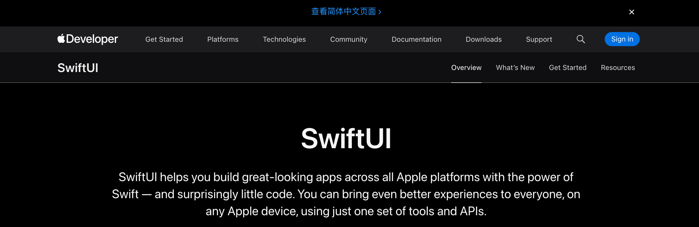

tags:: [[SwiftUI]]
---

- ## 官方资料
	- 官网: [SwiftUI Home Page](https://developer.apple.com/swiftui/)
	  logseq.order-list-type:: number
	- 官方文档: [SwiftUI Docs](https://developer.apple.com/documentation/swiftui/)
	  logseq.order-list-type:: number
	- 官方小教程: [Build an iOS app with SwiftUI](https://www.swift.org/getting-started/swiftui/) ==已阅==
	  logseq.order-list-type:: number
- ## 第三方资料
	- [hacking with swift - 100 Days of SwiftUI](https://www.hackingwithswift.com/100/swiftui)
	- [SwiftUI Cookbook](https://www.kodeco.com/books/swiftui-cookbook)
	- [SwiftUI Resources](https://orvnge.notion.site/SwiftUI-Resources-4dfbc29c535f4db992014e8cbdac66ad?pvs=4)
- ## 学习进度: 官网
	- [SwiftUI Home Page](https://developer.apple.com/swiftui/)
	- 
	- ==已阅:== Overview,
	- ==需要时再看:== What’s new ,
	- ==无需阅读:== Resources 中除 Tutorials 外的其他内容.
	- ### Resources - Tutorials - Develop in Swift
		- 旧教程: [SwiftUI Tutorials](https://developer.apple.com/tutorials/swiftui) ==不看了, 看新教程==
			- 2024-10-19 学习完 Building lists and navigation 课程
		- 新教程 (2026-07-12): [Develop in Swift Tutorials](https://developer.apple.com/tutorials/develop-in-swift)
		- ==已阅:==
			- Welcome to Develop in Swift Tutorials, Meet Xcode, Create a project, New: Discover coding intelligence
			- 接下来看: [Welcome to app design](https://developer.apple.com/tutorials/develop-in-swift/welcome-to-app-design)
	- ### Resources - Tutorials - SwiftUI Concepts
		- [SwiftUI Concepts Tutorials](https://developer.apple.com/tutorials/swiftui-concepts)
		- ==已阅:==
	- ### Get Started - SwiftUI Pathway
		- [SwiftUI Pathway](https://developer.apple.com/swiftui/get-started/)
		- ==已阅:== Meet SwiftUI ,
- ## 学习进度: 官方文档
	- [SwiftUI Docs](https://developer.apple.com/documentation/swiftui/)
- ## 学习进度: Strandford CS193p 2025
	- [【极致中配】斯坦福大学 CS193p：使用 SwiftUI 进行 iOS 开发 | 2025](https://www.bilibili.com/video/BV15nTF65Ens)
	- 看到  L2 - 34:09
- ## 学习进度: ChaoCode SwiftUI 入门
	- [SwiftUI 入门](https://www.bilibili.com/video/BV1z8411s7oP)
	- 看到 1-3 - 33:49
	-