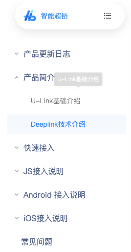

tags:: [[U-Link]]
---

- ## 学习进度
	- {:height 392, :width 211}
	- ### 产品更新日志 ==已阅==
	- ### 产品简介 ==已阅==
		- U-Link 基础介绍 ==已阅==
		- Deeplink 技术介绍 ==已阅==
	- ### 快速接入
		- 快速接入 ==已阅==
		- 功能使用介绍 ==已阅==
			- Deeplink 设置 ==已阅==
			- 裂变营销 ==已阅==
			- 超链概况 ==已阅==
	- ### JS 接入说明
		- 更新说明 ==已阅==
		- JS SDK 接入
	- ### Android 接入说明
	- ### iOS 接入说明
		-