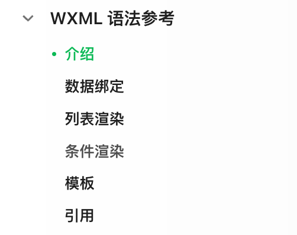

tags:: [[WXML]]
---

- ## 学习进度
	- ### [WXML 语法参考](https://developers.weixin.qq.com/miniprogram/dev/reference/wxml/)
		- {:height 148, :width 183}
		- 看完: 介绍, 数据绑定, 条件渲染, 模板, 引用
		- 接下来读 **列表渲染** 的 `wx-key`
		-