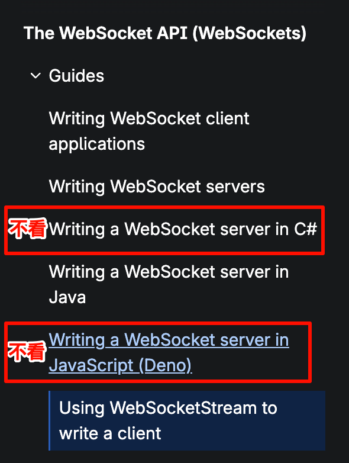

tags:: [[WebSocket]]
---

- ## 问题点
	- Websockt starter
	  logseq.order-list-type:: number
		- JS 原生 Websocket 
		  logseq.order-list-type:: number
		- JS 框架 Websocket
		  logseq.order-list-type:: number
		- Node.js Websocket 服务端
		  logseq.order-list-type:: number
		- Java Websocket 服务端
		  logseq.order-list-type:: number
		- Websocket 协议
		  logseq.order-list-type:: number
	- WebSocket 连接管理
	  logseq.order-list-type:: number
		- SSE 支持断线重连, 但是 WebSocket 不支持?
		  logseq.order-list-type:: number
		- WebSocket 保持长连接的底层原理是啥?
		  logseq.order-list-type:: number
			- 心跳机制.
			  logseq.order-list-type:: number
		- 同一个连接并发发送多条信息会怎样?
		  logseq.order-list-type:: number
	- 消息代理
	  logseq.order-list-type:: number
		- [[STOMP]]
		  logseq.order-list-type:: number
		- [[MQTT]]
		  logseq.order-list-type:: number
- ## 学习进度
	- [MDN - The WebSocket API (WebSockets)](https://developer.mozilla.org/en-US/docs/Web/API/WebSockets_API)
	  logseq.order-list-type:: number
		- {:height 216, :width 312}
		- 除了 [Using WebSocketStream to write a client](https://developer.mozilla.org/en-US/docs/Web/API/WebSockets_API/Using_WebSocketStream) , 其他都看过了 (2025-10-10).
	- [WebSocket.org 官网](https://websocket.org/) (参见: [[WebSocket.org]] )
	  logseq.order-list-type:: number
		-
- ## 学习资料
	- [MDN - The WebSocket API (WebSockets)](https://developer.mozilla.org/en-US/docs/Web/API/WebSockets_API)
	  logseq.order-list-type:: number
	- [WebSocket.org 官网](https://websocket.org/) (参见: [[WebSocket.org]] )
	  logseq.order-list-type:: number
-
-
-