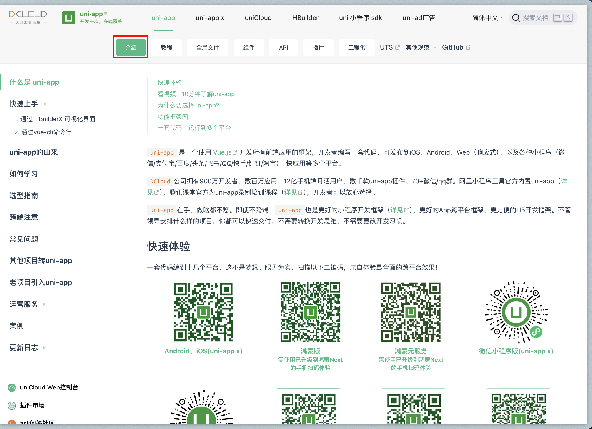
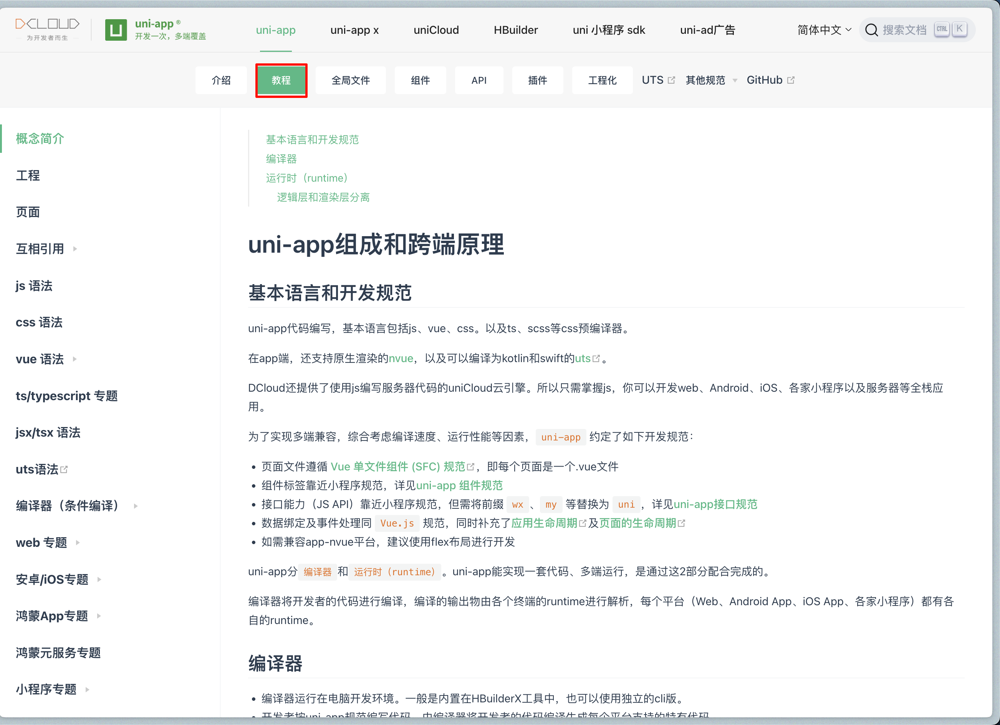

tags:: [[uni-app]]
---

- ## 学习资源
	- ### 官方资源
		- [uni-app - 介绍](https://uniapp.dcloud.net.cn/)
		  logseq.order-list-type:: number
			- 
		- [uni-app - 教程](https://uniapp.dcloud.net.cn/tutorial/)
		  logseq.order-list-type:: number
			- 
		- 其他 tab 不用特别学习, 只用于查找.
- ## 学习进度
	- [uni-app - 介绍](https://uniapp.dcloud.net.cn/)
	  logseq.order-list-type:: number
		- 看完了 **如何学习**
		-
	- logseq.order-list-type:: number
-