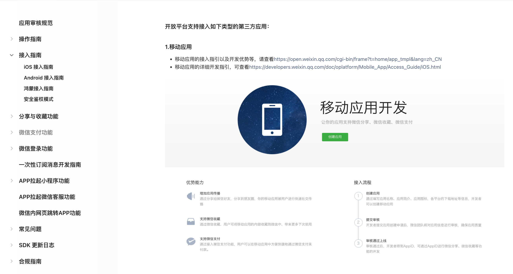

tags:: [[微信 - 移动应用]]
---

- ## 官方文档
	- [微信开放平台 - 移动应用](https://developers.weixin.qq.com/doc/oplatform/Mobile_App/Resource_Center_Homepage.html)
	  logseq.order-list-type:: number
- ## 学习进度
	- ### 官方文档
		- {:height 552, :width 974}
		- 应用审核规范 ==需要时再看==
		- 操作指南 ==需要时再看==
		- 接入指南
		- SDK 更新日志
			- 看完: Open SDK for iOS ,
		- 合规指南
			- 看完: 微信Open SDK个人信息处理规则