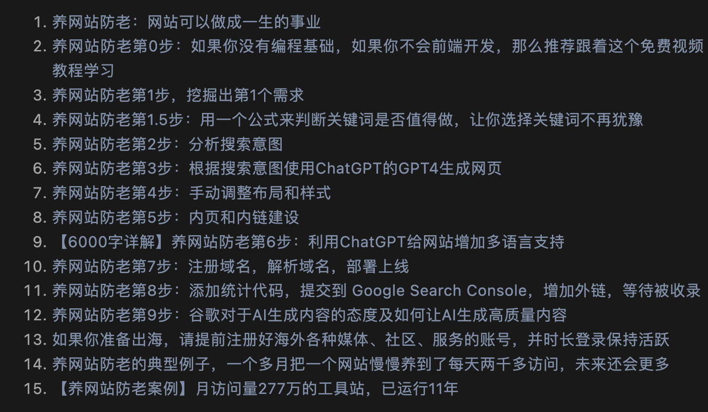

tags:: [[养网站防老]]
---

- ## 问题
	- 1、建站基础，如何快速做一个网站；
	  2、SEO基础，如何优化网站；
	  3、推广基础，如何宣传推广网站；
	  4、运营基础，如何运营好一个网站；
	  5、Adsense基础，如何靠谷歌Adsense赚广告费；
	  6、一些工具使用经验分享，如Semrush分析别的网站流量和出入站链接，Similarweb如何看流量；
	  7、基于Semrush、Similarweb等工具，如何去发掘新需求，发现新网站；
	  8、实战经验，如何去抓住新词热词做网站，从搜索引擎获取流量。
	- 如何查询一个网站的访问量？
	  logseq.order-list-type:: number
	- similarweb 官方访问不了？
	  logseq.order-list-type:: number
	- 关于首页、内页 的 title 、description 和 链接的SEO？
	  logseq.order-list-type:: number
	- 为什么要生成很多页面？内链和网站地图是啥？
	  logseq.order-list-type:: number
		- 每个页面都有对应的关键字，多个页面，就增加网站被搜多到的概率。
	- 关键字密度?
	  logseq.order-list-type:: number
- ## 学习资料
	- [【养网站防老】每个人都要有自己的小果园，今天请为你的果园种下第一棵小树苗吧](https://mp.weixin.qq.com/s/01b42cCbYO2G5RkdN2Z56w)
		- {:height 313, :width 467}
		- 正在看 第 0 步提到的教程
			- html +css : https://www.bilibili.com/video/BV1Wr4y1R7Bd/
			- JS : https://developer.mozilla.org/zh-CN/docs/Web/JavaScript
		- 正在看 第 1 步
- ## 学习进度
	-