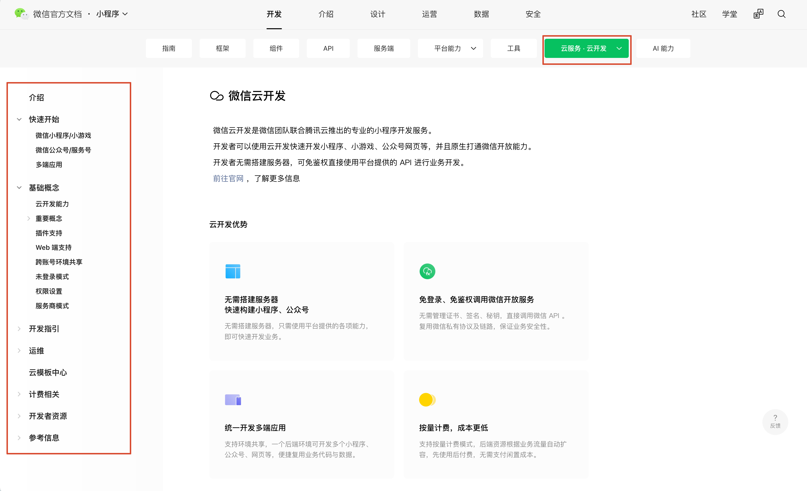

tags:: [[微信云开发]]
---

- ## 学习资源
	- [微信云开发](https://developers.weixin.qq.com/miniprogram/dev/wxcloudservice/wxcloud/basis/getting-started.html)
	  logseq.order-list-type:: number
	- [微信学堂 - 云开发入门](https://developers.weixin.qq.com/community/business/course/00022011ec0a287dd32b4ddce5180d)
	  logseq.order-list-type:: number
	- [微信学堂 - 云开发官方直播课](https://developers.weixin.qq.com/community/business/course/0000a824168998b1cdac9dd975440d)
	  logseq.order-list-type:: number
- ## 学习进度: 官方文档
	- [微信云开发](https://developers.weixin.qq.com/miniprogram/dev/wxcloudservice/wxcloud/basis/getting-started.html)
	- {:height 549, :width 661}
	- ==已阅:== 介绍
	- 快速开始:
		- ==已阅:== 首页, 微信小程序/小游戏
		- ==有需要再读:== 微信公众号/服务号 , 多端应用
	- 基础能力:
		- ==已阅:== 首页,