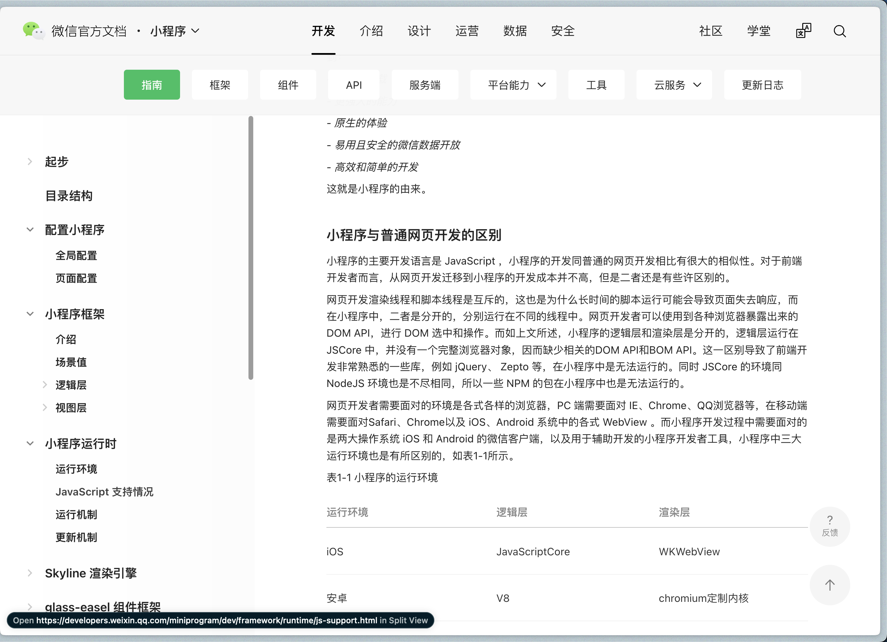

tags:: [[微信小程序]]
---

- ## 问题
	- 微信开发者工具各个版本的区别？
	  logseq.order-list-type:: number
	- 用户使用小程序时, 用户访问的是下载到本地的资源, 还是微信服务器上的资源?
	  logseq.order-list-type:: number
- ## 学习资源
	- ### 官方
		- [小程序开发起步](https://developers.weixin.qq.com/community/business/course/000264e20a0dd8e69669b609451c0d)
		  logseq.order-list-type:: number
		- [小程序 - 开发 - 指南](https://developers.weixin.qq.com/miniprogram/dev/framework/)
		  logseq.order-list-type:: number
- ## 学习进度
	- ~~[小程序开发起步](https://developers.weixin.qq.com/community/business/course/000264e20a0dd8e69669b609451c0d)~~
	  logseq.order-list-type:: number
		- 已学完
	- [小程序 - 开发 - 指南](https://developers.weixin.qq.com/miniprogram/dev/framework/)
	  logseq.order-list-type:: number
		- 
		- 看完 **配置小程序** .
			- 路过的 **起步** 中的 [小程序开发指南](https://developers.weixin.qq.com/ebook?action=get_post_info&docid=0008aeea9a8978ab0086a685851c0a) 还未看
		- 看完 **小程序框架-逻辑层-页面生命周期**
-