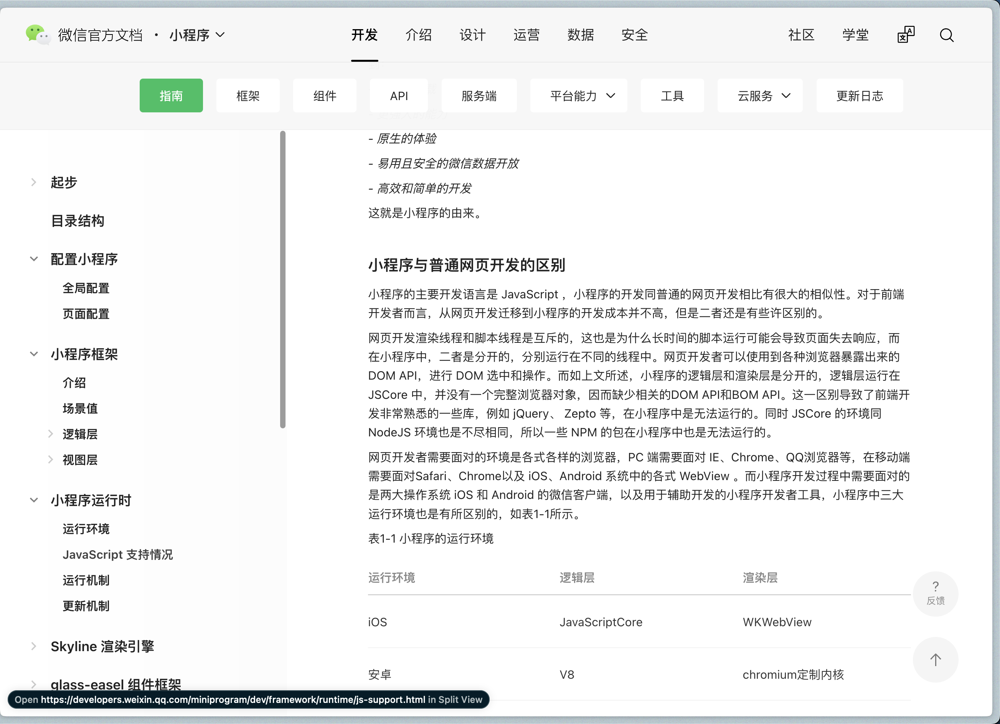

tags:: [[微信小程序]]
---

- ## 问题
	- 微信开发者工具各个版本的区别？
	  logseq.order-list-type:: number
- ## 学习资源
	- ### 官方
		- [小程序开发起步](https://developers.weixin.qq.com/community/business/course/000264e20a0dd8e69669b609451c0d) (官方视频教程)
		  logseq.order-list-type:: number
		- [小程序 - 开发 - 指南](https://developers.weixin.qq.com/miniprogram/dev/framework/) (官方文档)
		  logseq.order-list-type:: number
- ## 学习进度
	- ~~[小程序开发起步](https://developers.weixin.qq.com/community/business/course/000264e20a0dd8e69669b609451c0d)~~
	  logseq.order-list-type:: number
		- 已学完
	- [小程序 - 开发 - 指南](https://developers.weixin.qq.com/miniprogram/dev/framework/)
	  logseq.order-list-type:: number
		- 
		- ==看完:==
			- **起步**
				- 其中, 旧版本的 [小程序开发指南](https://developers.weixin.qq.com/ebook?action=get_post_info&docid=0008aeea9a8978ab0086a685851c0a) 还未看, 现在貌似访问不了了 (2026.06)
			- **目录结构** , **配置小程序**
			- **小程序框架**
				- 看完: **介绍** , **场景值**
				- 逻辑层:
					- 看完: **介绍**, **注册小程序** , **注册页面**, **页面声明周期**
					- **页面路由** : 接下来读 **介绍** 的 `路由类型 - 2. 打开新页面`
						- 参见: [[微信小程序 - 路由类型: navigateTo 打开新页面]]
				- 视图层:
					- 看完: **介绍**, **WXSS** , **基础组件** ,
					- ==**WXS** 暂时不看==
			- **小程序运行时** ,  **基础库**
-