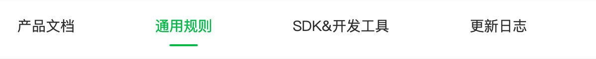

tags:: [[微信支付]]
---

- ## 学习进度
	- {:height 129, :width 686}
	- ### 通用规则
		- [APIv2 通用规则](https://pay.weixin.qq.com/doc/v2/merchant/4011939746) ==已阅==
		  logseq.order-list-type:: number
		- [APIv3 通用规则](https://pay.weixin.qq.com/doc/v3/merchant/4012081606) 没怎么读, 直接用 SDK 好了
		  logseq.order-list-type:: number
	- ### SDK&开发工具
		- APIv2 ==已阅==
		- APIv3
- ## 遇到的问题
	- [{"errMsg":"requestPayment:fail [payment微信:-1]General errors","errCode":-100,"code":-100}](https://ask.dcloud.net.cn/question/121117)
	  logseq.order-list-type:: number
		- `weixin-java-pay` 生成的字段大小写与 uni-app 的 `uni.requestPayment` 的 `orderInfo` 对象中的字段不一样.
			- Android 用 appid
			- iOS 用 appId
	- [[微信支付]支持配置微信支付公钥](https://github.com/binarywang/WxJava/pull/3425)
	  logseq.order-list-type:: number
		- `weixin-java-pay` 4.6.0 版本不支持 `微信支付公钥` , 升级到 4.7.0
-