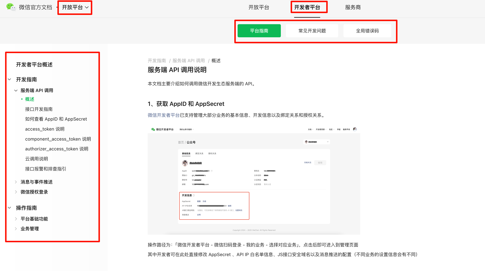

tags:: [[微信服务端 API]]
---

- ## 学习进度
	- ### 开放平台 - 开发者平台
		- {:height 599, :width 1042}
		- [微信官方文档 - 开放平台](https://developers.weixin.qq.com/doc/oplatform/developers/dev/)
		- #### 平台指南
			- 开发者平台概述 ==已阅==
			- 开发指南 > 服务端 API 调用
				- 概述 ==已阅==
				- 接口开发指南 ==已阅==
				- 如何查看 AppID 和 AppSecret ==已阅==
				- access_token 说明 ==已阅==
				- component_access_token 说明 ==暂不需要==
				- authorizer_access_token 说明 ==暂不需要==
				- 云调用说明  ==已阅==
				- 接口报警和排查指引 ==遇到问题时再看==
			- 开发指南 > 消息与事件推送
		- #### 常见开发问题
		- #### 全局错误码 ==已阅, index==
		-
		-