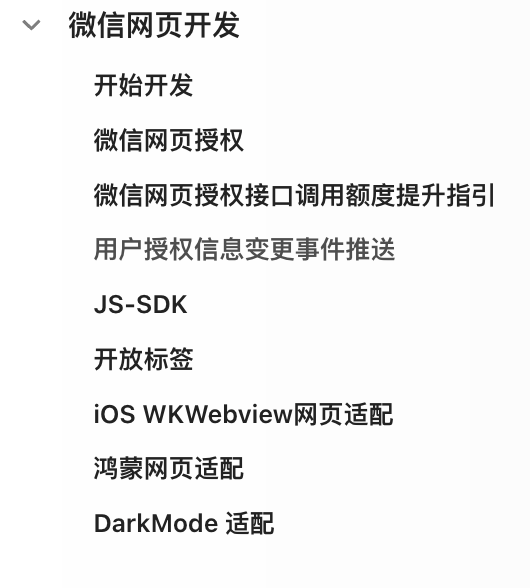

tags:: [[微信网页开发]]
---

- ## 学习进度
	- 以 [服务号 - 微信网页开发](https://developers.weixin.qq.com/doc/service/guide/h5/) 文档, 为主要资料
	- {:height 245, :width 208}
	- 开始开发 ==已阅==
	- 微信网页授权 相关
		- 微信网页授权 ==略读, 需要时再详读==
		- 微信网页授权接口调用额度提升指引 ==略读, 需要时再详读==
		- 用户授权信息变更事件推送 ==略读, 需要时再详读==
	- JS-SDK ==已阅, 仅剩 "卡券扩展字段及签名生成算法" ==
	- 开放标签 ====
	- 系统适配相关:
		- iOS WKWebview网页适配
		- 鸿蒙网页适配
	- DarkMode 适配  ==略读, 需要时再详读==