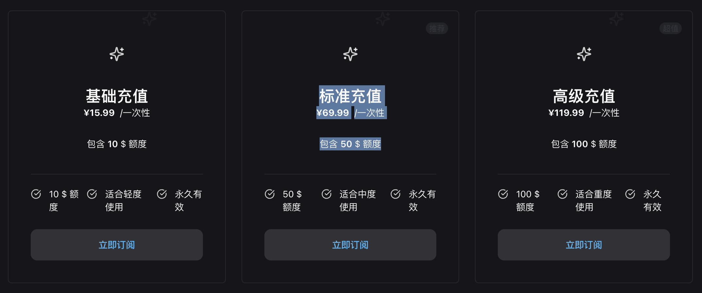

tags:: [[Claude Code]]
---

- ## 订阅 Claude Code 官方套餐
	- 贵, 且不方便付款.
- ## 接入各大模型 API
	- ### 使用 Claude Code 原生配置
		- 配置 `~/.claude/settings.json` (以 GLM 为例)
			- ``` json
			  {
			    "env": {
			      "ANTHROPIC_AUTH_TOKEN": "xxx",
			      "ANTHROPIC_BASE_URL": "https://open.bigmodel.cn/api/anthropic",
			      "API_TIMEOUT_MS": "3000000",
			      "CLAUDE_CODE_DISABLE_NONESSENTIAL_TRAFFIC": 1
			    }
			  }
			  ```
	- ### 使用 Claude Code Router
		- [Claude Code Router](https://github.com/musistudio/claude-code-router?tab=readme-ov-file)
		- 安装 Claude Code Router: `npm install -g @musistudio/claude-code-router` .
		  logseq.order-list-type:: number
		- 配置 `~/.claude-code-router/config.json` .
		  logseq.order-list-type:: number
			-
	- ### 使用 CC Mate
		- [CC Mate](https://randynamic.org/ccmate)
- ## 使用 Claude Code 代理平台
	- ### Code Router
		- [Code Router](https://api.code-relay.com/)
		- 2025-12-31 价格
			- 通过邀请链接注册, 免费获得 30$ 额度.
			- {:height 375, :width 701}
		- 配置 `~/.claude/settings.json`
			- ``` json
			  {
			    "env": {
			      "ANTHROPIC_BASE_URL": "https://api.code-relay.com/",
			      "ANTHROPIC_AUTH_TOKEN": "你的API_KEY"
			    }
			  }
			  ```
-